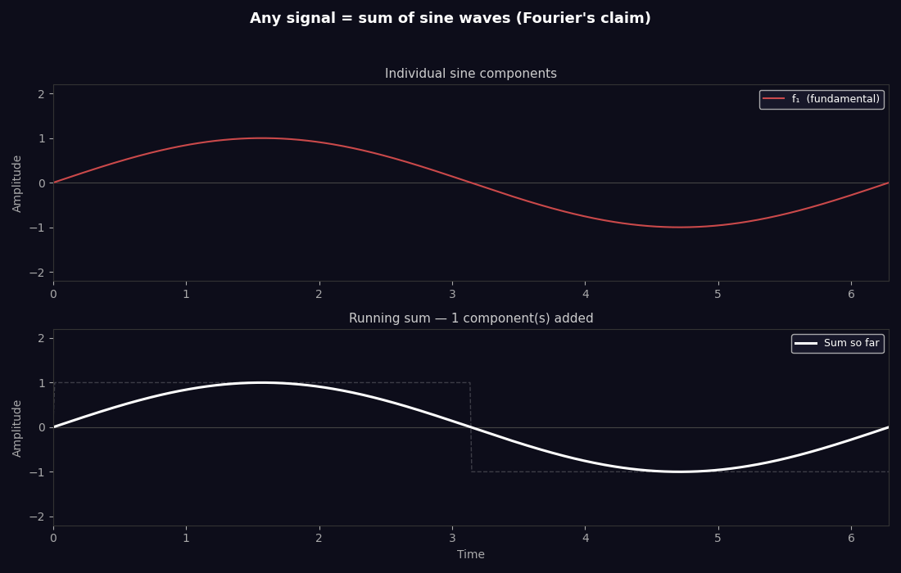
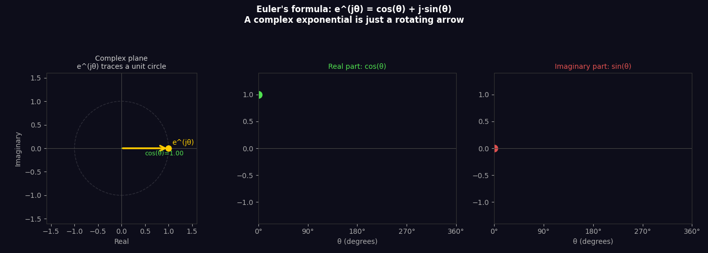
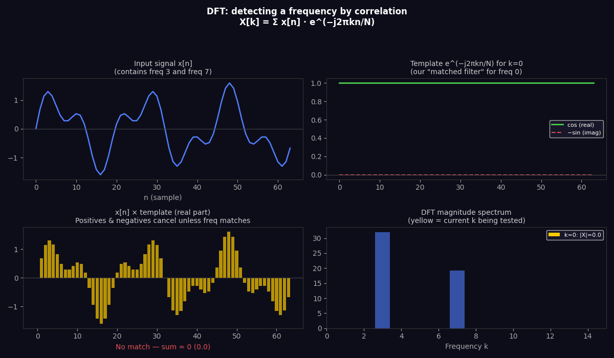
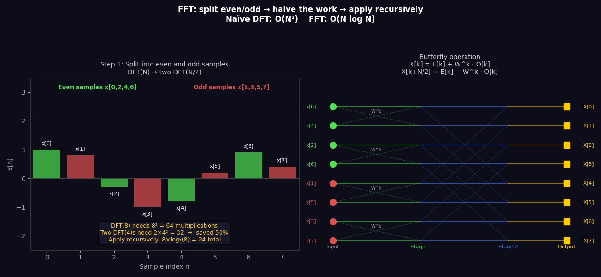
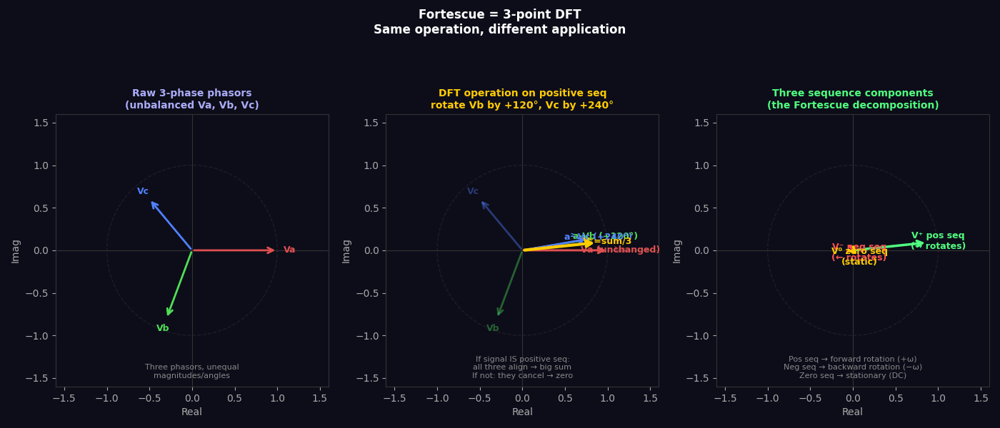

<script src="https://cdn.jsdelivr.net/npm/mermaid@10/dist/mermaid.min.js"></script>
<script>mermaid.initialize({startOnLoad:true, theme:'dark'});</script>

# FFT and Fourier — Intuition, Derivation, and the Link to Fortescue

This builds from first principles: what a frequency is, why sine waves are special, how the DFT detects them, why the FFT is fast, and how Fortescue's symmetrical components are just a 3-point DFT applied to motor phases.

---

## Contents

1. [What is a frequency, really?](#1-what-is-a-frequency-really)
2. [Fourier's claim](#2-fouriers-claim)
3. [Euler's formula — the rotating arrow](#3-eulers-formula--the-rotating-arrow)
4. [The DFT — detecting a frequency by correlation](#4-the-dft--detecting-a-frequency-by-correlation)
5. [The DFT matrix — it's just matrix multiplication](#5-the-dft-matrix--its-just-matrix-multiplication)
6. [The FFT — why it's fast](#6-the-fft--why-its-fast)
7. [Fortescue = 3-point DFT](#7-fortescue--3-point-dft)
8. [The unified picture](#8-the-unified-picture)

---

## 1. What is a frequency, really?

A frequency is just a sine wave repeating at a particular rate. That's it.

```
f = 1 Hz  →  one full cycle per second
f = 3 Hz  →  three full cycles per second
```

What makes sine waves special is that they are **eigenfunctions of linear systems** — if you put a sine wave into any linear system (a filter, a motor winding, an amplifier), the output is also a sine wave at the same frequency. Only the amplitude and phase can change, never the frequency.

This is why frequency analysis is so powerful: it's the natural language of linear systems.

---

## 2. Fourier's claim

Jean-Baptiste Fourier (1822) made a claim that seemed absurd at the time:

> **Any periodic signal, no matter how complicated, can be written as a sum of sine waves.**



*A square wave being built up from odd harmonics: f, 3f, 5f, 7f... Each frame adds one more sine wave. More components = sharper corners.*

The coefficients (how much of each sine wave) are what the Fourier transform computes. The transform doesn't change the signal — it just **re-describes it in frequency language instead of time language**.

Same information, different perspective. Like describing a location as (x, y, z) vs (r, θ, φ) — same point, different coordinates.

---

## 3. Euler's formula — the rotating arrow

Before the DFT, you need to understand Euler's formula:

```
e^(jθ) = cos(θ) + j·sin(θ)
```

This connects the exponential function to rotation. A complex exponential is just an **arrow rotating in the complex plane**.



*Left: the phasor e^(jθ) rotating on the unit circle. Middle: its real part traces a cosine. Right: its imaginary part traces a sine. They're the same thing viewed from different angles.*

### Why j (imaginary unit)?

j = √(-1). Multiplying by j rotates a complex number by 90°:

```
1   × j = j        (0° → 90°)
j   × j = -1       (90° → 180°)
-1  × j = -j       (180° → 270°)
-j  × j = 1        (270° → 360° = 0°)
```

Repeated multiplication by j is rotation. The exponential `e^(jθ)` generalises this to any angle.

### Negative frequency

`e^(-jθ)` rotates in the opposite direction — clockwise. This is negative frequency. It's not mysterious — it's just rotation the other way.

When you multiply a signal by `e^(-jωt)` you are **subtracting** the rotation ω from whatever is in the signal. If the signal contains a component at ω, that component's rotation cancels to zero — it becomes DC.

This is the entire mechanism of the Park transform and the DFT.

---

## 4. The DFT — detecting a frequency by correlation

### The problem

You have N samples of a signal `x[0], x[1], ..., x[N-1]`. You want to know: **how much of frequency k is in this signal?**

### The answer — correlation

Multiply each sample by the complex conjugate of the frequency-k template, then sum:

```
X[k] = Σ x[n] · e^(-j2πkn/N)      for n = 0, 1, ..., N-1
```

This is the **Discrete Fourier Transform (DFT)**.



*The yellow bar sweeps through frequency bins k=0 to 10. When k matches a frequency in the signal (k=3 and k=7), the products all align and sum to a large value. Everywhere else they cancel.*

### Why does it work?

For each sample `x[n]`, you multiply by `e^(-j2πkn/N)`. This rotates the sample backwards by angle `2πkn/N` — exactly the angle that a frequency-k component would have accumulated by sample n.

If the signal **contains** frequency k:
- All rotated samples point the same direction
- They add constructively
- `|X[k]|` is large

If the signal **does not contain** frequency k:
- Rotated samples point in random directions
- They cancel
- `|X[k]|` ≈ 0

This is why the DFT is called a matched filter — the template `e^(-j2πkn/N)` is shaped exactly like frequency k. It resonates with its own frequency and rejects everything else.

### The output

`X[k]` is a complex number. Its magnitude `|X[k]|` tells you how much of frequency k is present. Its angle `∠X[k]` tells you the phase.

---

## 5. The DFT matrix — it's just matrix multiplication

Write all N DFT outputs at once:

```
X = W · x
```

Where `W` is the N×N **DFT matrix**:

```
        [  1      1        1        1     ...  ]
        [  1      W^1      W^2      W^3   ...  ]
W  =    [  1      W^2      W^4      W^6   ...  ]
        [  1      W^3      W^6      W^9   ...  ]
        [  ...                              ...  ]

where W = e^(-j2π/N)   (the N-th root of unity)
```

Entry `W[k,n] = e^(-j2πkn/N)` — rotating the n-th sample back by k steps.

The DFT matrix is a **unitary matrix** — its inverse is just its conjugate transpose scaled by 1/N:

```
W^(-1) = (1/N) · W*     (complex conjugate)
```

This means the DFT is perfectly reversible. No information lost — just a change of basis.

### The 3×3 case — preview of Fortescue

For N=3:

```
W = e^(-j2π/3)    →    W^0=1,  W^1=a*,  W^2=a²*
```

Where `a = e^(j2π/3)` is Fortescue's rotation operator. The 3-point DFT matrix is:

```
[X[0]]   [1    1     1  ] [x[0]]
[X[1]] = [1    W     W² ] [x[1]]   × (1/3)
[X[2]]   [1    W²    W⁴ ] [x[2]]
```

This is **exactly** the Fortescue transform. The sequences are just DFT frequency bins at N=3.

---

## 6. The FFT — why it's fast

### The problem with the DFT

Computing X[k] requires N multiplications. Computing all N outputs requires N² multiplications total.

For N = 1024: **1,048,576 multiplications**.
For N = 1,000,000: **10¹² multiplications** (takes hours).

The DFT is too slow for real-time use.

### Cooley-Tukey's insight (1965)

Split the N-point DFT into two N/2-point DFTs — one for even-indexed samples, one for odd:

```
X[k] = Σ x[n]·W^(kn)                              (all N samples)
     = Σ x[2m]·W^(2km) + Σ x[2m+1]·W^(k(2m+1))  (split even/odd)
     = Σ x[2m]·(W²)^(km) + W^k · Σ x[2m+1]·(W²)^(km)
     = E[k]  +  W^k · O[k]
```

Where:
- `E[k]` = N/2-point DFT of even samples
- `O[k]` = N/2-point DFT of odd samples
- `W^k` = **twiddle factor** (just a rotation)

### The butterfly operation

```
X[k]       = E[k]  +  W^k · O[k]
X[k + N/2] = E[k]  -  W^k · O[k]
```

Two outputs from two half-size DFTs plus one multiply. This is the **butterfly** — the basic building block of the FFT.



*Left: the even/odd split halves the problem. Right: the butterfly diagram showing how each stage combines two half-size DFTs. Three stages for N=8.*

### The recursion

Apply the split recursively:

```
DFT(N) → 2 × DFT(N/2)
       → 4 × DFT(N/4)
       → 8 × DFT(N/8)
       → ...
       → N × DFT(1)    (trivial — just the sample itself)
```

Each level has N multiplications. There are log₂(N) levels.

Total: **N·log₂(N) multiplications**.

```
N = 1024:   naive DFT = 1,048,576    FFT = 10,240      (100× faster)
N = 1M:     naive DFT = 10¹²        FFT = 20,000,000  (50,000× faster)
```

This is why real-time audio, radar, MRI, WiFi, 4G, and motor drives can all use frequency analysis — without the FFT, none of it would be computationally feasible.

### Requirement

Cooley-Tukey FFT requires N = 2^m (power of 2). This is why FFT sizes are always 256, 512, 1024, 2048... Zero-padding a signal to the next power of 2 is standard practice.

---

## 7. Fortescue = 3-point DFT

Now put it all together.



*Left: raw unbalanced phasors Va, Vb, Vc. Middle: the DFT operation for positive sequence — rotate Vb by 120°, Vc by 240°, then sum. If the system is positive sequence, all three align → big result. Right: the three sequences animated — positive rotates forward, negative rotates backward, zero is static.*

### The 3-point DFT explicitly

For N=3 samples (Va, Vb, Vc) and twiddle factor `W₃ = e^(-j2π/3)`:

```
X[0] = Va + Vb        + Vc             (k=0, DC / zero sequence)
X[1] = Va + W₃·Vb    + W₃²·Vc        (k=1, fundamental forward)
X[2] = Va + W₃²·Vb   + W₃⁴·Vc        (k=2, fundamental backward)
```

Now note that `W₃ = e^(-j2π/3) = a*` (complex conjugate of Fortescue's a).

Rewriting with Fortescue's `a = e^(+j2π/3)`:

```
V⁰ = ⅓(Va  + Vb    + Vc  )     ← X[0]/3 = zero sequence
V⁺ = ⅓(Va  + a·Vb  + a²·Vc)   ← X[1]/3 = positive sequence
V⁻ = ⅓(Va  + a²·Vb + a·Vc )   ← X[2]/3 = negative sequence
```

**This is literally the Fortescue transform.** The only difference from the standard DFT is the sign convention on the rotation operator — Fortescue defines `a` as positive rotation (forward), whereas the DFT defines its twiddle factor as negative rotation (backward). They're the same thing, just looking from opposite directions.

### What each bin means physically

| DFT bin k | Frequency | Fortescue name | Physical meaning in motor |
|---|---|---|---|
| 0 | DC | Zero sequence | All phases in phase — fault current |
| 1 | +f | Positive sequence | Forward MMF — useful torque |
| 2 = −1 | −f | Negative sequence | Backward MMF — braking, heat |

### Why there are only 3 bins for 3 samples

The DFT of N samples gives you exactly N frequency bins. For N=3 you get 3 bins — DC, +f, and −f. You cannot resolve more than 3 frequencies from 3 samples. This is the **Nyquist-Shannon sampling theorem** at the most basic level.

For a 3-phase motor, 3 samples (one per phase) is exactly the right number to resolve the three possible symmetrical states. Nature and mathematics align perfectly.

---

## 8. The unified picture

Every transform in this chain is doing the same thing:

**Change basis to make the signal easier to work with.**

<div class="mermaid">
flowchart TD
    FOURIER["Fourier / DFT\nTime → Frequency\nN samples → N frequency bins\nDetect 'how much of each frequency'"] 
    FFT["FFT\nFast algorithm for DFT\nO(N²) → O(N log N)\nSplit even/odd recursively"]
    FORT["Fortescue\n3-point DFT\n3 phases → 3 sequences\nDetect pos/neg/zero symmetry"]
    CLARKE["Clarke Transform\nExtract positive sequence\nas real αβ components\n(Fortescue in real arithmetic)"]
    PARK["Park Transform\nRotate by −θ\nFreeze positive sequence as DC\n(matched filter + frame switch)"]
    FOC["FOC Current Control\nRegulate Id=0, Iq=torque\n(PI on DC quantities)"]

    FOURIER --> FFT
    FOURIER --> FORT
    FORT --> CLARKE
    CLARKE --> PARK
    PARK --> FOC

    style FOURIER fill:#1a1a5a,color:#fff
    style FFT fill:#1a3a5a,color:#fff
    style FORT fill:#3a1a5a,color:#fff
    style CLARKE fill:#1a5a3a,color:#fff
    style PARK fill:#5a3a1a,color:#fff
    style FOC fill:#5a1a1a,color:#fff
</div>

### The matched filter thread

Every step is a matched filter:

- **DFT bin k** — matched to frequency k, rejects all others
- **Fortescue V⁺** — matched to positive sequence, rejects negative and zero
- **Clarke αβ** — extracts positive sequence in real coordinates
- **Park dq** — matched filter + reference frame switch, freezes positive sequence as DC
- **PI controller** — effectively a matched filter for DC (infinite gain at zero frequency)

### The frame switch thread

Every step is also a reference frame change:

- **DFT** — time domain → frequency domain
- **Fortescue** — phase domain (abc) → sequence domain (0, +, −)
- **Park** — stationary frame (αβ) → rotating frame (dq)
- **Field weakening** — dq frame at ω → dq frame at different operating point

Same idea, different application, different level of abstraction.

### Key numbers to remember

```
DFT:        X[k] = Σ x[n] · e^(-j2πkn/N)
FFT:        O(N log N)  vs  O(N²) for naive DFT
Fortescue:  V⁺ = ⅓(Va + a·Vb + a²·Vc)     where a = e^(j2π/3)
Clarke:     Iα = Ia,   Iβ = (Ia + 2Ib)/√3
Park:       Id + jIq = (Iα + jIβ) · e^(-jθ)
FOC:        Id_ref = 0,   Iq_ref = τ / Kt
```

They're all the same equation at different scales.
