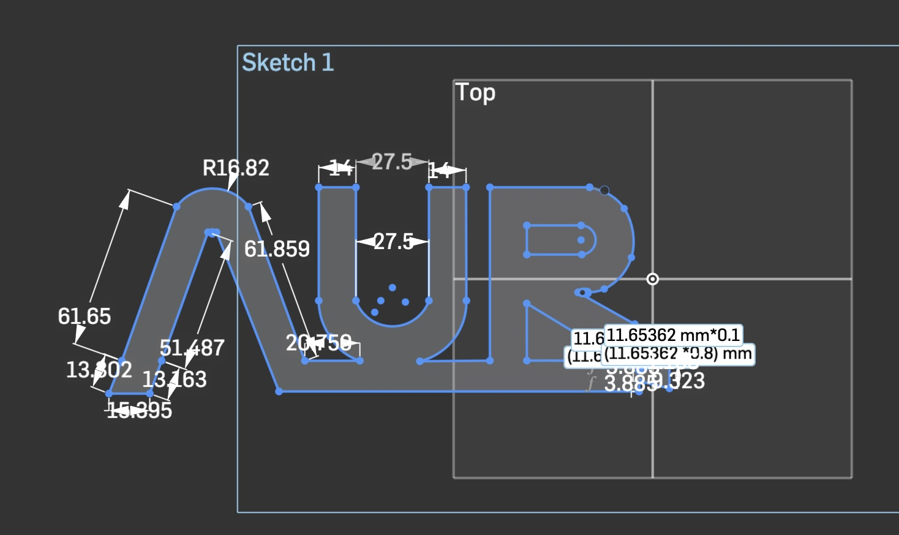
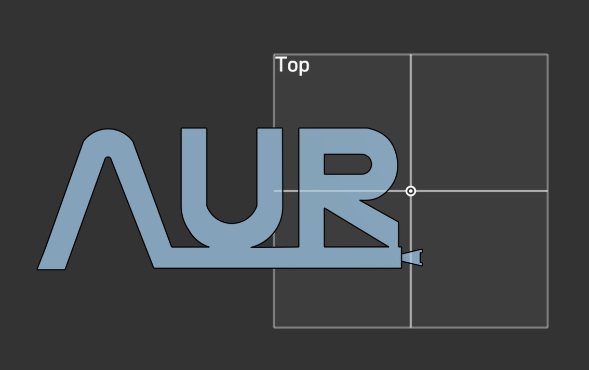
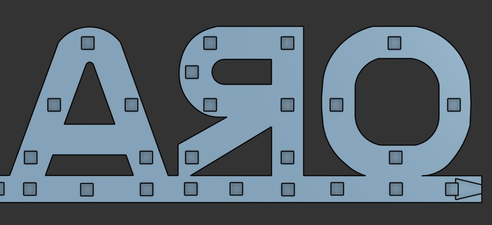
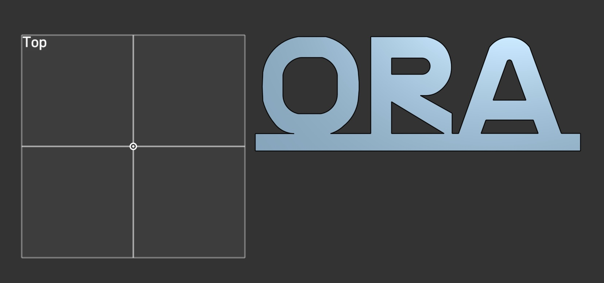
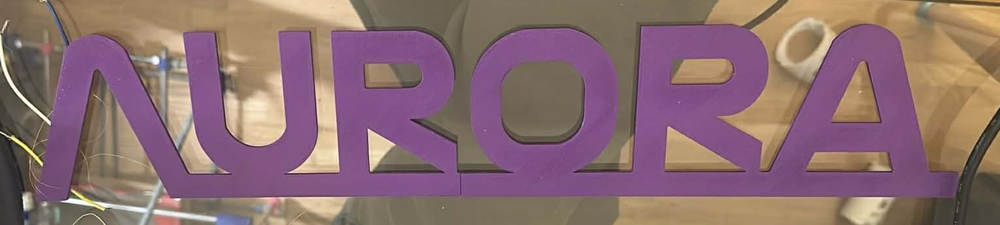

# Aurora Sign
---

## 08/03/26
So, I need a sign that says "Aurora". I thought it would be cool to use the
NASA type font, so I found a site that generates you NASA text, and downloaded
the image. I then imported that to OnShape, and drew around it:

You'll notice that this is only half of the word. I wanted the sign pretty big,
so I made it 400mm, but, my print bed is only 200x200. So, I cut the design, and
added a dove tail joint so that I can join the two parts of the sign together. 

Then, I extruded the part.

 

Then, I needed LED holes! I had 50 of [these](https://uk.rs-online.com/web/p/leds/1808083) RS components LEDS, which are pretty
much neopixel LEDS, but with a slightly different pin out - same library works
with it, though.

Next, it was time to print. I loaded up both parts into OrcaSlicer, and an hour
later I had my two part sign!

There we have it! 
