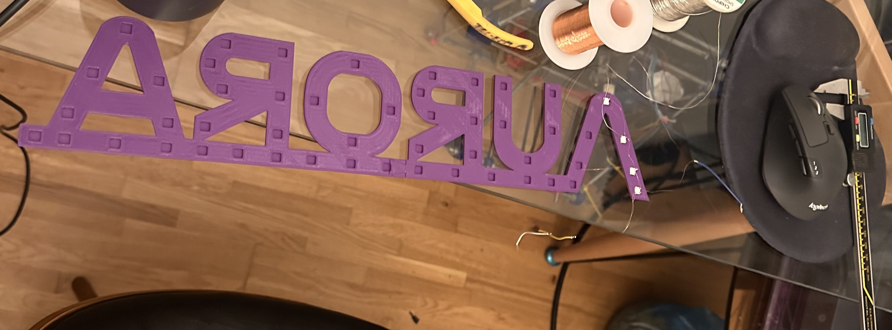
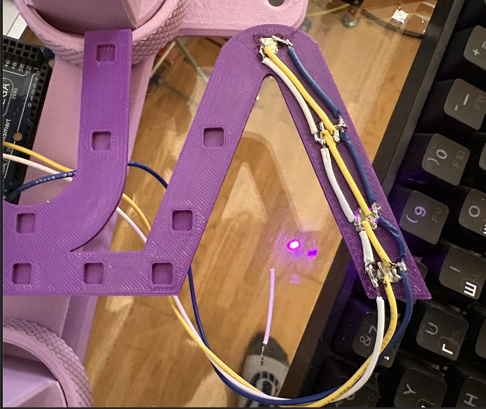

# Aurora Sign
---

## 08/03/26
So, I need a sign that says "Aurora". I thought it would be cool to use the
NASA type font, so I found a site that generates you NASA text, and downloaded
the image. I then imported that to OnShape, and drew around it:

You'll notice that this is only half of the word. I wanted the sign pretty big,
so I made it 400mm, but, my print bed is only 200x200. So, I cut the design, and
added a dove tail joint so that I can join the two parts of the sign together. 

Then, I extruded the part.

 

Then, I needed LED holes! I had 50 of [these](https://uk.rs-online.com/web/p/leds/1808083) RS components LEDS, which are pretty
much neopixel LEDS, but with a slightly different pin out - same library works
with it, though.

Next, it was time to print. I loaded up both parts into OrcaSlicer, and an hour
later I had my two part sign!

There we have it!

## 10/03/26

Okay, so I've been working on this a little, but not much. Tomorrow is the
deadline, so I will have to pick up pace then. For now, I changed tack a little.

 

Above we have two images. I initially started with very thin, 0.8mm, enameled
wire. This was, I thought, a good idea. I could quickly tack them on to each pad
that I needed. It was thin enough to quickly burn through the enamel and solder
to the pad. They'd be thin, won't short out when touching each other, etc. Alas,
it didn't work out that way. I was getting a lot of lack of contact between wire
and pad, they were brittle and would snap, there's no rigidity and so wouldn't
stay in place, etc. etc.. So, I went with the more standard approach - using 22
AWG wire. You can see how I've daisy chained them on the image on the right. I
now have a bunch more to do (but only ~50 LEDs available). I'll get all these
done tomorrow. Currently, the code is very simple and turns on each LED
sequentially, in purple.

I also had an issue with oddities when string the LEDs together. The first would
illuminate fine, but the second, third, forth, would change colour and
eventually start "double counting" as if LEDs $$X$$ and $$X+1$$ were the same.

The issue was that these LEDs are RGB_W_. I forgot about the _W_. Easy fix in
code. I'll probably share the code here when I'm done (simple Arduino C++ code)
and some oscilloscope shots of the data lines out of interest, too. But, only
when I've soldered all those LEDs!

## 13/03/26

<iframe width="560" height="315" src="https://www.youtube.com/embed/Z5suf64Qr8A?si=qyUN-N6rT_Y287wB" title="YouTube video player" frameborder="0" allow="accelerometer; autoplay; clipboard-write; encrypted-media; gyroscope; picture-in-picture; web-share" referrerpolicy="strict-origin-when-cross-origin" allowfullscreen></iframe>

Okay, not too much of an update here -- basically, I have soldered a few more
LEDs and printed a base. The base is very much the same idea as the sign, I used
dove tail joints, and there's a hollow section at the bottom that houses the
arduino. Once I have more LEDs soldered, I'll give a full update, this will
probably be the penultimate update (not much more interesting to update on
until it's all soldered up!)
