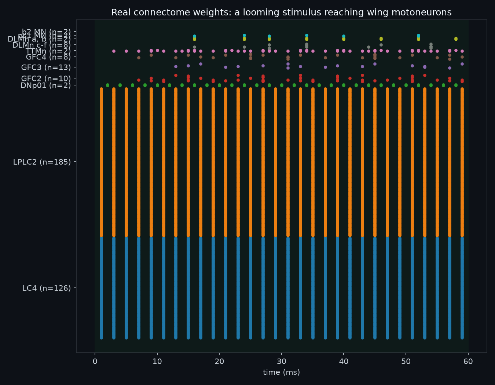
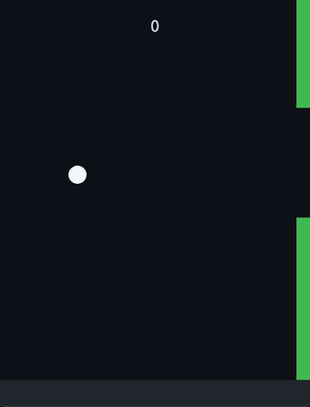
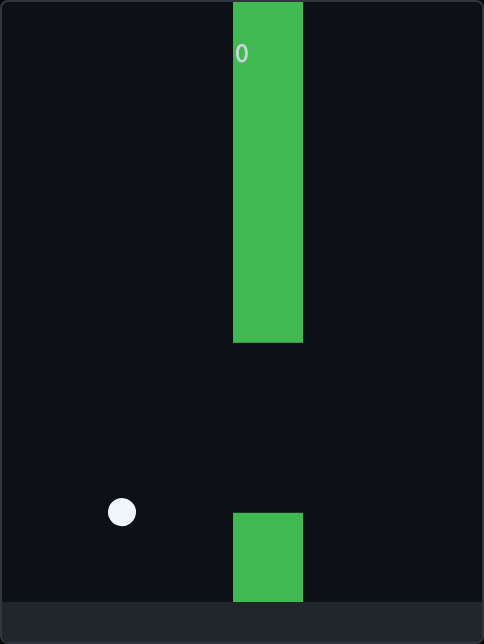
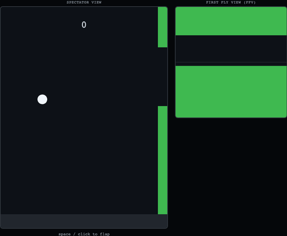
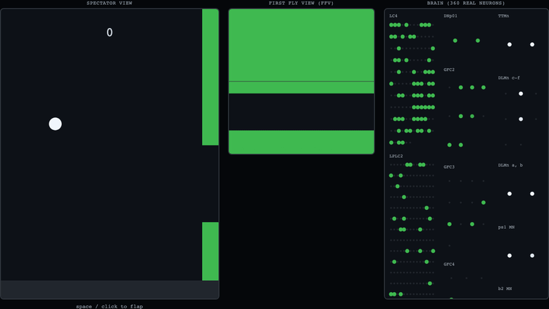
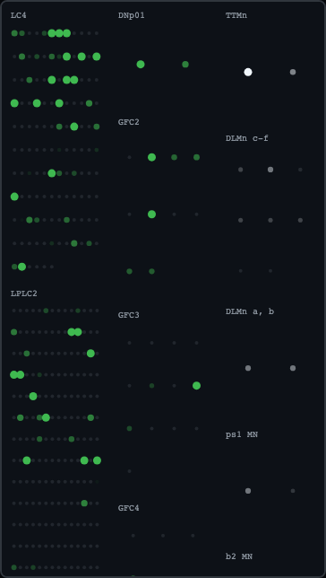
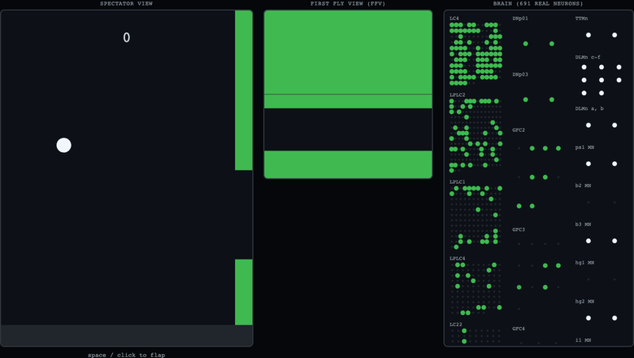

# FlyPyBird
---

## 12/09/26

**The premise:** take a *real* fruit-fly connectome — an actual, measured wiring
diagram of a fly's nervous system — and wire it into a game of Flappy Bird. Game
on the left, the fly's brain lighting up on the right. Can biology dodge the
pipes?

This is a learning project, so I'm writing down what I get *wrong* as much as
what I get right. Day one already corrected a big misconception of mine.

### Misconception #1: a connectome is not a trainable model

I came in picturing this like the old RL-plays-Mario videos: a neural network you
*train* with rewards until it gets good, dopamine for surviving, punishment for
crashing. But a **connectome isn't a network you train — it's frozen anatomy.**
It tells you "neuron A connects to neuron B, this many synapses, excitatory or
inhibitory," and nothing else. It's a wiring diagram, not a set of weights
waiting for gradient descent.

The important consequence, which took a second to sink in: **if I RL-train the
weights "like Mario," I've thrown the fly brain away.** What's left is a generic
neural net that merely happens to be *shaped* like a fly. The entire point — that
real fruit-fly wiring is flying my game — evaporates the moment I start tuning
the synapses.

So the dopamine/reward idea isn't dead, it's just *demoted*. Real flies do learn
via dopamine, at specific synapses in a structure called the **mushroom body** —
but modelling that plasticity is the hard, final milestone, not the MVP.

### The MVP is a fly that REACTS, not one that LEARNS

Here's the reframe. I don't need learning to get a fly through a pipe. Flies have
**dedicated collision-detector neurons** — lobula cells called `LC4` and `LPLC2`
— that fire when something *looms* (grows) in the visual field and drive an
escape/steering response. So I don't hand-wire "walls are scary." I render the
wall so it **looms** in the fly's view, feed it into the real optic-lobe circuit,
and the avoidance is *the actual neurons firing*.

MVP loop: **wall looms in the fly's view → real circuit fires → read a motor
neuron → fly goes up or down.** No learning anywhere. Get the reflex working
end-to-end first.

### A question I got stuck on: do we *discover* which neurons fire, or is it known?

> If we put the looming wall in, do we then *see* which neurons fire for the
> wings — or is that already known for flies?

Both — and the overlap is the whole project:

- **Known (anatomy + literature):** the cast of characters. The fly escape/flight
  pathway is among the best-studied circuits in neuroscience. The connectome
  hands me the wiring explicitly — the looming detectors (`LC4`, `LPLC2`), the
  **Giant Fiber** (`DNp01`, the famous "escape command" neuron that bridges brain
  to nerve cord), and the ~few dozen **wing motoneurons**. I don't have to guess
  where to look.
- **Observed (run the sim):** the *dynamics*. Given *my* wall, at *my* speed, with
  *my* pixel encoding, which of those neurons fire, how hard, in what order — that
  only emerges when I actually run the simulation. That "watch them light up" step
  doubles as my correctness check: loom a wall, and if `LC4 → LPLC2 → Giant Fiber`
  fire in sequence, I've reproduced textbook biology and know my encoding is right.

So I'm not blindly probing — I'm reproducing a known circuit and then watching it
play my game.

### Which fly? The "male CNS" and why it's the harder-but-better choice

The neurons that flap the wings live in the **VNC** (the fly's "spinal cord"), not
the brain — but vision happens in the brain's optic lobes. So the loop *eyes →
wings* has to cross from brain into VNC, and that crossing is done by **descending
neurons**. I went with the **complete male central nervous system connectome**
([Cell, 2026](https://www.cell.com/cell/fulltext/S0092-8674(26)00942-6), ~166k
neurons) because it's a *single connected graph* covering optic lobes + brain +
VNC — my exact loop exists end to end in one dataset. The male VNC on its own
([MANC](https://www.janelia.org/project-team/flyem/manc-connectome), ~23k neurons)
is on [neuPrint](https://neuprint.janelia.org) and downloadable, with the wing
motoneurons already identified.

The catch: there's no ready-made real-time simulator for it (unlike the FlyWire
brain, which has an in-browser one). So I'll **build my own small
leaky-integrate-and-fire sim over a subset** — the vision→escape→flight pathway,
a few thousand neurons, not all 166k. More work, but it's the most educational
part of the whole thing. Stack: **Python** — neuPrint client for the data,
Brian2/NumPy for the simulation.

### The roadmap (each milestone = a checkpoint here)

- **M0** — repo + this post. ✅
- **M1** — *spike the crux:* pull the escape-circuit subgraph, prove I can inject
  input into one neuron and watch it drive another, at game-loop speed. (This is
  the real risk, so it goes first — before any game polish.)
- **M2** — reactive Flappy Bird: scrolling map, gravity, player-controlled first.
- **M3** — the two views: spectator side-view **+** First-Fly-View (looming
  top/bottom bars with a gap).
- **M4** — wire the circuit in: fly-view → visual neurons; motor neuron → up/down.
- **M5** — split-screen brain viz: neurons light up live.
- **M6** — *later:* learning via mushroom-body/dopamine plasticity.
- **M7** — deploy to a watchable site.

Next up: M1, the spike. Gifs to follow once there's something moving.

---

### A glossary, and a live toy neuron circuit you can poke at

Before the spike, it's worth nailing down the vocabulary I've been throwing
around — and, since this is a learning project, actually *building* one of the
smallest possible pieces of it so it stops being an abstraction.

**[Connectome](https://en.wikipedia.org/wiki/Connectome)** — a complete wiring
diagram of a nervous system: every neuron, and every synapse connecting it to
every other neuron, with a strength (synapse count) and a sign. Nothing about
*time* or *activity* is in it — it's a parts list and a netlist, like a circuit
schematic with no power connected yet.

**[Neuron](https://en.wikipedia.org/wiki/Neuron)** — the basic signalling cell.
It receives input from other neurons at synapses, and if that input pushes its
internal voltage high enough, it fires.

**[Spike / action potential](https://en.wikipedia.org/wiki/Action_potential)**
— the brief, stereotyped electrical pulse a neuron fires once its voltage
crosses a threshold. This is the unit of communication in the brain — neurons
don't send graded voltages to each other, they send spikes (or don't).

**[Chemical synapse](https://en.wikipedia.org/wiki/Chemical_synapse), excitatory
vs. inhibitory** — the connection between two neurons, and its *sign*.
Excitatory synapses push the receiving neuron's voltage **up** (more likely to
spike); inhibitory synapses push it **down** (less likely). The connectome
records which is which for every connection — this is not something we get to
choose, it's measured.

**[Descending neuron (DN)](https://en.wikipedia.org/wiki/Efferent_nerve_fiber)**
— a neuron whose cell body and dendrites sit in the brain, but whose axon runs
*down* into the ventral nerve cord (VNC) — literally the wire carrying a
"decision" made in the brain out to the motor circuits that act on it. It's the
bridge between seeing and doing. The
[Giant Fiber (`DNp01`)](https://www.ncbi.nlm.nih.gov/pmc/articles/PMC10263144/)
is the most famous example in flies — a single spike in it is enough to trigger
the entire jump-and-flight escape sequence.

**A "stereotyped" brain** — the surprising fact that makes any of this possible:
individual neurons in a fly are *anatomically reproducible* across different
flies of the species. `DNp01` isn't "a Giant-Fiber-like neuron this particular
fly happened to grow" — it's the same identifiable cell, in the same place,
doing the same job, in (almost) every fly. That's precisely how neurons in the
[MANC](https://www.janelia.org/project-team/flyem/manc-connectome) dataset
(imaged from one fly) can be matched by name to neurons in the male CNS dataset
(imaged from a *different* fly) — you're not matching serial numbers, you're
matching recognisable characters.

**The looming detectors** — the actual visual cells this project hinges on:
[`LC4`](https://www.virtualflybrain.org/term/lc4-fbbt_00003874/) and
[`LPLC2`](https://www.virtualflybrain.org/term/lplc2-optic-glomerulus-fbbt_00052656/),
lobula neurons that respond selectively to something expanding in the visual
field — i.e. an object on a collision course — and synapse directly onto the
Giant Fiber.

#### A tiny leaky-integrate-and-fire circuit, running live

Here's the smallest circuit that actually demonstrates the ingredients above:
**leak, integrate, fire, and signed synapses.** Four neurons:

- **N0 (sensory)** — the one you stimulate with the button below.
- **N1 (fast excitatory relay)** — gets excited by N0, quickly.
- **N2 (slow inhibitory relay)** — also gets excited by N0, but reacts more
  sluggishly, and its output is *inhibitory*.
- **N3 (motor)** — our stand-in for "the wing neuron." It gets excited by N1
  and inhibited by N2. Its firing rate is the number I'd eventually read out
  as "how hard to flap."

Watch what happens as you turn the stimulus up: at low strength, nothing
downstream fires at all. Push past a threshold and N1's *fast* excitation
reaches N3 before N2's *slow* inhibition has caught up — so N3 gets a real,
sustained response instead of being cancelled out immediately. This
"fast-excite / slow-inhibit" motif is a real, common one in real nervous
systems for exactly this reason: it lets a circuit respond to changes rather
than just sitting at some cancelled-out steady state — which is the whole game
when the thing you actually care about is a wall that's *looming*, not a wall
that's simply *there*.

To be clear about what this toy is **not**: it is not LC4/LPLC2/the Giant Fiber,
the constants aren't fit to any biological data, and it's simulated with a
plain fixed-step Euler integrator, not anything resembling Brian2. It exists
purely so the words "leak," "integrate," "fire," "excitatory," and "inhibitory"
have a picture attached to them before M1.

<div class="lif-demo">
  <canvas id="lifCanvas" width="700" height="340"></canvas>
  <div class="lif-controls">
    <button id="lifStimBtn">⚡ Stimulate N0</button>
    <label>Strength
      <input type="range" id="lifStrength" min="0" max="60" step="1" value="35">
      <span id="lifStrengthVal">35</span>
    </label>
  </div>
  <div class="lif-readout">
    N3 (motor) firing rate — the "wing neuron" proxy:
    <strong id="lifRate">0.0 Hz</strong>
  </div>
</div>

<style>
.lif-demo { border:1px solid #30363d; border-radius:8px; padding:1rem; margin:1.5rem 0; background:#0d1117; }
.lif-demo canvas { width:100%; max-width:700px; display:block; margin:0 auto; background:#05070a; border-radius:6px; }
.lif-controls { display:flex; gap:1.25rem; align-items:center; justify-content:center; margin-top:0.75rem; flex-wrap:wrap; color:#c9d1d9; font-size:0.9rem; }
.lif-controls button { background:#238636; color:#fff; border:none; padding:0.5rem 1rem; border-radius:6px; cursor:pointer; font-size:0.9rem; }
.lif-controls button:hover { background:#2ea043; }
.lif-readout { text-align:center; margin-top:0.6rem; color:#c9d1d9; font-size:0.95rem; }
.lif-readout strong { color:#58a6ff; }
</style>

<script>
(function(){
  const canvas = document.getElementById('lifCanvas');
  const ctx = canvas.getContext('2d');

  const vRest = -70, vThresh = -50, vReset = -65, vSpike = 10;

  function makeNeuron(name, x, y, tau) {
    return { name, x, y, tau, v: vRest, Iinj: 0, wasSpike: false, spikedThisStep: false, history: [] };
  }

  const N0 = makeNeuron('N0 sensory',   110, 170, 12);
  const N1 = makeNeuron('N1 excitatory', 380, 90,  8);
  const N2 = makeNeuron('N2 inhibitory', 380, 250, 30);
  const N3 = makeNeuron('N3 motor',      620, 170, 12);
  const neurons = [N0, N1, N2, N3];

  // from -> to, weight (mV kick on arrival, sign = excitatory/inhibitory), delay (ms)
  const synapses = [
    { from: N0, to: N1, weight: 22,  delay: 4 },
    { from: N0, to: N2, weight: 12,  delay: 4 },
    { from: N1, to: N3, weight: 20,  delay: 6 },
    { from: N2, to: N3, weight: -22, delay: 6 },
  ];

  let pending = [];   // in-flight synaptic events: { time, synapse }
  let inFlightDots = []; // for drawing: { synapse, tStart, tArrive }
  let simTime = 0;
  let n3SpikeTimes = [];
  let stimUntil = -1;
  let strength = 35;

  function stepSim(dt) {
    simTime += dt;
    N0.Iinj = (simTime <= stimUntil) ? strength : 0;

    // deliver any synaptic events whose arrival time has passed
    pending = pending.filter(ev => {
      if (ev.time <= simTime) { ev.synapse.to.v += ev.synapse.weight; return false; }
      return true;
    });

    for (const n of neurons) {
      if (n.wasSpike) { n.v = vReset; n.wasSpike = false; }
      // the LIF equation: leak back to rest, plus injected current, scaled by dt/tau
      n.v += ((vRest - n.v) + n.Iinj) * (dt / n.tau);
      n.v = Math.max(n.v, -95);
      n.spikedThisStep = false;
      if (n.v >= vThresh) { n.v = vSpike; n.spikedThisStep = true; n.wasSpike = true; }
      n.history.push(n.v);
      if (n.history.length > 260) n.history.shift();
    }

    for (const s of synapses) {
      if (s.from.spikedThisStep) {
        pending.push({ time: simTime + s.delay, synapse: s });
        inFlightDots.push({ synapse: s, tStart: simTime, tArrive: simTime + s.delay });
      }
    }
    inFlightDots = inFlightDots.filter(d => d.tArrive > simTime);

    if (N3.spikedThisStep) n3SpikeTimes.push(simTime);
    n3SpikeTimes = n3SpikeTimes.filter(t => simTime - t < 1000);
  }

  function colourForV(v) {
    const f = Math.max(0, Math.min(1, (v - vRest) / (vThresh - vRest)));
    const r = Math.round(40 + f * 200), g = Math.round(80 + f * 100), b = Math.round(160 - f * 120);
    return `rgb(${r},${g},${b})`;
  }

  function draw() {
    ctx.clearRect(0, 0, canvas.width, canvas.height);

    for (const s of synapses) {
      ctx.strokeStyle = s.weight > 0 ? '#3fb950' : '#f85149';
      ctx.lineWidth = Math.max(1, Math.abs(s.weight) / 22 * 3);
      ctx.beginPath();
      ctx.moveTo(s.from.x, s.from.y);
      ctx.lineTo(s.to.x, s.to.y);
      ctx.stroke();
    }
    for (const d of inFlightDots) {
      const f = (simTime - d.tStart) / (d.tArrive - d.tStart);
      const x = d.synapse.from.x + (d.synapse.to.x - d.synapse.from.x) * f;
      const y = d.synapse.from.y + (d.synapse.to.y - d.synapse.from.y) * f;
      ctx.fillStyle = d.synapse.weight > 0 ? '#3fb950' : '#f85149';
      ctx.beginPath(); ctx.arc(x, y, 4, 0, 7); ctx.fill();
    }

    for (const n of neurons) {
      const spiking = n.v === vSpike;
      ctx.beginPath();
      ctx.arc(n.x, n.y, 26, 0, 7);
      ctx.fillStyle = spiking ? '#f0f6fc' : colourForV(n.v);
      if (spiking) { ctx.shadowColor = '#f0f6fc'; ctx.shadowBlur = 20; }
      ctx.fill();
      ctx.shadowBlur = 0;
      ctx.strokeStyle = '#30363d'; ctx.lineWidth = 2; ctx.stroke();

      ctx.fillStyle = '#8b949e'; ctx.font = '11px monospace'; ctx.textAlign = 'center';
      ctx.fillText(n.name, n.x, n.y - 36);

      const hw = 42, hh = 24, hx = n.x - hw / 2, hy = n.y + 40;
      ctx.strokeStyle = '#21262d'; ctx.strokeRect(hx, hy, hw, hh);
      ctx.beginPath();
      n.history.forEach((v, i) => {
        const x = hx + (i / 260) * hw;
        const y = hy + hh - ((v - (-95)) / (vSpike - (-95))) * hh;
        i === 0 ? ctx.moveTo(x, y) : ctx.lineTo(x, y);
      });
      ctx.strokeStyle = '#58a6ff'; ctx.lineWidth = 1; ctx.stroke();
    }
  }

  let lastT = performance.now();
  function frame(now) {
    let elapsed = Math.min(now - lastT, 50);
    lastT = now;
    while (elapsed > 0) { stepSim(1); elapsed -= 1; }
    draw();
    document.getElementById('lifRate').textContent = n3SpikeTimes.length.toFixed(1) + ' Hz';
    requestAnimationFrame(frame);
  }
  requestAnimationFrame(frame);

  const slider = document.getElementById('lifStrength');
  const sliderVal = document.getElementById('lifStrengthVal');
  slider.addEventListener('input', () => { strength = +slider.value; sliderVal.textContent = slider.value; });
  document.getElementById('lifStimBtn').addEventListener('click', () => { stimUntil = simTime + 300; });
})();
</script>

<details markdown="1">
<summary>Show the code</summary>

The block above is the entire demo — no libraries, just a canvas and this
loop. The core of it is the LIF update:

```js
// the LIF equation: leak back to rest, plus injected current, scaled by dt/tau
n.v += ((vRest - n.v) + n.Iinj) * (dt / n.tau);

if (n.v >= vThresh) {
  n.v = vSpike;        // fire
  n.spikedThisStep = true;
}
// ...next step: n.v = vReset
```

And synapses are just delayed voltage kicks, positive for excitatory, negative
for inhibitory, queued and delivered after their conduction delay:

```js
if (s.from.spikedThisStep) {
  pending.push({ time: simTime + s.delay, synapse: s });
}
// later, once time has passed:
if (ev.time <= simTime) { ev.synapse.to.v += ev.synapse.weight; }
```

That's it — the whole vocabulary (leak, integrate, fire, excitatory/inhibitory
synapse, conduction delay) in about 40 lines. M1 is the same idea, scaled up
to a few thousand real neurons with real weights instead of four made-up ones.

</details>

---

## M1 — the spike: real fly neurons, real weights, real cascade

Time to find out if the actual risky idea holds up: can I pull real
per-neuron wiring out of a published connectome and run a fast-enough
simulation over it? No game yet, no vision yet — just: inject current into
real looming-detector neurons, see if it reaches real motoneurons.

### The data was easier to get than expected

The full male CNS connectome — 166k neurons — turns out to be sitting in a
[public Google Cloud bucket](https://storage.googleapis.com/storage/v1/b/flyem-male-cns/o),
no login, no API token, just flat files. I only needed three of them:
`body-annotations` (what type is each neuron?), `body-neurotransmitters`
(what does each neuron release — tells us excitatory vs. inhibitory), and
`connectome-weights` (25.5 **million** directed, weighted synaptic edges,
502MB as a feather file, downloaded in under a minute).

### Finding the real neurons

First sanity check: do the neurons the literature talks about actually exist
in this dataset, under the names I expect? Searching the annotations by
`type`:

- **`DNp01`** — 2 neurons (left + right Giant Fiber). ✅
- **`LC4`** — 126 neurons. **`LPLC2`** — 185 neurons. ✅
- Searching for wing/flight motoneurons turned up exactly the classic names
  from decades of fly physiology, verbatim: `b1 MN`, `b2 MN`, `b3 MN`,
  `i1 MN`, `i2 MN`, `iii1 MN`, `iii3 MN`, `hg1–4 MN`, `tpn MN`, `ps1 MN`
  (wing steering muscles), `DLMn` (flight power muscle), `TTMn`
  (tergotrochanteral — the jump muscle).

Real neurons, real names, right where the textbooks say they should be.

### Querying the actual wiring, not assuming it

Next: does `LC4`/`LPLC2` really synapse onto `DNp01`? Querying the weights
table directly — yes. 126 `LC4` neurons and 185 `LPLC2` neurons each send a
real, weighted synapse onto the Giant Fiber, exactly matching the published
circuit.

Then I asked the obvious next question: does `DNp01` synapse directly onto
any wing motoneuron? **Zero edges.** Not a bug — this matches known biology,
the Giant Fiber doesn't wire straight to most of the wing muscles. So
instead of assuming an intermediate neuron from memory, I just asked the data
what `DNp01` *does* connect to, sorted by total synaptic weight. Top hits:
`GFC2`, `GFC3`, `GFC4` (literally named "Giant Fiber Circuit" interneurons)
and `TTMn` directly. Querying `GFC2/3/4`'s own downstream targets turned up
`TTMn`, `DLMn`, `ps1 MN`, `b2 MN` — the bridge to the wing muscles, discovered
from the data itself rather than assumed from a paper.

Checking neurotransmitter predictions for the whole pathway — `LC4`, `LPLC2`,
`DNp01`, `GFC2/3/4` are all acetylcholine, i.e. every synapse here is
**excitatory**. This particular pathway is a pure, fast, feedforward relay —
consistent with the Giant Fiber's whole reason for existing, which is speed,
not computation.

### A bug that taught me something about LIF models

First sim run: `DNp01` fired beautifully, driven by real pooled input from
`LC4`/`LPLC2` — but nothing downstream ever fired, no matter how hard I drove
it. Tracing the voltage step by step, I'd folded the synaptic kick into the
same `dt/tau`-scaled leak equation as the membrane leak:

```python
v += ((V_REST - v) + i_inj + syn_input) * (DT / TAU)
```

A 21mV synaptic kick was getting divided down to a ~1.4mV nudge every step,
because I was treating it like a continuous injected current rather than a
discrete event. This is exactly the mistake the toy JS demo above *doesn't*
make — there, synaptic arrivals are direct, un-scaled voltage jumps,
separate from the leak. Fixing it to match:

```python
v += ((V_REST - v) + i_inj) * (DT / TAU)   # leak + injected current: continuous
v += prev_spiked @ W * SYN_SCALE            # synaptic arrival: instantaneous
```

immediately fixed the cascade. A synapse isn't part of the membrane's leak
dynamics — it's a discrete event, a burst of neurotransmitter opening
channels, and it should hit the voltage as a jump, not get smeared through
the leak's time constant.

### A second surprise: this brain is recurrent, even locally

With the bug fixed, everything fired — and never stopped, long after the
stimulus ended. Turned out 20,254 of the 21,151 edges I'd pulled between my
11 neuron types were **lateral connections within `LC4`/`LPLC2` itself** —
looming detectors talking to each other, not to the Giant Fiber. Real
biology, and a legitimate thing to model eventually, but it turned my
"stimulus in, cascade out" test into a self-sustaining loop. For this first
spike I restricted the graph to the specific feedforward edges the escape
circuit is known to use — 473 edges instead of 21k — and the runaway
disappeared.

### The result

 DNp01 -> GFC2/3/4 -> wing/jump motoneurons" style="max-width:100%; border-radius:6px;">

Driving `LC4`/`LPLC2` with a sustained current produces a clean cascade, in
the correct biological order: looming detectors fire, the Giant Fiber fires
about a millisecond later, `GFC2/3/4` and the jump muscle (`TTMn`) follow a
few milliseconds after that, and the flight-power muscles (`DLMn`) and one
steering muscle (`ps1 MN`) fire last. That ordering — and the few-millisecond
gaps between each stage — lines up with published Giant-Fiber escape
latencies, which is a real (if informal) correctness check: I didn't tune
this to match, it just came out of running real weights through a generic
LIF equation.

One honest miss: `b2 MN` (a wing steering muscle) never fires, at any
stimulus strength I tried. Not a bug — its real incoming synaptic weight from
`GFC2` is far weaker than `ps1 MN`'s or `DLMn`'s in this dataset, so under a
generic, untuned LIF model it just doesn't get enough drive. A limitation to
note, not paper over.

### Does it run fast enough for a game?

This was the actual point of M1. Simulating 400ms of activity across all 360
neurons took **6.1–6.5ms of wall-clock time**, on plain NumPy, one CPU core,
no GPU, no Brian2. That's roughly **65x faster than real-time** — the sim can
run comfortably inside a 60fps game loop with room to spare, even before any
optimisation.

### What's real here vs. what I chose

Worth being precise about this, since it's easy to blur: the connectome gave
me the **wiring** — which neurons exist, which ones connect to which, how
many synapses, and (via neurotransmitter) the sign. It did **not** give me
membrane time constants, firing thresholds, or a physical unit for "synaptic
weight in millivolts" — `TAU = 15ms` and `SYN_SCALE = 0.3` are modelling
choices I made, not numbers read out of the data. The realistic-looking
propagation *order* and *cascade structure* come from the real graph; the
exact firing rates and thresholds come from generic LIF defaults. (The
proper way to do this — fitting these constants against real calcium-imaging
data — is what [Shiu et al. 2024](https://www.nature.com/) actually did for
their whole-brain model. Worth revisiting once the game needs to feel right,
not just work.)

**M1: done.** Real neurons, real weights, real cascade, real-time-capable.
Next: M2 — an actual, playable, non-neural Flappy Bird, so there's a game for
the brain to eventually fly.

---

## M2 — a real, playable Flappy Bird (no brain yet)

Deliberately the least interesting milestone, and that's the point: before any
neuroscience touches the controls, there needs to be an actual game — gravity,
a scrolling pipe gap, collision, score, death, restart — that a keyboard can
play correctly. Get the mechanics right and boring first, so that when M4
swaps the keyboard for a wing motoneuron's firing rate, exactly one thing
changes and everything else can be trusted.

It's a small canvas + vanilla JS page, live in the repo at `web/`:



Physics is the standard arcade recipe, not a real flight model — gravity pulls
a velocity down every frame, a flap *sets* (not adds to) that velocity upward,
position integrates from velocity:

```js
bird.vy += GRAVITY * dt;
bird.y += bird.vy * dt;
// on flap: bird.vy = FLAP_VY;  (a fixed value, not cumulative --
// otherwise holding flap would let the bird accelerate upward forever)
```

One structural choice made deliberately, with M4 already in mind: `update()`
(physics), `flap()` (the single entry point for "go up now"), and `draw()`
(rendering) are three separate functions, and nothing in `update()` cares
*where* a call to `flap()` came from. Right now it's a mouse click or a
spacebar. In M4 it'll be "the wing motoneuron's firing rate crossed a
threshold this frame." The game doesn't need to know the difference — that
separation is the whole point of building the game before the brain touches
it.

### Verifying it for real

Console-error-free isn't the same as *correct* — a page can render its shell
while the actual mechanics are silently broken. So this got driven headlessly
with Playwright rather than just eyeballed: launched a local server, clicked
into the canvas like a player would, and — rather than trust a screenshot's
rendered score digit — read the game's actual `score`/`state`/`pipes`
variables directly out of the page after each flap. That caught the thing a
screenshot alone would have hidden: confirmed score increments at exactly the
frame a pipe's trailing edge passes the bird's x-position, confirmed a
collision correctly flips the state to `dead` and freezes physics, and
confirmed clicking on the death screen correctly resets bird position, pipes,
and score back to a fresh `ready` state.

**M2: done.** A boring, correct, keyboard-playable Flappy Bird. Next: M3 —
the two views. A spectator side-view of the game as normal, plus First-Fly-View
— the same wall, rendered as the fly would actually see it: looming bars from
ceiling and floor, closing in.

---

## M3 — First-Fly-View: turning distance into an angle

The spectator view shows a pipe as a green rectangle some number of pixels
away. A fly doesn't experience "pixels away" — it experiences an *angle*. A
wall far away takes up a small slice of your field of view; the same wall up
close fills it. That growth in angular size **is** looming, and it's the thing
that actually needs to reach the visual neurons — not a rescaled copy of the
side-view sprite.

So FFV isn't a re-skin, it's a real (if simplified) perspective projection.
For each edge of the gap, given how far away it is (depth) and how far above
or below the bird's eye it is (height), compute the elevation angle from the
bird to that edge, then map that angle onto a row of the FFV canvas:

```js
function elevationDeg(relY, depth) {
  return Math.atan2(-relY, depth) * (180 / Math.PI);
}
function elevationToPixelY(elevDeg) {
  const frac = (elevDeg + FFV_FOV_DEG / 2) / FFV_FOV_DEG; // 0=bottom of FOV, 1=top
  return (1 - frac) * FFV_H;
}
```

`FFV_FOV_DEG` (the fly's assumed forward field of view, currently 100°) is
another one of those honest modelling choices — nothing in the connectome
tells you a field of view, that's a property of the eye's optics, not the
wiring.

### Checking it actually looms, not just looks plausible

Three cases, checked by actually flying the game (headlessly, reading real
pipe/bird state, not just eyeballing a screenshot):

**Far away** — the gap is a thin dark sliver between two green bars. A distant
wall subtends a small angle, exactly as it should:


**On a clean approach through the gap** — the forward view opens up almost
entirely, because *if you're aimed at the gap*, more and more of your straight-ahead
vision is "open sky" as you get closer, and the solid parts of the wall recede
toward your periphery — genuinely how it should feel to fly through an aperture
you're lined up on.

**On an actual collision course** — this is the case that matters, and it's
the one that convinced me the projection is doing something real, not just
plausible-looking: I deliberately flew the bird onto a collision path with the
bottom pipe. Side view and FFV at the same instant:




The bottom wall doesn't just get "bigger" — it comes to dominate almost the
entire forward view, because that's genuinely what's about to fill the fly's
eyes. That asymmetry, appearing automatically from the geometry rather than
being hand-coded as "if about to crash, show more red," is the whole point of
doing this as a real projection instead of a fake one.

### A question that exposed a real gap in the plan

> It might not understand whether to fly up or down, if there's no way to
> tell which wall is the ceiling and which is the floor.

This is a genuine hole, not a non-issue — and it's worth being honest about
exactly where it bites. FFV renders correctly either way, but M1's spike test
drove *every* `LC4`/`LPLC2` neuron with the *same* pooled current, as one
undifferentiated "something is looming" signal. Fed that way, the circuit
really can't tell top from bottom — direction information gets thrown away
before it even reaches the Giant Fiber.

The fix is real biology, not a patch: the fly's visual system is
**retinotopic** — `LC4` isn't one neuron, it's ~126 of them, each wired to a
*different small patch* of the visual field, tiled like pixels. "Up" and
"down" aren't a property of the signal, they're a property of *which neuron*
fires. A real fly knows a wall is above it because the LC4 cells whose
receptive field points upward are the ones spiking — not because there's a
separate "direction" signal riding alongside.

The genuinely good news: this mapping isn't something to invent, it's sitting
in the data I already downloaded. The annotation table has
`assignedOlHex1`/`assignedOlHex2` columns — the actual hexagonal-lattice
coordinates of each neuron's position in the optic lobe, i.e. its address in
the retina. M4's real job, then, isn't "drive the looming neurons" (M1 already
did that, badly) — it's: for each row of the FFV canvas, look up which
`LC4`/`LPLC2` neurons' hex coordinates correspond to that vertical position,
and drive *only those*. Top-wall-looming and bottom-wall-looming then
genuinely activate different populations, and that distinction has a chance
of surviving all the way down to which way the wings push.

**M3: done** — a real perspective projection, verified against a genuine
collision case, plus a clear-eyed look at the one thing it doesn't yet
solve. Next: M4 — wire FFV into the real circuit properly this time,
retinotopically, and read a motor neuron out the other end.

---

## M4 — closing the loop, and finding out the circuit can't steer

This is the milestone where the game and the brain actually meet: FFV drives
real neurons, real neurons drive the flap. It's also the milestone that
forced the most honesty, because the closed loop kept breaking in ways that
turned out to be genuinely informative rather than just bugs to paper over.

### First: is there a real steering pathway, or not?

Before wiring anything, I went back to the data to actually resolve the
question from M3 — is the "top vs bottom" ambiguity fixable by finding a
*different*, more direction-preserving route through the connectome, rather
than accepting the Giant Fiber's blindness? Three checks, capped deliberately
so this didn't turn into an open-ended search:

1. **Direct 1-hop:** does `LC4`/`LPLC2` synapse straight onto any wing
   motoneuron, bypassing `DNp01` entirely? **Zero edges.**
2. **A selectivity scan:** split `LC4`/`LPLC2` into upper-field and
   lower-field halves (by soma position) and compare, for *every* downstream
   target, how lopsided upper vs. lower input is. Most big targets are
   near-identical between halves — but one descending neuron, `DNp71`,
   showed real selectivity (upper-preferring, 0.31 on a -1..1 scale). A
   genuine lead.
3. **Traced it:** `DNp71`'s own downstream targets are other descending
   neurons and unverified VNC interneurons — no path to a wing motoneuron
   within a hop I could confirm.

So: no. Within what's actually reconstructed and confirmable in this data,
**there is no directional pathway to the wing muscles.** Every route pools
through `DNp01`'s two neurons (or its immediate interneurons) before reaching
any motor output, and that convergence is where "which side is the wall on"
gets thrown away — for good, not just in my simplified model of it. This
means the retinotopic input fix from M3 is still necessary (it's really where
the fly's own eye is looking) but it's **not sufficient** — the circuit
itself is a panic button, not a steering wheel. I'm building M4 to reflect
that finding, not to route around it.

### Building the loop: the same LIF sim, now live in the browser

The M1 Python sim gets ported to run directly in-browser (`web/brain.js`) —
same 360-neuron subgraph, same equations, exported once as a static JSON so
no server is needed at runtime (a deliberate choice: the eventual goal is a
site people can just load and watch).

FFV's geometry decides which `LC4`/`LPLC2` neurons get driven: a neuron only
"sees wall" if the wall is actually within its own assigned patch of visual
field. But **which neuron corresponds to which patch?** The connectome's
proper answer — `assignedOlHex1`/`assignedOlHex2`, the real optic-lobe
hex-lattice coordinates I mentioned in M3 — turned out to be entirely empty
for `LC4`/`LPLC2` (populated only for a different neuron class). The best
data actually available per neuron is its **soma's 3D position**, so that's
the fallback — with a catch: soma x-coordinate isn't a smooth gradient across
the population, it's **bimodal**, two dense clusters with a dead zone between
them. A plain linear rescale to a -50°..+50° field of view left the entire
forward-looking fovea with *zero* assigned neurons — the exact region that
matters most, empty by construction. The fix: rank each neuron by its soma
position instead of using the raw value, spreading them uniformly across the
field regardless of the underlying clustering. Worth being honest about what
this is: a bigger liberty than picking `TAU` or `SYN_SCALE` — it doesn't just
choose a number, it reshapes the mapping.

### Two runaway-behavior bugs, both found by actually running it

Getting a stimulus number and a trigger threshold that produce *sensible*
behavior, rather than a degenerate one, took two rounds of "run it, watch it
fail in a very specific way, understand why":

**Bug 1 — one neuron can fake convergence.** First pass used a strong drive
(160, the value M1 needed to force the *entire* 300+ neuron population to a
full cascade). But feeding that same strength to individual retinotopic
neurons meant a *single* driven neuron — one, alone — would fire on almost
every timestep and, through sheer repetition, eventually drag `DNp01` over
threshold anyway. That defeats the actual point of pooling: the escape
circuit is supposed to require *real, simultaneous* agreement from many
looming detectors, not get fooled by one neuron shouting for a while. Fix:
drop the per-neuron drive down near the ~25–30 M1 identified as the minimum
for a *single* neuron to spike at all — enough to participate, not enough to
dominate alone.

**Bug 2 — a throttle disguised as a tap.** Even after fixing that, the bird
rocketed straight into the ceiling in well under a second, every single time.
Tracing it: my code called `flap()` on *every frame* the alarm condition held
true. Since `flap()` **sets** velocity (correctly, from M2 — that's how a
real tap works), calling it every frame while alarmed doesn't produce a tap,
it produces *continuous thrust* — and because going up moves the bird further
into the top wall's angular territory, that's a straight positive-feedback
line into the ceiling. A spike burst is a discrete event, not a held-down
key; the fix was to trigger `flap()` only on the alarm's **rising edge** —
the same distinction between a keypress and a key-hold a human player uses
without thinking about it.

### The honest result



With both fixes in, I ran 8 brain-controlled trials against 8 "never flap"
baseline trials:

| | avg. survival | typical cause of death |
|---|---|---|
| brain control | ~1250ms | mixed: ground, and occasionally the bottom pipe |
| no input at all | ~900ms | always the ground (pure gravity fall) |

A real, if modest, improvement — about 39% longer survival than doing
nothing. That's roughly what I'd predict given everything above: the circuit
*reacts* — it isn't random, it isn't inert, real spikes from real weights are
turning into real flaps — but it can't tell "wall above, don't flap" from
"wall below, flap now." It occasionally still dies flying into a ceiling it
should have avoided, because the wing motoneurons genuinely don't carry that
information. This is the finding the whole milestone was actually testing
for, and it came back a clean, quantified, unglamorous yes: **the Giant
Fiber pathway is a real, working panic button — and a panic button is not a
pilot.**

**M4: done.** The loop is closed end-to-end: real visual input, into real
neurons, through real weights, out to a real motor action, with the ceiling
on its ambition set honestly by what the anatomy actually supports. Next:
M5 — visualize the brain itself, live, split-screen next to the game, so the
"panic button" firing (or not) is something you can actually watch happen.

---

## M5 — watching the panic button

Everything from M4 was already real — real neurons, real weights, real
spikes — but invisible. The brain was a black box quietly deciding to flap
or not. M5 is purely about making that visible: a third panel, live,
showing all 360 neurons as a small circuit diagram, each one flashing the
instant it spikes and fading over the following 300ms.



### Laying out 360 real neurons so it's actually legible

We don't have 3D positions for most of these neurons (soma coordinates
exist for `LC4`/`LPLC2`, but not for `DNp01`, `GFC2–4`, or the motoneurons),
so this isn't an anatomical map — it's a **circuit diagram**, and I laid it
out that way on purpose: three columns, left to right, in the same order the
real signal actually flows — visual input (`LC4`, `LPLC2`) → the Giant Fiber
circuit (`DNp01`, `GFC2/3/4`) → wing and jump motoneurons. Same-type neurons
group into one labelled box, packed into a small grid. It's honest about
what it is: this tells you *which population*, not *where in the fly*.

One deliberate color choice: the wing/jump motoneurons — the actual output
of the whole circuit — render in white when firing, everything else in
green. That population is the answer to "is it about to flap", so it earns a
visually distinct identity rather than blending into the crowd.



This closeup, from testing, is a genuinely nice catch: `TTMn` (the jump
motoneuron) shows one neuron white — mid-spike — right next to its idle
partner, while `DNp01` and `GFC2`/`GFC3` show real, live activity upstream,
and the flight/steering motoneurons on the right sit correctly idle,
consistent with M4's finding that the full cascade doesn't always complete.
Nothing here was staged — it's a frame grabbed from an actual running
session.

### One small but real design change: decoupling watching from driving

While wiring this up, it became obvious the brain should keep running
*regardless* of whether it's actually driving the flap. Previously the
`b`-key toggle controlled both "does the brain run" and "does the brain's
output flap the bird" as one setting. Now the brain ticks every frame the
game is playing no matter what, and the toggle only gates whether its alarm
is allowed to trigger `flap()`. Practical effect: you can fly manually and
still watch the real circuit react underneath you — useful for exactly the
kind of comparison M4's batch test needed, and just a better way to look at
this thing.

**M5: done.** The circuit is no longer a black box — every neuron in the
subgraph, its type, and its exact spike timing is now something you can
watch happen, live, next to the game it's (trying to) play. That's the last
of the "make it visible" milestones. What's left is the hard one: M6, real
learning via mushroom-body dopamine plasticity — and M7, putting this
somewhere people can watch it for themselves.

---

## M4 revisited — a second pathway, and a correction along the way

Before moving to learning, one loose thread from M4 was worth pulling
properly: I'd only checked `DNp01`'s own downstream connections and one
lead (`DNp71`) for a genuine directional route to the wing muscles. That
wasn't a complete search. Doing it properly meant scoring *every* descending
neuron downstream of the looming detectors by directional selectivity, not
just the famous one.

### A real find: `DNp03`

That broader scan turned up `DNp03` — a descending neuron with a **direct,
substantial, excitatory connection straight to wing and flight
motoneurons** (`DLMn`: 405 synapses, `ps1 MN`: 220, plus `b3 MN`, `hg1/hg2
MN`, `i1/i2 MN`, `iii1 MN`, `tpn MN`), bypassing the Giant Fiber's
two-neuron convergence hub entirely. And its upper/lower selectivity
measured at **0.27** — meaningfully better than `DNp01`'s 0.056. For a
moment, this looked like the steering pathway M4 concluded didn't exist.

### The correction: that number was measuring the wrong thing

Before building anything on it, I checked what actually drives `DNp03`.
`LC4`/`LPLC2` — the two types I'd been using to compute selectivity — turn
out to supply only **13%** of its total input. The other 58% (once you
include everything) comes from `LPLC1`, `LPLC4`, `LC22`, and `LC23` — real
visual-projection neuron types I hadn't included anywhere in the model.
Recomputing selectivity against `DNp03`'s *actual* full input mix, not just
the slice I happened to be tracking, dropped it to **0.096** — barely above
`DNp01`'s. The earlier 0.27 wasn't wrong, exactly, it was measuring 13% of
the picture and mistaking that for the whole thing. Worth sitting with: this
is the second time this project's excitement got tempered by finishing the
measurement instead of stopping at the encouraging number — first the
directional-pathway search in M4, now this.

### What's still worth building

`DNp03`'s weak selectivity doesn't make it worthless — it's still a real,
substantial, direct route to the wing muscles that the circuit was missing
entirely. So: expanded the visual population from 2 types to 6
(`LC4`, `LPLC2`, `LPLC1`, `LPLC4`, `LC22`, `LC23`), added `DNp03` alongside
`DNp01` as a second hub, wired its real motor targets in, and expanded the
motor population from 5 wing-muscle types to 12. The subgraph grew from 360
neurons to **691**.

### A second runaway bug, caused by success

Batch-testing the bigger circuit immediately regressed — average survival
dropped to 938ms, statistically indistinguishable from doing nothing at all
(900ms), down from M4's 1250ms. Tracing it: the wider visual population
raised the circuit's *ambient* firing rate so much that the trailing 150ms
alarm window almost never emptied back to zero after the first burst. My
edge-triggered flap detector — built for a smaller, quieter circuit — fired
exactly once, right at the start, then sat permanently "alarmed" and
silent for the rest of the game. Fix: a much shorter window (40ms) and a
threshold recalibrated to the new baseline (40 spikes, not 2) — the old
numbers were tuned for a circuit that no longer existed.

### The result



With that recalibrated: **~1988ms average survival — roughly 2.2x the
do-nothing baseline**, up from M4's 1250ms (1.4x). The failure mode shifted
too: previously a mix of ground and ceiling collisions, now *consistently*
death by the bottom pipe. That's a meaningfully different, better failure —
the bird is now actively and fairly effectively resisting gravity the whole
time, it just still can't tell which direction is actually safe, so it
eventually flies into the one wall it can't avoid by flapping alone.

**A real, quantified, honest improvement** — from adding a genuine second
pathway and properly recalibrating for it, not from hand-tuning toward a
number. Next: M6, the hard one.
