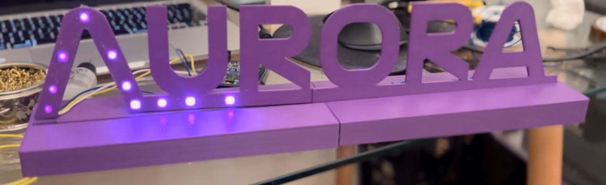
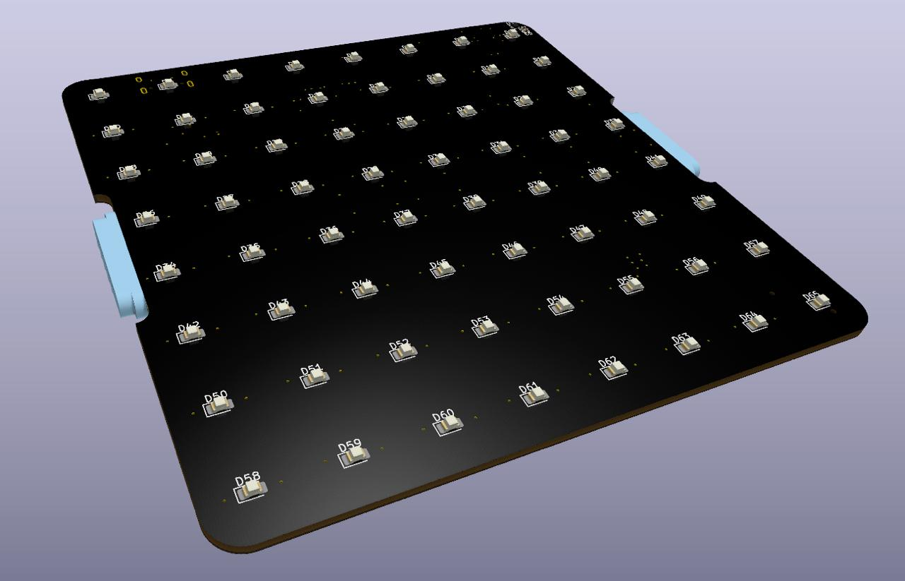
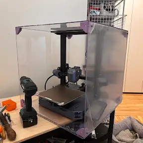
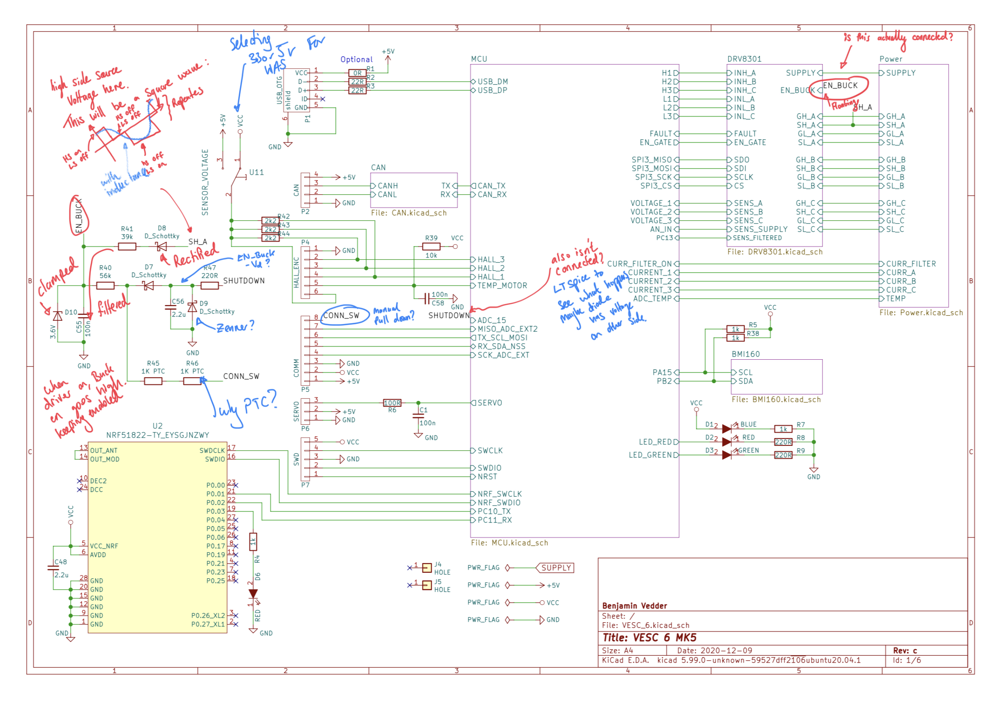

---
---

  
  

    <h1><a href="./stl_stacker">STL Stacker</a></h1>
    
<strong>Start Date:</strong> 22/03/26 &nbsp;·&nbsp; <strong>Last Edited:</strong> 22/03/26 &nbsp;·&nbsp; <strong>Status:</strong> Ongoing

    
For my Rocket Clock project I need many face plates. I realised, I could stack them, but there's no convenient tool do so - so I built one.

  

  
  

    <h1><a href="./linear_regression_deep_dive">Linear Regression Deep Dive</a></h1>
    
<strong>Start Date:</strong> 22/03/26 &nbsp;·&nbsp; <strong>Last Edited:</strong> 22/03/26 &nbsp;·&nbsp; <strong>Status:</strong> Ongoing

    
I recently utilised a linear regression machine learning algorithm at work. It was incredibly affective, and I wanted to get an intuative understanding of how it worked.

  

  
  

    <h1><a href="./aurora_sign">Aurora Sign</a></h1>
    
<strong>Start Date:</strong> 08/03/26 &nbsp;·&nbsp; <strong>Last Edited:</strong> 13/03/26 &nbsp;·&nbsp; <strong>Status:</strong> Ongoing

    
Needed a sign that said "Aurora" -- added cool RGB LEDs. All 3D printed.

  

  
  

    <h1><a href="./robot_dog_butler">Robot Dog Butler</a></h1>
    
<strong>Start Date:</strong> 28/02/26 &nbsp;·&nbsp; <strong>Last Edited:</strong> 28/02/26 &nbsp;·&nbsp; <strong>Status:</strong> Ongoing

    
My daughter really wants a dog, so we settled on a robot dog (called Cedric, named by my daughter). I thought it would be cool to make it useful, so we'll attached a steward platform to the top, and make it carry drinks.

  

  
  

    <h1><a href="./inductive_charger_from_scratch">Inductive Charger from Scratch</a></h1>
    
<strong>Start Date:</strong> 26/02/26 &nbsp;·&nbsp; <strong>Last Edited:</strong> 26/02/26 &nbsp;·&nbsp; <strong>Status:</strong> Ongoing

    
A recent project of mine required some custom, non standard coil, inductive charging. I want to document my development of this custom wireless/inductive charger.

  

  
  

    <h1><a href="./led_streaming_display___rocket_countdown/">LED Streaming Display - Rocket Countdown</a></h1>
    
<strong>Start Date:</strong> 02/02/26 &nbsp;·&nbsp; <strong>Last Edited:</strong> 21/03/26 &nbsp;·&nbsp; <strong>Status:</strong> Ongoing

    
I really want to have an old school scrolling display in my room. I kinda want it to have the time, temperature outside, etc., but also show me when and who is the next rocket launch. So, this is my design of such a thing.

  

  
  

    <h1><a href="./making_an_enclosure_for_3d_printer/">Making an Enclosure for 3D Printer</a></h1>
    
<strong>Start Date:</strong> 02/02/26 &nbsp;·&nbsp; <strong>Last Edited:</strong> 20/03/26 &nbsp;·&nbsp; <strong>Status:</strong> Ongoing

    
I recently bought a new 3D printer (retiring my old homemade one!). I wanted an enclosure to stop accidental touches (from 3 year old hands!) and also extract fumes from plastics like PETG. This is my build process, documented.

  

  
  

    <h1><a href="./Drone_Hacking/">Drone Hacking</a></h1>
    
<strong>Start Date:</strong> 31/03/2024 &nbsp;·&nbsp; <strong>Last Edited:</strong> On going &nbsp;·&nbsp; <strong>Status:</strong> Ongoing

    
I'm reverse engineering a Snaptain AF15 drone, to be able to fly it from my laptop.

  

  
  

    <h1><a href="./DIY_One_Wheel/">DIY One Wheel</a></h1>
    
<strong>Start Date:</strong> 31/07/2022 &nbsp;·&nbsp; <strong>Last Edited:</strong> 25/03/26 &nbsp;·&nbsp; <strong>Status:</strong> Abandoned

    
A self balancing electric skateboard. Superseded by the Robot Dog Butler — which requires a custom BLDC driver with torque control that the VESC doesn't support, making a custom motor driver necessary anyway.

  

  
  

    <h1><a href="./Programming_Portfolio/">Programming Portfolio</a></h1>
    
<strong>Start Date:</strong> 17/08/2022 &nbsp;·&nbsp; <strong>Last Edited:</strong> On going &nbsp;·&nbsp; <strong>Status:</strong> Ongoing

    
This section outlines some of my programming projects. This is mainly to document my progression.

  

  
  

    <h1><a href="./Havard_CS50_Course/">Harvard CS50 Course</a></h1>
    
<strong>Start Date:</strong> 16/08/2022 &nbsp;·&nbsp; <strong>Last Edited:</strong> On going &nbsp;·&nbsp; <strong>Status:</strong> Ongoing

    
My submissions and thoughts during my Harvard CS50 (computer science) course. (Really needs updating, I've almost completed the course!)

  

<!-- /projects-column -->

<aside class="pub-column">

  

    <h2 class="pub-section-title">Publications</h2>

    

      
<a href="https://ieeexplore.ieee.org/document/8459991/" target="_blank">Discrete-time modelling of pulse-width modulated DC-DC converters in sub-sampling conditions</a>

      
Max Simmonds et al. &nbsp;·&nbsp; <em>IEEE COMPEL</em>, 2018

      
Extends small-signal discrete-time modelling of DC-DC converters to sub-sampling conditions — where the sample interval spans multiple switching periods. Derives a model that quantifies the dynamic performance degradation and enables proper controller design under these constraints.

      
<a href="https://ieeexplore.ieee.org/document/8459991/" target="_blank">IEEE Xplore ↗</a>

    

    

      
<a href="/An Investigation into Linear Codes copy.pdf" target="_blank">An Investigation into Linear Codes &amp; The Viterbi Algorithm</a>

      
Max Simmonds &nbsp;·&nbsp; <em>University of Plymouth</em>, 2017

      
A rigorous treatment of the Extended Hamming (8,4,3) code — constructing parity-check and generator matrices, comparing G- and H-matrix trellis complexity, and demonstrating that Viterbi decoding outperforms both codeword enumeration and syndrome decoding. Includes a quantitative complexity analysis.

      
<a href="/An Investigation into Linear Codes copy.pdf" target="_blank">PDF ↗</a>

    

    

      
<a href="https://cds.cern.ch/record/2210440" target="_blank">Fibre Optic Notch Filter for the Antiproton Decelerator Stochastic Cooling System</a>

      
Max Simmonds &nbsp;·&nbsp; <em>CERN Document Server</em>, 2016

      
Reverse-engineered and restored a fibre optic notch filter for integration into CERN's Antiproton Decelerator (AD) stochastic cooling system. Confirmed temperature stabilisation and brought the device to operational status. Completed during a summer placement in the BE Accelerator Technology department.

      
<a href="https://cds.cern.ch/record/2210440" target="_blank">CERN CDS ↗</a>

    

  

  

    <h2 class="pub-section-title">Articles &amp; Media</h2>
    <ul class="article-list">
      <li><a href="https://www.electronicsweekly.com/blogs/electro-ramblings/site-update/chiips-25-edge-ai-insights-from-max-simmonds-of-purple-parrot-2026-01/" target="_blank">Edge AI insights from Purple Parrot</a> Jan 2026 Electronics Weekly — CHIIPS Podcast</li>
      <li><a href="https://www.electronicsweekly.com/blogs/viewpoints/why-baby-monitors-must-respect-privacy-in-the-age-of-ai-2025-12/" target="_blank">Why baby monitors must respect privacy in the age of AI</a> Dec 2025 Electronics Weekly</li>
      <li><a href="https://www.startupday.ee/news/speaker-contest-winner-max-simmonds-on-why-children-s-data-isn-t-safe" target="_blank">Speaker contest winner — why children's data isn't safe</a> Startup Day Estonia</li>
      <li><a href="https://www.rs-online.com/designspark/max-hacks-his-brightsparks-trophy" target="_blank">Max Hacks His BrightSparks Trophy</a> RS DesignSpark — turning a PCB award into a plasma speaker</li>
      <li><a href="https://www.electronicsweekly.com/news/ew-brightsparks/ew-brightsparks-2019-profile-max-simmonds-2019-05/" target="_blank">BrightSparks 2019 — profile</a> 2019 Electronics Weekly</li>
      <li><a href="https://www.plymouth.ac.uk/courses/undergraduate/meng-electrical-and-electronic-engineering/case-study-max-simmonds" target="_blank">Student profile — MEng Electrical &amp; Electronic Engineering</a> University of Plymouth</li>
      <li><a href="https://www.plymouth.ac.uk/schools/school-of-engineering-computing-and-mathematics/student-placements/max-simmonds-application-engineer-at-national-instruments-and-cern" target="_blank">Placement at National Instruments &amp; CERN</a> University of Plymouth</li>
    </ul>
  

  

    <h2 class="pub-section-title">Awards</h2>
    <ul class="awards-list">
      <li><strong>NASA Space Apps Challenge</strong> 2018 International Winner &amp; Global Top 5 — NASA's global hackathon across 200+ cities worldwide.</li>
      <li><strong>The Manufacturer's Top 100</strong> 2019 Recognised among the UK's top 100 young manufacturing professionals.</li>
      <li><strong>Bright Spark</strong> 2019 Electronics Weekly award for outstanding young engineers.</li>
      <li><strong>Engineering Excellence</strong> 2018 University of Plymouth graduation award.</li>
      <li><strong>Technical Innovation</strong> 2018 University of Plymouth graduation award.</li>
      <li><strong>Contribution to Student Life</strong> 2018 University of Plymouth graduation award.</li>
    </ul>
  

</aside>

<!-- /content-layout -->
