# LED Streaming Display - Rocket Countdown
---

## 02/02/26

### Requirements

Okay, so, as I said. I want to have a scrolling LED, wall mounted display that
can show:

- Temperature
- Time 
- Date 
- Latest Rocket Launch
- Other stuff

Basically, anything that I want to put on it. It'll be Wi-Fi enabled (either by
ESP32, or RPI or something, not yet decided. If I can get away with the low pin
count of the ESP, then that makes the most sense).

In terms of loose requirements, in no particular order:

1. Should be made as cheaply as possible. That means using whatever I have to
   hand, and buying very little extra
2. I want quite a few modules. About 10-15. So buying the standard 8x8
   modules, and the MAX7219 (almost 20€ or so each!)
3. 1xn is required. 2xn might be possible, but maybe left for the future.
4. Single colour LEDs, (RED). Future project could utilise RGB, and/or single
   wire protocol, addressable.
5. USB powered
6. Easily readable from a few meters. That means large modules, and enough of
   them to make readability better.
7. Be able to make some noise. I think a simple buzzer would suffice initially,
   maybe there's scope for a speaker, but to have an alarm or stopwatch, I want
   it to make some noise.r a speaker, but to have an alarm or stop watch
function then I want it to make some noise.
8. Easily be able to update the display, so needs some sort of UI. I want to be
   able to do this from my phone and or laptop.

The main parts of the design will be:

1. Plastic enclosure module
    1.1 Will be 3D printed. Designed in either Onshape or Freecad (preferably
the former if my free period is still available)
2. Electronics
    2.1 Some type of power supply - could be directly from USB, I don't
anticipate the current to be too high, I'll be driving one column at a time
(will need to check if I can keep the refresh rate >50Hz with a 15 module long
display while keeping the brightness reasonable).
    2.2 Controller - so this will be something like ESP32, or RPI (something
with Wi-Fi)
    2.3 Driver - now this is were the project gets interesting. A simple
solution is to buy 15 MAX7219's, that's like $$ 15 x 20 = £300 $$ !!! And that's
before we add the rest of the stuff in. Likely I will be charliplexing this,
rather than simple x/y multiplexing. That'll save me some pins, at the expense
of software complexity (but hey, bits are free!). I'm thinking of something like
shift registers, maybe some IO expanders, I'm not sure yet. But this will be the
problem we need to solve first, and it'll drive the constraints.
3. UI - this will be pretty simple, so doesn't warrant much here.

That's all for now, tomorrow we'll tackle the multipl>exing issue!

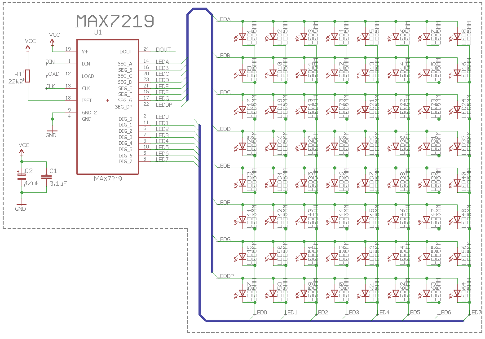

## 07/02/26

Okay, so it's been a little longer than "the next day". I should have known.
I've been busy on a few projects in parallel (I have a startup utilising edge
AI, an enclosure for my [3D
printer](../making_an_enclosure_for_3d_printer/index.md), and a few others in
the works). 

Anyway, I've been googling and thinking about
[multiplexing](https://en.wikipedia.org/wiki/multiplexing) vs
[charlieplexing](https://en.wikipedia.org/wiki/charlieplexing). I read some
interesting pros and cons. Originally, I wanted to go with the former, as I was
thinking __"damn if I want 15 or so modules, with 64 LEDS each, that's almost
1000 LEDs. Each requiring a driving pin. No microcontroller has that many pins.

I was thinking of solutions with charlieplexing, shift registers, I2C IO
expanders, and then I realised, there's no point charlieplexing (which has
downsides in refresh rates and brightness, plus 'ghosting' issues between
switching), I was going to have to use shift registers in any case, so IO
expanders were not really needed (can daisy chain the shift registers). The
added complexity of charliplexing (which needs tristate shift registers) was
just not needed.

With 3 pins:

- Data
- Strobe
- Clock

I can drive any number of LEDs with just these three DIO pins - I can add more
whenever I want (just software update) and I can still scroll either vertically
or horizontally. So this really seems like the best of all worlds.

Each shift register output needs to be able to drive the LED and sink current
from it. Typically, this is about 25mA for full brightness. We can PWM LEDs on a
"per module" basis using the output enable (OE) pin on the shift register
(obviously, we'll need to choose one that has this feature, I have 3 in mind,
which I'll show a pro/con for each, but likely we will settle for the simple
74HC595).

This means we can easily use the ESP32, and run as many 8x8 modules that we
need.

### The Shift Register

A lot of this project is defined by the shift register choice. I've been looking
around, asking Gemini, etc., and I think I've come to a decision. The 4 I
thought about were:

- CD4014
- 74HC595
- TPIC6B595
- MAX7219

The winner, based on price and a few other things, was the **74HC959**. Let's
summarise them below:

| IC | Pros | Cons | Price |
| :--- | :--- | :--- | :--- |
| **CD4014** | • Cost is essentially €0 (I have 4)   • Good for learning | • PISO (Parallel-In, Serial-Out) is the opposite of what we want   • No output latch (flicker) | ~€1-2 |
| **74HC595** | • OE pin allows for PWM   • Extremely cheap | • **6mA limit!** Needs a Darlington array (ULN2803) or external transistors to handle the current | ~€0.20 |
| **TPIC6B595** | • **150mA** per output (massive)   • Power shift register | • More expensive   • Harder to source on LCSC | ~€1.00 |
| **MAX7219** | • Purpose-built display driver   • Built-in multiplexing   • [LCSC Chinese clones](https://www.lcsc.com/product-detail/C6705351.html) make it affordable | • Genuine Maxim versions are crazy expensive (€15+)   • Requires 10µF/0.1µF caps to stay stable | ~€1.00 |

So, let's think, maybe we should go with the MAX7219? Let's think more about
this tomorrow.

## 10/02/26

Okay, a few days late but hey, we're back. Let's pick up where we last were, I
think the MAX7219 is the choice. Specifically, the MAX7219M/TR. For each module
(64 LEDs), I would need only 1 for each 8x8 module. That's pretty good. Also,
it's possible to control the brightness digitally too. Finally, they can be
cascaded - so that works well for this scrolling text.

### The LEDs

So, next step is to take a look at some LEDs. We're going to need a lot, so I
want some cheap ones. I'm not too sure on size yet, either. I'm not sure if I
need SMD or THT - I'm inclinded to thing that THT would be more the look I'm
going for. From NASAs mission control center:

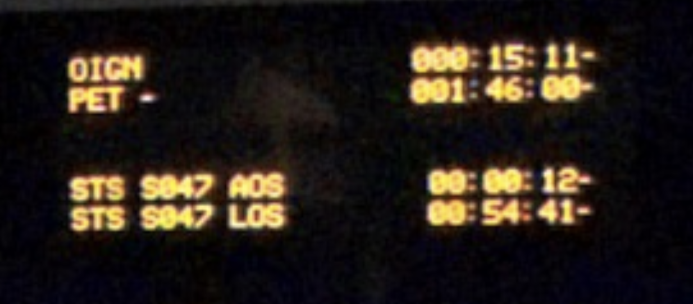

Looking on LCSC [this LED](https://www.lcsc.com/product-detail/C7470870.html) looks to be a good fit. In 1000 quantities, it's about $27.7. That's not too bad, so probably will get these. They're clear (which probably looks better when LEDs are off) and then it's green when it's on.

## 21/02/26

Well it's been a little while, but I have been working (I promise). I've been
getting the base schematic done, I won't share it just yet, I'll wait till it's
done. But here's a few insights I've gotten so far:

1. The wifi link (ESP32) isn't actually an ESP32. I had a look at what I
   actually had and it was a [D1 mini](https://uc2cb756136852eb70d6a7c764aa.dl.dropboxusercontent.com/cd/0/inline2/C7QL3nZnDZNxBcOEiZFGtSBBPEXyqxlR70cme3Fjo7H9jrEw_xGuSXMaOJtRmAoR6fdZL-cHu3gwxdcLE-HGDzPPFSICcu0sYBHyFn336KLB1hG2uhc8YTWx-qEFsVPoqfg6mMdH2nVsf2TnSIG2nWmSDx8tQCkoSmlyi7TgZRf-PpEkmsVTbjltrazOGphf6ygioTYiFPVe0IXAqk2seujc00Cx0sLtUAbXD8ANNNat6iL5Ageq9DuPzW6o4bfN6vgUsyVKne-owqdk4Xzs4bK5gjADMG8lYQfAgtfLK0J_GQORKCzArELZezyPqrbCiisjJ2j57So1muzeelSbOYpinutrX58YMX7_YBIRq68zbw/file), which actually has an ESP82266MOD with 4MB
   of flash (over the SPI pins of the dev board, so those are actually out of
action). Now, these are pretty cheap on LCSC, about $2.5 or so. The "dev board"
is an ESP12F - really low GPIO count, and not many bells and whistles. It needs
a USB 2 UART, a few pullups/downs, and a 3v3 LDO.

2. I realised that, to keep costs down, I should make a PCB with all components
   on every module (IE, wifi, LEDs, USB connectors, etc.) Obviously only one
board (let's call it, the master board) needs a wifi module/USB, etc., but I can
reuse the same PCB board for each. That way, I can get 20 ish made at JLCPCB,
probably 100x100mm, for like $20.

## 23/02/2026

So I want to think about the current requirements of the LED supply.

Since it's rastered (that is, column driven) I think the worst case current,
assuming full brightness, would be $$8 \cdot 20mA = 160mA$$. But, that's for
just one module. We have 15 (maybe 16, seems like a more rounded number? Let's
go with 16 for now) so $$16 \cdot 160mA = 2.560A$$. At 5V, that's about 12.5W -
I will just pull this from the USB port that this will be connected too.

## 24/02/2026

Okay, so, I think the schematic capture is pretty much done. Here's a [pdf](https://github.com/maxsimmonds1337/RocketClock/blob/d438bd8a07c629ab0a97276669d96e3dab4f1ef7/manufacturing/RocketClock.pdf) of it, in it's current version.

As I move towards the PCB layout, I want to give a little thought to the
mechanical design. The PCB itself will be 100mmx100mm - but how that's housed,
how the LEDs are situated and how far apart, etc., needs a little thought. I
know I want some way of passing the 3 display signals (CLK, CS, and data), plus
power and ground, in a way that's easy - no cables. So, that leaves contact
connectors (like pogo pins) or some push-fit type connectors (like header pins,
but probably something a bit more robust).

Let's brainstorm:

| connector type | Pros | Cons | Cost | Link |
| :---           | :--- | :----| :--- | :--- |
| Pogo Pins      | * Press fit   * Cool   * More tolerance in X and Y (depending on type)   * Intergrated magnets  | * Current carrying capabilities is limited though I found one for 2A (could probably do 2.5A at a push)   * Requires manual soldering | ~3$ per pair | https://www.lcsc.com/product-image/C41361293.html |
| Mechanical Connector | tigher fit, might not shake loose on wall.   * Cheap
(basically pin headers)   * Doesn't require manual soldering (probably) |
0.10$ | https://www.lcsc.com/product-detail/C18357552.html?s_z=n_pcb%2520interconnect%25205%2520pin |

So, I really wanted to go for the magnetic one, but all things considered, a mechanical connector makes the most sense. Also, I can reuse the USB connector that I need anyway, so that keeps the overall BOM list smaller. I have an idea for how to set these out physically:

## 25/02/26

Okay, so I didn't get a chance to finish where I was last night. I woke up extra
early today (0530 hrs!) to have some time to work on this, and other things,
before work. I found a nice "PCB edge" connector that I think will work really
well for the module interconnect. Specifically, it's this
[one](https://www.digikey.com/en/products/detail/w%C3%BCrth-elektronik/632712000011/5806668):

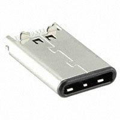

So, this is designed for PCB thicknesses of 0.8mm. I'll need to remember that.
Gemini seems to think this may not be the best part (and also, I can't find
anything similar on LCSC!) and I need a mid-mount part. So, let's take a look at
those.

Actually, talking a few hours later, I don't think I need a mid-mount part. I
can have a normal mounted USB C connector, with PCB pads on either side.
Depending on whether I want to pass USB power in, or pass through the CS, Data,
etc.,. I can either solder it from top or bottom, or I could just have 0 Ohm
resistors for selecting what goes where - like that idea better, I think. And
with that, let's CAD something simple up.

### Quick CAD Model

Nope, no CAD. I flip-flopped back again. I realised an issue. Male USB C
connectors don't seem to be easily available in right angle mounted horizontal
connectors. Maybe they are and I'm just not looking correctly. But the more I
look at it, the more I would need to either choose both edge mounted, or both
normal mounted, to ensure alignment, and I just don't think I can find that. I'm
going back to the nice mag connectors.

## 27/02/26

Okay, been a couple of days, I've been working on a seperate project ([inductive
charging](./../inductive_charger_from_scratch/) but let's refocus on this, and
try and get that CAD mockup done of the connectors.

Step 0 - model them because I can't find a model online :(.

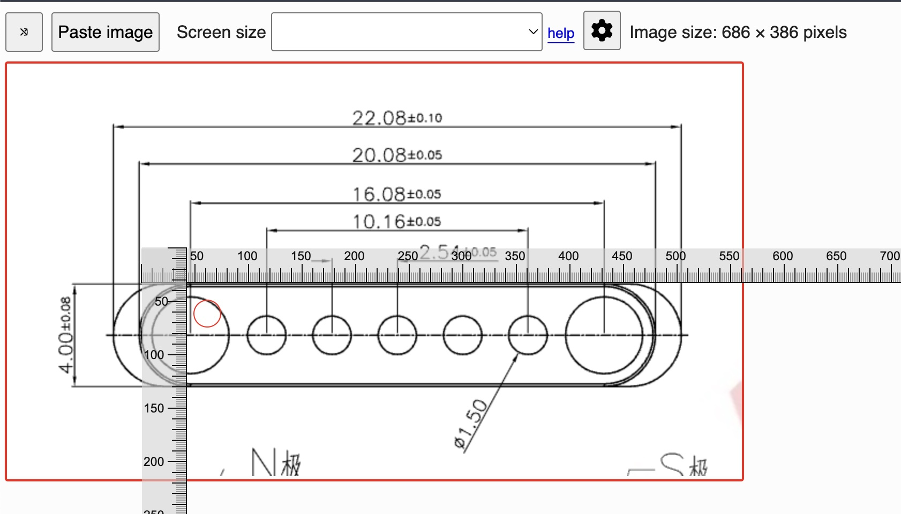

The magcon didn't have a dimension for the hole which houses the magnet. I used
a known dimension (the 4mm radius) and measured the number of pixels. It was 130
pixels. Then I measured the unknown dimension, which was 103, and that gives me:

$$ \frac{4}{130} \cdot 103 = 3.16 \approx 3.2mm $$

So now I have the dimension!

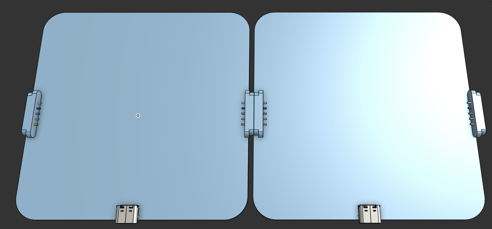

Okay, so I got the connector modelled, and I started place them on the "PCB". This will be the basis for me to understand how the enclouser will look. The enclosure will house the PCB, but also the LEDs and possible use some [lithophane](https://en.wikipedia.org/wiki/Lithophane) type techniques (or not really lithophane, but some type of dispersion maybe?) of the LEDS. Or I might just have a hole -- not sure yet, that's why I need to CAD it up!

## 01/03/26

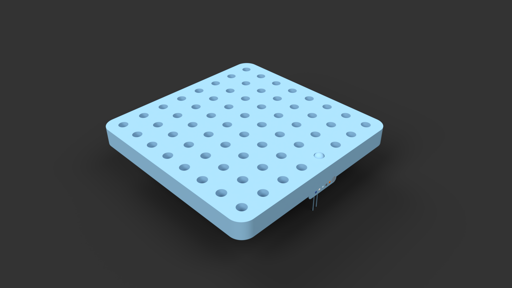

We have a model! A very basic one, but we have a model. This was a pretty decent
exercise. I now have a PCB board envelope to work with. I do my modelling in
[OnShape](https://cad.onshape.com). It's pretty easy to get a DXF of the layout,
which I then import into KiCAD as a board layout:

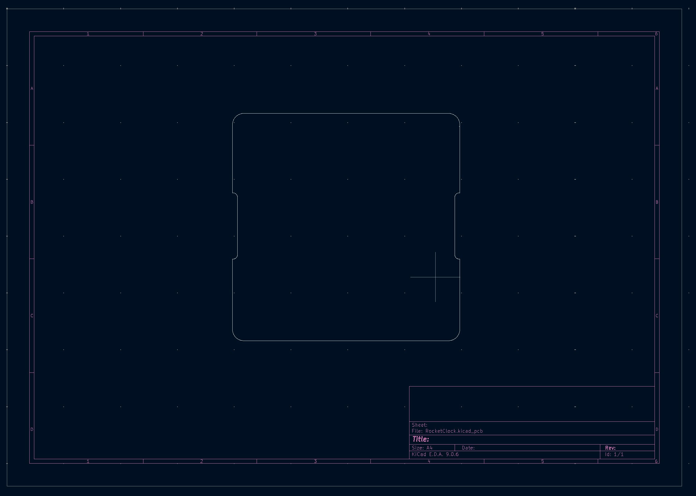

### Schematic update

I remembered, I wanted to have a buzzer so that I could also use this as an
alarm, maybe even play some crappy music. But, I have no pins left on the uP.
So, I do have an I2C bus, but I haven't played or seen any I2C buzzers before.
Let's see if I can find any.

Okay, I had a look, all I can find that's somewhat decent is the
[SparkFun](https://www.sparkfun.com/sparkfun-qwiic-buzzer.html#content-overview)
speaker board. It has an ATTiny84 on there for basically being an I2C -> PWM
converter with configurable frequency and volume. I checked LCSC, it's like 2$
for an [attiny84](https://www.lcsc.com/product-detail/C1522082.html?s_z=n_attiny84) and then another few dollars for the [buzzer](https://www.lcsc.com/product-detail/C22359724.html?s_z=n_CBT-09427-SMT-TR), which is currently out of stock so I'll probably chose a different one.

For the sake of a couple of dollars, I'll add one (of course, the footprint will
be on every module, but only one can be used unless I pass I2C bus over the
modules some how. I'll need to write my own firmware for it, but that'll be
pretty cool. I have this old [programmer](https://www.sparkfun.com/tiny-avr-programmer.html#content-documentation) from SparkFun that programes the ATTINY series, so I can easily program it that way. Seems like a pretty cool addition. Plus, the [schematics](https://docs.sparkfun.com/SparkFun_Qwiic_Buzzer/assets/board_files/SparkFun_Qwiic_Buzzer_Schematic_V10.pdf) are all available, so nice and easy.

Let's add this to the current schematic and update the github repo. Then, we're
ready for PCB Layout!

Ah - I just found
[this](https://github.com/sparkfun/SparkFun_Qwiic_Buzzer/tree/main/Firmware/QwiicBuzzerFirmware)
which is the firmware for the attiny! I might need to make mods, because the pin
out may not be the same (I might use a digipot for the volume) but that will
make this much much easier!

In the end, I didn't go with the digipot. LCSC has a bunch, but I'd need to mod
the firmware and now I know I don't have to write custom FW, I'm lazy! The
pinout for the IC I've chosen (QFN) is not the same as SparkFun's, so I'll need
to do some pin changes, but that should be fine.

Schematic's not finished, but I'll do some more tomorrow.

## 02/03/26

New day, let's gooooooo.

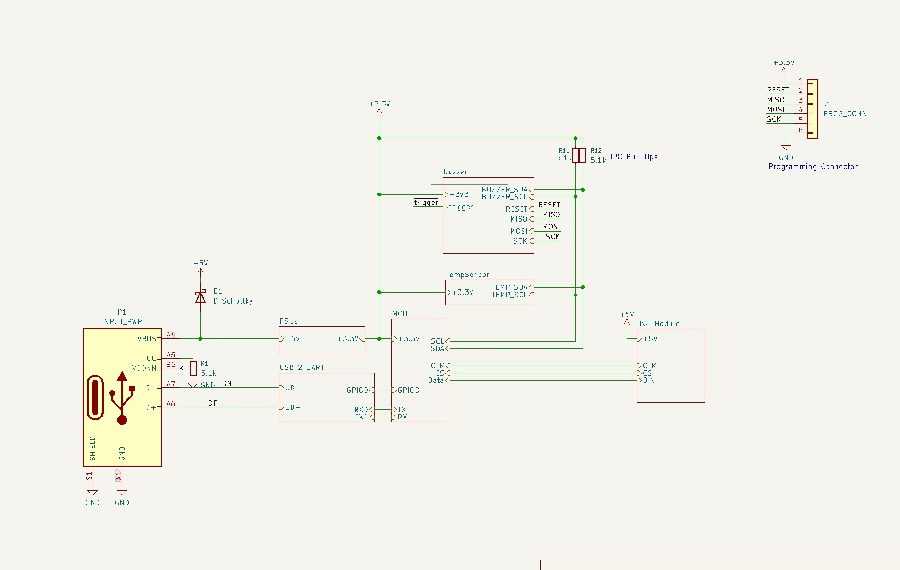

Alright, I added a buzzer, it was pretty involved, but it's now done. Back to
the PCB. The exported PCB board file is nice, but I would like guidelines on
where to put them. Luckily, we can export that from OnShape, and add it on a
layer in the PCB.

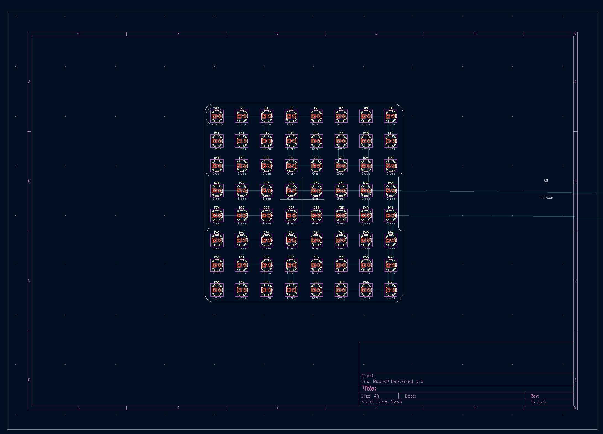

This was actually pretty easy in KiCAD. I used the DXF of LED places from
OnShape to understand whereabouts I need to place them. Then, I used the Grid
Array feature in KiCAD (CMD + T on a mac) and placed them in an 8x8 grid, with
12.5 ($$ \frac{100}{8} $$) spacing.

## 07/03/26

Quick update: I'm an idiot. I wanted to use through holes to give the modules an
archaic feel, but that's not going to work. There's so many holes that I can't
place anything on either side of the PCB. DOH. So, I'll update the LEDs to SMD
(they're cheaper, too!) and then maybe we'll need light pipes or maybe we can
get away with just the 3D printed diffusers or something. Needs some thought,
but today (later) I'll update the schematic to change the footprints to SMD.
Sigh. 

## 10/03/26

Been 3 days, not had too much time. I had a couple of issues I wanted to note
down though.

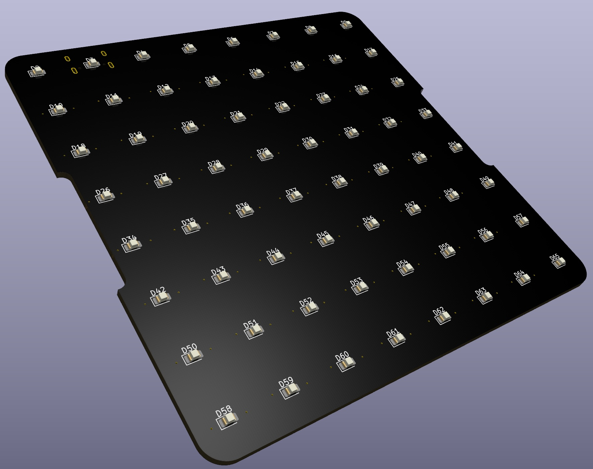 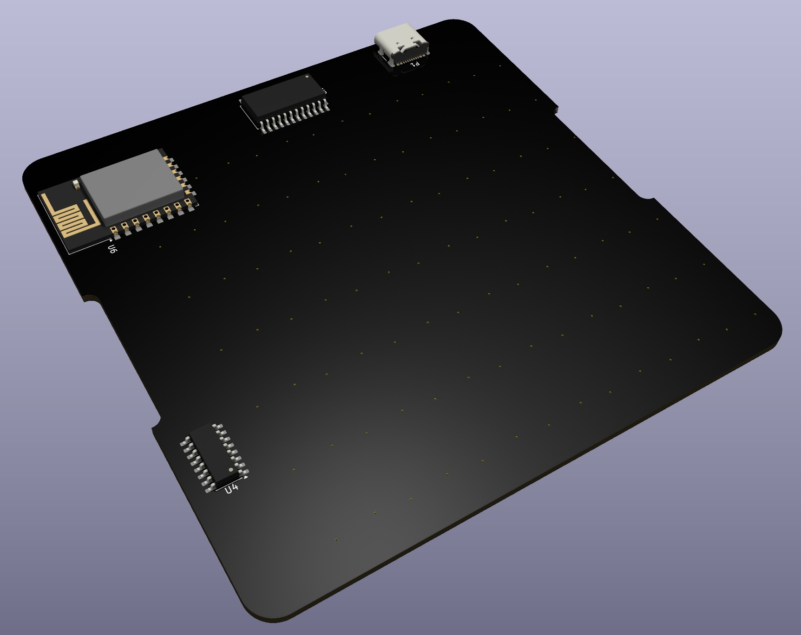

1. Edge cuts. I had a small issue with the board outline, easy fix, basically
   there was a spur coming off the perimeter, don't know why but deleting it
fixed it.
2. Replaced THT LEDs with SMD, this means a redesign of the enclosure, at least
   the holes. Not sure how these will look in real life, probably I will make a
   test square piece with several types of holes and diffusions, and I'll see
how it looks with an LED before committing to the hole thing
3. Finally, the layout of the multiplexed LEDs isn't the most conducive to a 2
   layer board. I need vias to jump over/under traces, but then I litter the
bottom side with areas where I can't place large components. I do have these
areas near the top and right of the board where there are no vias or bottom
traces. I'll try and fit most components there.

Anyway, that's all I can update today. Hopefully will get some more time for
this later this week, and get the boards made! It's been about 5 weeks since I
had this idea, so need to get the cadence up!

## 16/03/26

I've mostly done the layout now, I wanted to add some photos to show the
progress.

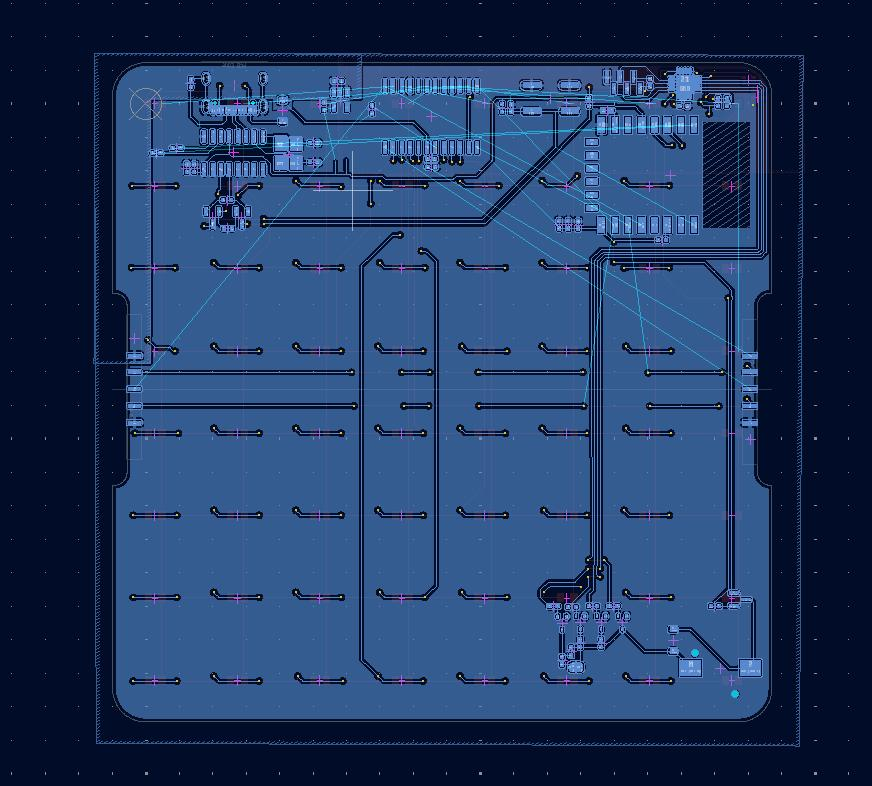

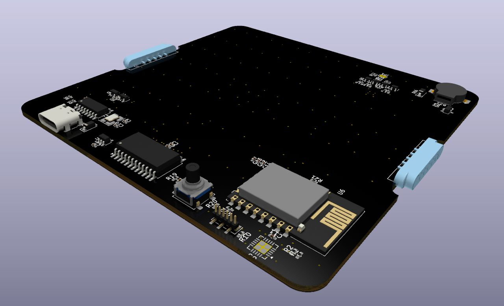

## 21/03/26

Layout is now done, DRC is passing, and DFM checks on JLCPCB are good. A few
warnings about annular rings and some other such stuff (silkscreen over board
edge, but that's not an issue, just how I placed my custom magconnector
footprints).

I'm using Claude to help speed up part selection - when LCSC's BOM uploader tool
can't find a part (or it's out of stock) I get Claude to find me a replacement,
drop in. For example, the buzzer I used was available in LCSC, but it's out of
stock. Claude was able to find a great match, based on a bunch of metrics (DB,
size, footprint) and one that's in stock - I was pretty impressed!

## 25/03/26
Okay, so, about 2 days ago I finally hit the button on the order! The grand
total is:

* PCBs - $94.08
   * PCBs (x30) - $30.40
   * Shipping - $45.47
   * Customs - $18.21
* Parts - $ 152.58
   * Parts - $135.38
   * Shipping - $34.82
   * Discount - $17.62

Total: $246.66

So, it was quite a lot! But, I did get enough for 30 boards. The mag connectors
were not in-stock which was a shame, so I had to order some header pins (luckily
the mag conns were 2.54 mm pitch parts and I made a custom footprint (to solder
them parallel to the board) so it was an easy fix)). Shame I can't easily extend
the modules, but it's okay, I can buy them later if needs be.

All the board files, manufacture ring data, bom, etc, are
[here](https://github.com/maxsimmonds1337/RocketClock/releases/tag/v1.0.0). I
haven't started the software/firmware yet, I wanted to think about that a bit
here.

### Software

I think I'll need:

* Rocket Clock Server, this will technically run on the ESP12F.
   * Also, turns out the ESP can also serve webpages, simple ones that is. So,
   that makes things more simple.
* Attiny FW, this is already written for me by SparkFun, so that's easy

It's actually pretty simple, in my head there was a lot more I needed to do. I
have an ESP12F here so I can start on some of the work, things off the top of my
head:

* UI interface, to be served to clients, to do the following:
* Events
   * Set Alarms / Clear Alarms
   * Tell me next rocket launch
   * Word of the day
   * News
   * My next calender event
* Take a character, for example "a", and convert to the required LEDs to
illuminate on the module
* Horizontal scrolling of text
* Vertical scrolling of text
* Temperature reading and display
* Pulling in data from outside (rocket launches, weather, etc)
* Buzzer interface over I2C

Anyway, that's the update, PCBs should be here on 31st March. That gives me
about a week to get the software ready, or at least as ready as I can without
actually having the hardware!
