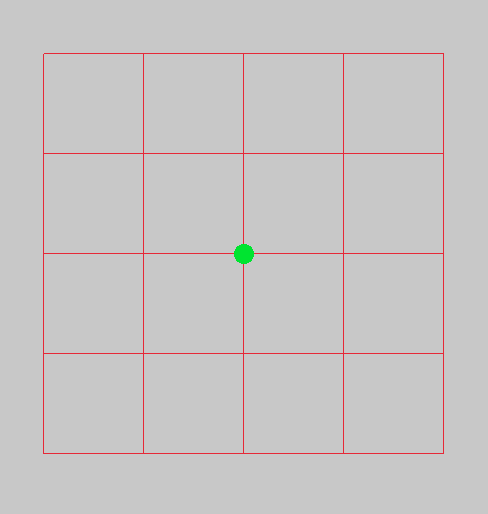
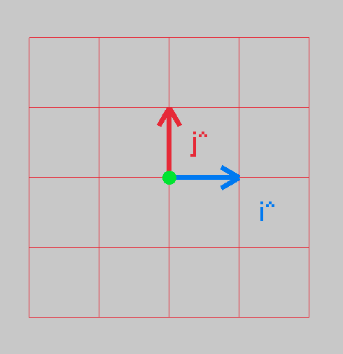
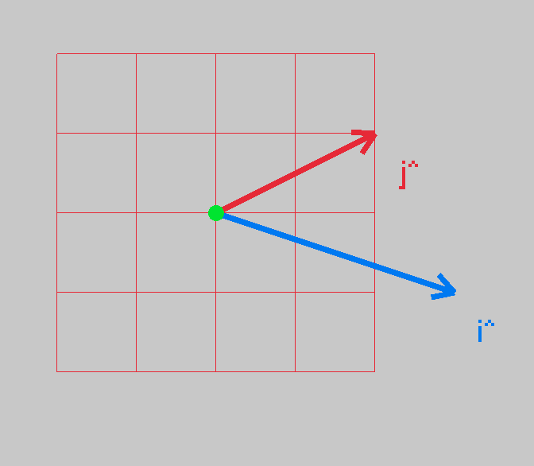
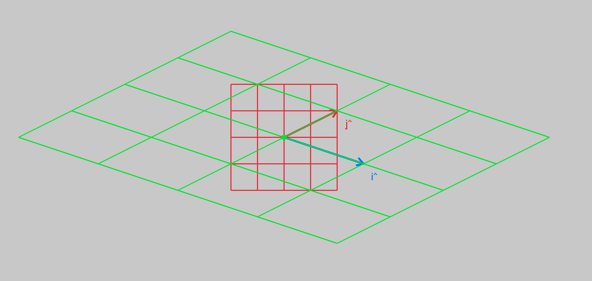
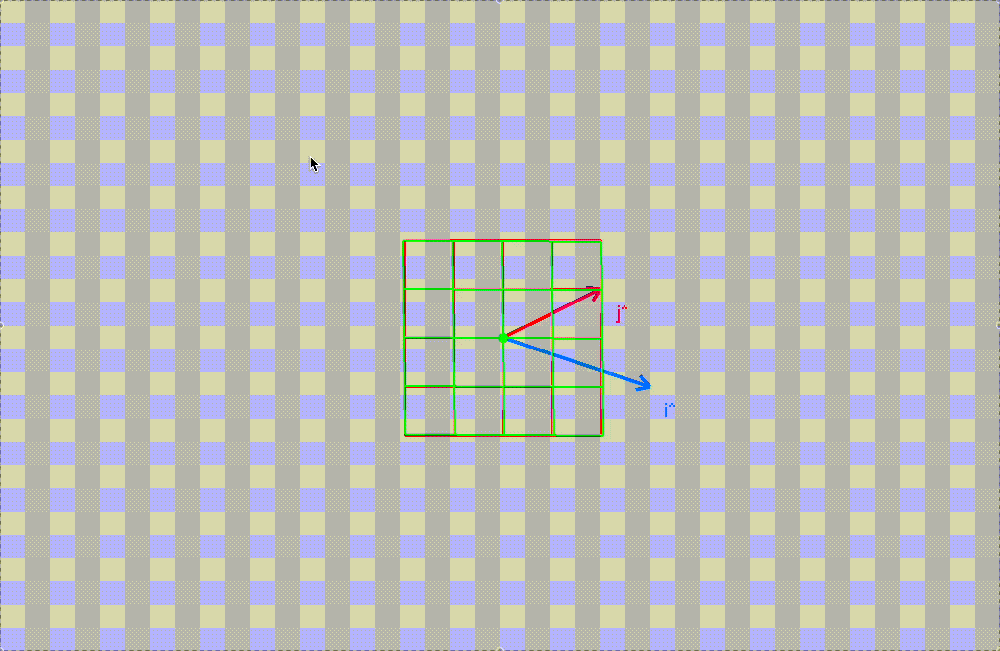

# Linear Regression Deep Dive
---

## 22/03/26
Project started today!

## 31/03/26

I have actually been working on this, but haven't made much progress as I've
been busy with a bunch of other projects (most notably, the [Rocket
Clock](../led_streaming_display___rocket_countdown/) which is close to being
done.

One thing I will write here, though, is that I've been looking at linear
transforms, or rather, revising them again. I wanted to visualise what happens
in a 2d transform, specifically, to the basis vectors (and therefore, the entire
"space" of that 2D system). Not super important in terms of linear regression,
except that a linear system is one that:

- is additive
- is homogeneous

### Additive

Formally, this is defined as:

$$ f(x+y) = f(x)+f(y) $$

This is a fancy way of saying if you have a function, say $$ f(x) = 1 + x $$ and
you want to test if it's additive:

$$ f(3) = 1 + 3 = 4; f(1) + f(2) = 1 + 1 + 1 + 2 = 5 $$

So, this function is not linear (or at least, not additive). An example of one
would be:

$$ f(x) = 2 \cdot x $$

Interestingly, the function we mentioned ($$ f(x) = 1 + x$$) is an __affine__
transform, which we actually use in linear regression! So it's not strictly a
linear transform, rather an affine transform, but they still call it so. An
affine transform is a linear transform with some shifting origin.

## 13/04/26

Been a while since I've picked this up, so let's continue.

### Homegenity

Formally, this is written as:

$$ f(cx) = c \cdot f(x) $$

A scaled input yields a scaled output. Let's say we have the function in our
previous example, $$ f(x) = x + 1 $$.

Let's see if it's also homogenious:

$$ f(10 \cdot x) $$

This means, multiply $$x$$ by 10, then put it into our function:

$$ f(10 \cdot x) = 1 + 10 \cdot x $$

That's scaling the input. Scaling the output:

$$ c \cdot f(x) = 10 \cdot (1 + x) = 10 + 10 \cdot x $$

Since $$ 1 + 10 \cdot x \neq 10 + 10 \cdot x $$ then this function in (again)
not linear.

### Exploring linear transformations in vectors

Linear transforms can be done quite well and compactly with vectors. A 2D matrix 
$$ A $$ can be used to detail what happens to the basis vectors of the orignal
vector, to transform it to the space of the new space. Let's first consider a 2D
"world". Often, it's easier to see said world by viewing the grid lines:

Generally, the "grid" is dictated by two vectors, namely, $$\hat{i}$$ and
$$\hat{j}$$. These are base vectors, and a space is some linear combination of
it's unit / base vectors - they define a spaces _span_.

Formally:

$$V = \{ a\hat{i} + b\hat{j}\} | a,b \in \mathbb{R}$$

This says that a 2D space is the set (that's what the curly brackets define) of
all elements that are linear multiples of the 2 basis vectors, where the basis
vectors are any real numbers.

## 03/05/26

I've been a little distracted recently, workong on some other projects
(https://xdoubledot.space/) but I'm slowly picking these things back up, to
finish them off. 

Anyway, let's plot the 2 basis vectors:

These two basis vectors, which are actually the columns of a 2D transformation
matrix, define your space:

$$

\text{2D transformation matrix} = 
\begin{bmatrix} 
a & b \\
c & d \\
\end{bmatrix}

$$

This is a typical 2D transformation matrix, you take your input ($$x$$ and $$y$$) and
multiple by this, to get your new point. But, what's fascinating, is that the
columns are the $$\hat{i}$$ and $$\hat{j}$$! EG, let's look at our example
above. Let's take the point $$(1,0)$$ and see where it lands.

$$

A = \begin{bmatrix} 
1 & 0 \\
0 & 1 \\
\end{bmatrix}
\cdot
\begin{bmatrix}
1 \\
0 \\
\end{bmatrix}

= 

\begin{bmatrix}
(1 \cdot 1) + (0 \cdot 0) \\
(0 \cdot 1) + (1 \cdot 0) \\
\end{bmatrix}

=

\begin{bmatrix}
0 + 1 \\
0 + 0 \\
\end{bmatrix}

=

\begin{bmatrix}
1 \\
0 \\
\end{bmatrix}

= \hat{i}

$$

So, we can see, that we've just extracted the $$\hat{i}$$ term.

When we have a new 2D transform, say, $$B = \begin{bmatrix} 
3 & 2 \\
1 & 1 \\
\end{bmatrix}
$$ 

These are now the _new_ basis vectors. We can apply this 2D transform to all
grid lines, and see how the space is warped.

First, let's look at the new basis vectors, how they look:

And now, let's transform the grid lines to see how the fabric of space changes:

As we can see, the grid space now lines up with the new basis vectors, pretty
cool!

Next, before we go back to linear regression (this has taken a major tangent),
i'll animate the change of grid lines, 3b1b style!

## 04/04/2026

And there we have it, if we interpolate between the identity matrix, and our
target transform. The enabler is the _LERP_ or LinEar inteRPolation. Basically,
how we transition, in discrete steps, from one thing to another.

$$

\text{LERP} = start \cdot \lambda \cdot (\text{end} - \text{start})

$$

$$\lambda$$ in this case, is some scaler, if we use $$\lambda \in \[ 0,
1\]$$ then we can take a percentage of the target and add it to the start. If
$$\lambda$$ is scale nicely from 0 -> 1 -> 0 then we can nicely LERP between our start (identity matrix) and target, our desired final transform. We than have a slightly warped transform, which we can now use to warp our grid lines by. We do this over and over, and we get the view from above!

