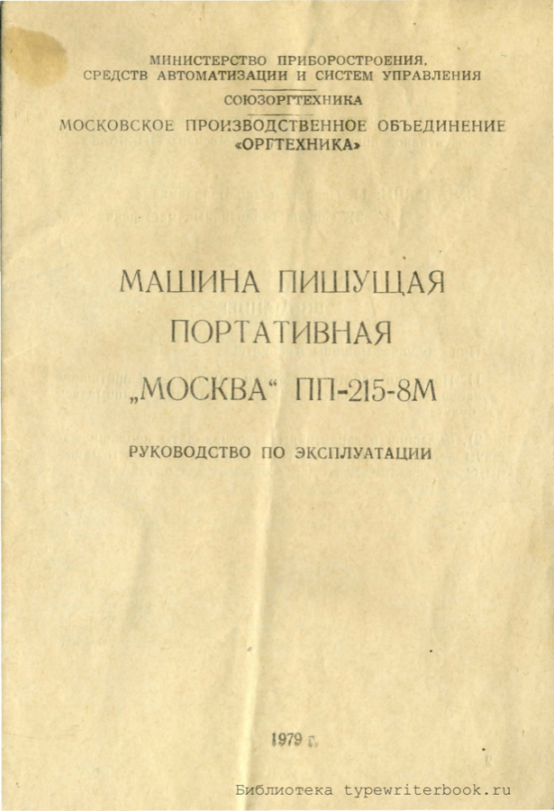
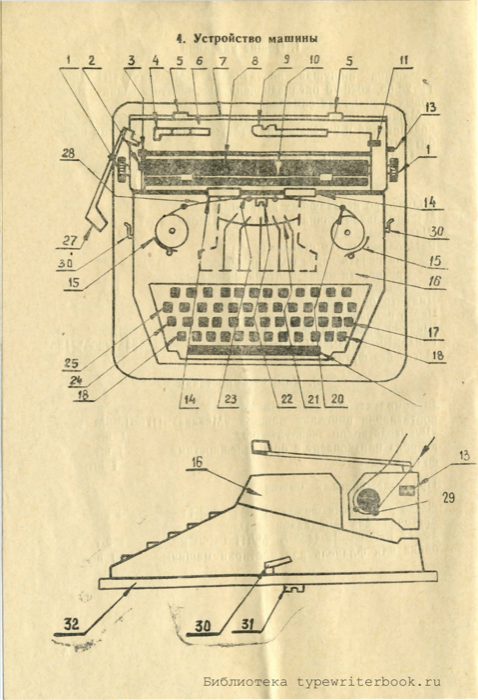

# Moskva 8M Typewriter Manual
---

## 22/07/26

I picked up a **"Moskva" PP‑215‑8M** portable typewriter — a Soviet-made machine from 1979, built by the Moscow Production Association "Orgtekhnika". The only manual I could find for it was the original Russian **"Руководство по эксплуатации"** ([source PDF](https://typewriterbook.ru/wp-content/uploads/2015/11/Moskva-8M-instruktsiya.pdf), via the excellent [typewriterbook.ru](https://typewriterbook.ru) archive), so I translated the whole thing to English below for my own reference — and for anyone else who ends up with one of these.

The original is a 13-page scan; the text below is my English translation, following the same section structure as the original.

---

## Operating Instructions for the "Moskva" PP‑215‑8M Portable Typewriter

**Inserts:** 1) Certificate of acceptance  2) List of warranty repair workshops

> **ATTENTION**
>
> When buying the machine, insist on:
>
> 1. A check of the machine's working order — otherwise complaints about the machine's quality will not be accepted by the factory;
> 2. The date of sale being entered on the warranty coupons — otherwise the warranty period will be counted from the machine's date of manufacture.

### 1. General Instructions

The "Moskva" PP‑215‑8M portable typewriter (spec TU 25‑03.2026‑78) is designed for printing alphanumeric and symbol characters.

The machine may be used in the typing pools of enterprises and institutions, as well as by individual users.

**Price of the machine — 135 roubles.**

### 2. Technical Data

| Parameter | Value |
|---|---|
| Number of typing keys | 45 |
| Maximum length of printed line | 215 mm |
| Character pitch | 2.6 mm |
| Line spacing — single spacing | 4.25 mm |
| Line spacing — one-and-a-half spacing | 6.37 mm |
| Line spacing — double spacing | 8.5 mm |
| Platen (paper roller) diameter | 32.3 mm |
| Number of simultaneous carbon copies | 4 |
| Ribbon width | 13 mm |
| Overall dimensions | 335 × 309 × 135 mm |
| Weight without case | 5.5 kg |

### 3. Scope of Delivery

The delivery set includes:

- Portable typewriter "Moskva" PP‑215‑8M — 1 pc.
- "Operating Instructions" — 1 pc.
- Box or envelope with accessories — 1 pc.
- Case — 1 pc.

**Accessories for the machine:**

- Type-cleaning brush (GOST 6388‑74) — 1 pc.
- Small brush for dusting (TU 17 RSFSR 18‑4453‑76 MLP RSFSR) — 1 pc.
- Flannel or baize cloth for wiping the machine down — 1 pc.

### 4. Construction of the Machine

**Key to numbered parts:**

1. Platen knob
2. Line-spacing selector lever
3. Platen release lever
4. Sliding paper guide
5. Margin stops
6. Rear carriage cover
7. Margin-stop rail
8. Platen (paper roller)
9. Paper support (book rest)
10. Paper-bail cover with rollers
11. Paper release lever
13. Carriage free-movement lever
14. Line-position (line finder) indicators
15. Ribbon spools
16. Top cover
17. Carriage back-space key
18. Shift key (upper case)
19. Carriage-space (skip) pedal
20. Ribbon guide
21. Segment
22. Type-guide (letter guide)
23. Ribbon vibrator
24. Shift lock key
25. Carriage-space (skip) key
27. Line-spacing/carriage-return handle
28. Ink ribbon
29. Pressure roller
30. Case fastening hooks
31. Transport (shipping) screws
32. Case base

### 5. Preparing for Work

**1.** The machine may stand on the case base while typing, or directly on the table. To remove the machine from the case base, unscrew the transport screws (31) and swing the hooks (30) aside.

**2. Inserting and aligning paper**

After removing the machine from its case, raise the paper support (9), located on the rear carriage cover (6), and extend it to the length needed for the desired position of the last line on the sheet. Insert the sheet of paper onto the platen (8) so that its lower edge rests against the pressure roller (29). Pull the paper-release lever towards you, then, by turning the platen knob, feed the paper under the line-position indicators (14) and the paper-bail cover with rollers (10).

To align the paper, pull release lever (11) towards you and raise the paper-bail cover (10) with its rollers — this allows the paper to be moved freely in any direction.

After inserting and aligning the paper, return levers 3 and 11 to their starting position.

**3. Setting the margins**

Press the margin stops (5), located on the rear of the machine, and slide them along the rail to set the beginning and end of the line.

**4. Setting the line spacing**

Set the line spacing using lever (2). Moving lever 2 to its extreme forward position sets the platen (8) to feed one line spacing, corresponding to 4.25 mm between lines. Moving lever 2 to the middle position sets one-and-a-half line spacing — 6.37 mm. Moving lever 2 to its extreme rear position sets double line spacing — 8.5 mm.

### 6. Operating Procedure

**1.** Printing is carried out by successive strikes on the keys. Each keystroke advances the carriage by one step.

**2.** Moving the carriage to its extreme right position and vertical paper feed are both carried out simultaneously using the line-spacing/return handle.

**3.** The line length is limited by the margin stops. As the carriage approaches the limit set by the right-hand margin stop, a bell sounds, warning that no fewer than 3 characters remain before the end of the line, after which the carriage automatically stops and the keyboard locks. If printing needs to continue up to the nearest word break or the end of the word, press the carriage-space key (25). To print in the left margin of the paper, press the same key while simultaneously pulling the carriage to the right.

**4.** For repetitive work, the paper guide (4) should be positioned against the left edge of the paper, so that on subsequent sheets the paper can be aligned against it, giving identical margins on every sheet.

**5.** To move the carriage freely, push lever (13) up. While doing so, hold the carriage with your hand to avoid a sudden jolt.

**6.** To type numbers or capital letters, press one of the shift keys (18). To lock the carriage in the shifted (upper-case) position, press the shift-lock key (24). To release the carriage from the upper case, press the left-hand key (18).

**7.** To move the carriage one step to the right (backspace), press the carriage back-space key (17). Moving the carriage backwards allows incorrectly or lightly printed characters to be corrected.

**8. Replacing a worn ribbon**

To replace a worn ink ribbon, position the carriage in the centre of the machine, remove the top cover (it lifts upward), shift the carriage into the upper case, and, holding down the shift-lock key (24), lock the carriage in this position. Then remove the worn ribbon from the spools and unwind it.

A new ribbon is fitted to the spools as follows:

- Take the ribbon end and hook it onto one of the spool hooks, pressing it against the point of the hook and pulling against the direction of the hook until the hook catches the ribbon;
- Fit this spool, centre hole first, onto one of the ribbon-mechanism spindles, so that the pin at the side of the spindle enters the hole in the spool;
- Hook the other end of the ribbon onto the second spool and fit it into place;
- Feed the ribbon in between the ribbon vibrator and the platen, then thread the ribbon through the ribbon guide as shown in the diagram.

The fitted ribbon should sit between the uprights of the ribbon guide (20).

After changing the ribbon, refit the top cover.

### 7. Warranty Obligations

The factory guarantees the correct operation of the machine for **18 months** from the date of purchase, and during this period will repair, free of charge, any faults that arise in it — except for those caused by improper handling of the machine.

### 8. Care, Storage and Transport

**1.** The segment (21), in whose slots the type bars move, should be cleaned periodically with the small brush, brushing lint from the ribbon and dust *upwards*, never across the segment, to avoid clogging it.

**2.** The type should be cleaned with a stiff toothbrush as it becomes dirty. If the type is heavily fouled with dried ink, moisten the brush with petrol (white spirit) or alcohol. Take care that dirt does not fall into the segment.

Clean the type and type bars (each individually), brushing in the direction of the letters.

> **Do not clean the type with steel objects.**

**3.** Clogged segment slots can cause type bars to jam. Once the segment has been cleaned, strike the jammed key's bar several times, flicking the bar back with a finger, until it moves freely.

**4.** A bent type bar can cause it to jam in the type guide (22). To fix this, press the corresponding key slowly to feed the bar into the type guide and, having identified the direction of the bend this way, gently bend it back in the opposite direction.

**5.** Dust should be removed from the machine with a flat brush; wipe the machine's outer parts with dry, soft flannel or baize. The rubber platen should be wiped periodically with a cloth lightly moistened with alcohol and then wrung out. Before wiping the platen, move the paper-release lever to the position that allows the platen to turn freely; once the platen has dried, return the paper-release lever to its normal position.

> Clean and wipe the parts in the upper section of the machine in such a way that dirt and dust do not fall inside the machine.

**6.** To avoid clogging the segment slots when erasing incorrectly typed letters or numbers with a rubber eraser, move the carriage so that the area being erased is clear of the segment. When doing so, place a sheet of paper between the copy sheets and the carbon paper.

**7.** After finishing work, the machine should be closed with its case.

**8.** In the event of a sharp change in temperature (e.g. carrying the machine in winter from one room to another), do not open the machine's case immediately.

**9.** The machine should be stored in its case, in a dry, heated room.

> **Do not store the machine:** near radiators or other heating appliances; in a room with high humidity or frequent temperature fluctuations; near chemicals or other substances whose fumes could cause parts of the machine to rust.

**10.** The carriage should not be left in the upper-case (shifted) position for extended periods.

**11.** When the machine is in its case, the carriage should not be left in the upper-case position.

**12.** Take care that foreign objects (pins, paper clips, etc.) do not fall under the platen or into the machine.

**13.** Moving joints should be lubricated with petroleum jelly (Vaseline oil) when the whole machine is cleaned. Oil must not get into the segment slots. Before lubricating the machine, dust must be thoroughly removed from it.

**14.** The machine should be protected from sharp knocks and impacts.

**15.** To avoid damage during transport, the machine must be carefully packed.

**16.** Repair of serious faults, as well as cleaning of hard-to-reach areas, should be entrusted to an experienced technician.

---

### Appendix: Warranty Repair Coupons

The original manual includes two tear-off warranty repair coupons (Талон № 1 and Талон № 2), issued by MPO "Orgtekhnika", Moscow, B. Serpukhovskaya, 21. Each is a blank form for a repair workshop to record the machine's serial number, date of manufacture, point of sale, owner details, and any warranty work carried out. My unit's factory number is **608161**, dated **11.03.80**, with QC (ОТК) stamp **72**.

---

*Translated from the original Russian "Руководство по эксплуатации портативной пишущей машины «Москва» ПП‑215‑8М" (1979, МПО «Оргтехника», Ржевская типография 17‑10000‑80). Scan courtesy of [typewriterbook.ru](https://typewriterbook.ru).*

## 22/07/26

### The Latin alphabet, typed on a Cyrillic machine

This machine has no Latin keys at all — it's a standard Soviet ЙЦУКЕН layout: Cyrillic letters, digits, and punctuation only. As a side project, I worked out how to render the full Latin alphabet anyway, using nothing but what's on the keyboard, leaning on two features the manual itself documents: the **carriage back-space key (17)**, which lets you strike a second character in exactly the same spot as the first (section 6.7), and fine manual rotation of the **platen knob (1)**, which lets you nudge a character slightly above or below the normal line before striking it.

A handful of Cyrillic capitals are drawn identically to Latin letters already — no trick needed. The rest are built by overstriking a base character with a modifier, in the same spirit as the F/I/R/S/T set I started with.

| Letter | Keys | Method |
|---|---|---|
| A | `А` | Direct — Cyrillic А is drawn identically to Latin A. |
| B | `В` | Direct — Cyrillic Ve is drawn identically to Latin B. |
| C | `С` | Direct — Cyrillic Es is drawn identically to Latin C. |
| D | `1` ⌫ `)` | Numeral stem plus a right parenthesis overstruck for the bowl. |
| E | `Е` | Direct — Cyrillic Ye is drawn identically to Latin E. |
| F | `Г` ⌫ `-` | Cyrillic Ge gives the top bar and stem; overstrike a hyphen for the missing middle bar. |
| G | `С` ⌫ `-` | C-shape plus an overstruck hyphen for the crossbar. |
| H | `Н` | Direct — Cyrillic En is drawn identically to Latin H. |
| I | `1` | Numeral one stands in for the plain vertical stroke. |
| J | `1` ⌫ `,` | Stem plus a comma overstruck at the foot for the hook — nudge the platen down slightly first for a cleaner hook. |
| K | `К` | Direct — Cyrillic Ka is drawn identically to Latin K. |
| L | `1` ⌫ `_` | Stem plus an underscore overstruck at the very bottom of the cell for the foot. |
| M | `М` | Direct — Cyrillic Em is drawn identically to Latin M. |
| N | `И` | Closest available stand-in — Cyrillic I is a mirror image of N (diagonal runs the other way), but it reads fine at a glance. |
| O | `О` | Direct — Cyrillic O is drawn identically to Latin O. |
| P | `Р` | Direct — Cyrillic Er is drawn identically to Latin P. |
| Q | `О` ⌫ `,` | O-shape plus a comma overstruck at the bottom right for the tail. |
| R | `Р` ⌫ `/` | P-shape plus an overstruck forward slash for the diagonal leg. |
| S | `5` | Numeral stand-in — no Cyrillic letter has an S-curve. |
| T | `Т` | Direct — Cyrillic Te is drawn identically to Latin T. |
| U | `Ц` | Closest available — Cyrillic Tse is a U-shape with a small extra tail at bottom right, but it's recognisable. |
| V | `Л` | Closest available stand-in — Cyrillic El is the same two-diagonal shape, just upside down (peak at the top instead of the bottom). |
| W | `Ш` | Closest available stand-in — Cyrillic Sha is three prongs on a base bar, blockier than a true W but reads the same way. |
| X | `Х` | Direct — Cyrillic Ha is drawn identically to Latin X. |
| Y | `У` | Direct — Cyrillic U is drawn identically to Latin Y. |
| Z | `-` ⌫ `/` ⌫ `_` | Three characters overstruck in the same spot: a hyphen nudged up slightly for the top bar, a slash for the diagonal, and an underscore at the baseline for the bottom bar. |

Twelve letters (A B C E H K M O P T X Y) are free — they're just the well-known Cyrillic/Latin lookalikes. The rest need one or two overstrikes each. Z is the hardest one on the whole keyboard: three separate strikes, one of them needing a manual platen nudge to land the top bar in the right place.

