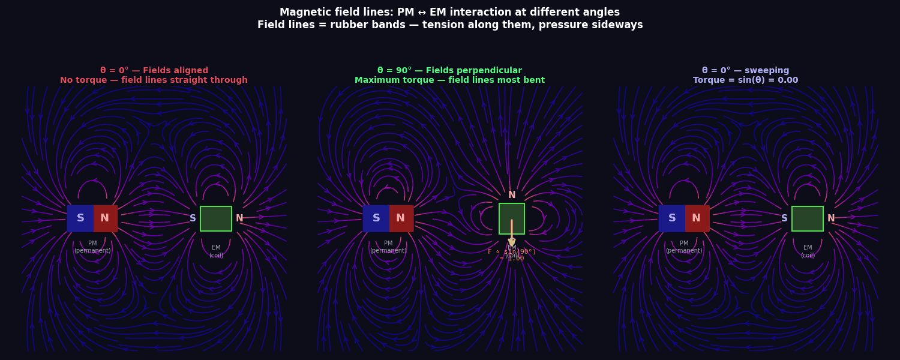
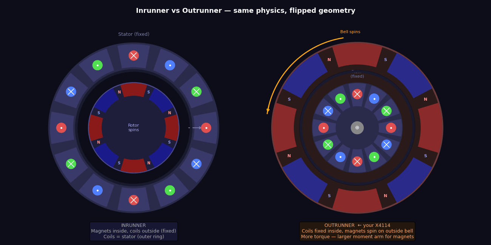
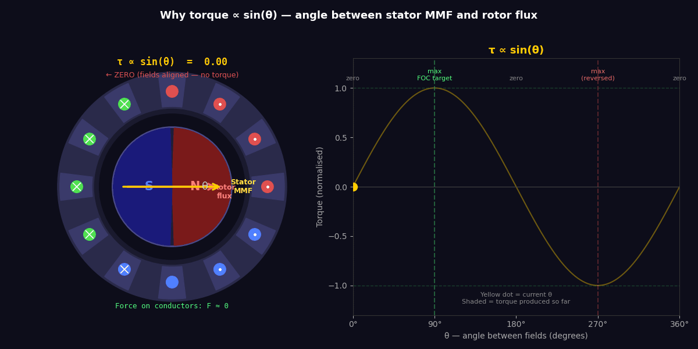
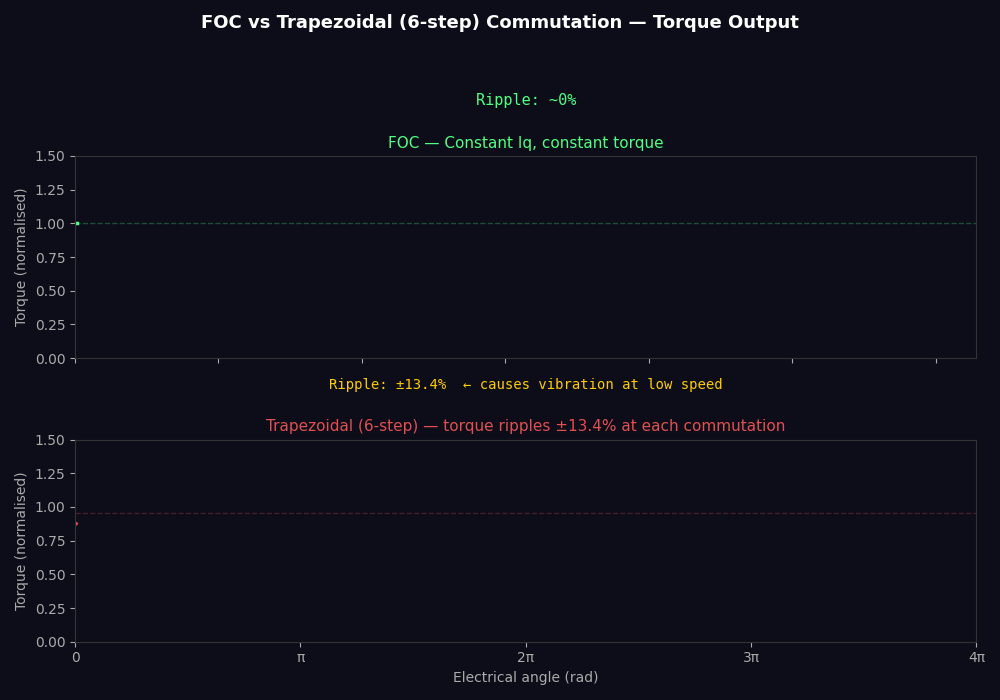
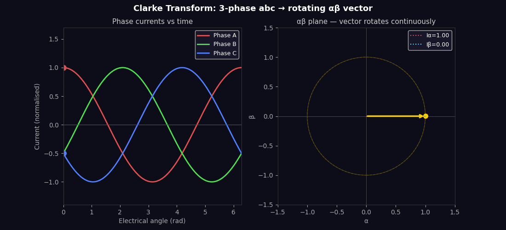
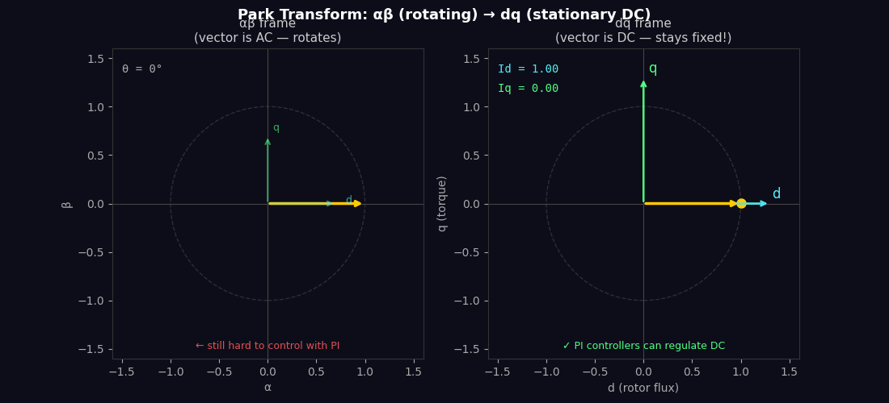
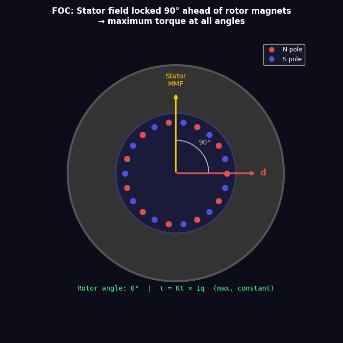

<script src="https://cdn.jsdelivr.net/npm/mermaid@10/dist/mermaid.min.js"></script>
<script>mermaid.initialize({startOnLoad:true, theme:'dark'});</script>

# Field Oriented Control (FOC) — A Full Technical Tutorial

A complete reference for understanding and implementing FOC on brushless motors, covering the maths, transforms, PID design, modelling, and safety.

---

## Contents

1. [What is FOC and why does it matter](#1-what-is-foc-and-why-does-it-matter)
2. [Brushless motor fundamentals](#2-brushless-motor-fundamentals)
3. [Symmetrical Components and Fortescue's Theorem](#3-symmetrical-components-and-fortescues-theorem)
4. [The Clarke Transform (αβ)](#4-the-clarke-transform-αβ)
5. [The Park Transform (dq)](#5-the-park-transform-dq)
6. [The dq Motor Model](#6-the-dq-motor-model)
7. [Instantaneous PQ Power Theory](#7-instantaneous-pq-power-theory)
8. [The FOC Control Loop](#8-the-foc-control-loop)
9. [PID Controllers — Design and Tuning](#9-pid-controllers--design-and-tuning)
10. [Space Vector PWM (SVPWM)](#10-space-vector-pwm-svpwm)
11. [Torque and Speed Control Modes](#11-torque-and-speed-control-modes)
12. [Field Weakening](#12-field-weakening)
13. [Motor Modelling and Parameter Identification](#13-motor-modelling-and-parameter-identification)
14. [Safety Margins and Protection](#14-safety-margins-and-protection)
15. [Sensorless FOC](#15-sensorless-foc)
16. [FOC on the moteus controller](#16-foc-on-the-moteus-controller)

---

## 1. What is FOC and why does it matter

A 3-phase brushless motor produces torque when current flows through its windings in the presence of a magnetic field. The torque produced is proportional to `sin(θ)` where θ is the angle between the stator magnetic field and the rotor magnetic field.

**Maximum torque occurs at θ = 90°.**



*Left: fields aligned — lines go straight through, no sideways force. Centre: 90° — lines are most bent, maximum force (rubber band trying to straighten). Right: angle sweeping live — torque tracks sin(θ).*



*Your X4114 is an outrunner — coils fixed in the centre, magnet bell spins around the outside.*



*Left: motor cross-section — rotor flux (red) is fixed, stator MMF (yellow) sweeps around. Green arrows show force on conductors. Right: the resulting sin(θ) torque curve with current operating point marked.*

Naive trapezoidal (six-step) commutation switches the stator field in discrete 60° steps, meaning θ wanders between 60° and 120° throughout each electrical cycle. At low speeds this produces torque ripple — the motor stutters, vibrates, and runs inefficiently.

**FOC continuously rotates the stator field so θ is always exactly 90°**, regardless of rotor position or speed. The result:



- Smooth torque at any speed including zero
- Maximum torque per amp (no wasted current)
- Direct torque control (command torque, not just speed)
- Better efficiency (less heat per Nm)
- Essential for compliant, force-controlled robots

---

## 2. Brushless Motor Fundamentals

### The KV constant and Kt

KV is defined as no-load RPM per volt. Converting to SI:

```
ω (rad/s per volt) = KV × 2π / 60
```

In an ideal motor, electrical power equals mechanical power:

```
P = V × I = τ × ω
```

Therefore:

```
τ / I = V / ω = 1 / (KV × 2π/60) = 60 / (2π × KV)
```

This gives the **torque constant**:

```
Kt (Nm/A) = 60 / (2π × KV)
```

KV and Kt are inverses. Lower KV = higher Kt = more torque per amp. Same motor, different winding.

### The back-EMF constant Ke

The same motor also acts as a generator. When spinning, it produces a back-EMF (BEMF):

```
BEMF (V) = Ke × ω
```

In SI units, Ke = Kt (numerically identical in a lossless motor).

### Electrical model of one phase

Each motor phase is modelled as a series circuit:

```
V_phase = R×I + L×(dI/dt) + BEMF
```

Where:
- R = winding resistance (Ω)
- L = winding inductance (H)
- BEMF = Ke × ω

This is the equation FOC is solving in real time across all three phases simultaneously.

### Pole pairs and electrical angle

The rotor has multiple pole pairs (p). One mechanical revolution = p electrical revolutions.

```
θ_electrical = p × θ_mechanical
ω_electrical = p × ω_mechanical
```

For your X4114 with 22 poles (11 pole pairs): one physical revolution = 11 electrical cycles. The FOC controller always works in electrical angle.

---

## 3. Symmetrical Components and Fortescue's Theorem

### Visual: Symmetrical components decomposition

<div class="mermaid">
flowchart LR
    ABC["Unbalanced 3-phase\nVa, Vb, Vc"] --> DEC["Fortescue\nDecomposition"]
    DEC --> POS["✅ Positive Sequence\nBalanced, forward rotation\n→ useful torque"]
    DEC --> NEG["⚠️ Negative Sequence\nBalanced, backward rotation\n→ braking torque + heat"]
    DEC --> ZERO["⚠️ Zero Sequence\nAll in phase\n→ only flows with neutral"]
    POS --> FOC_NOTE["FOC extracts only\npositive sequence via\nClarke + Park"]
    style POS fill:#1a5a1a,color:#fff
    style NEG fill:#5a1a1a,color:#fff
    style ZERO fill:#5a4a1a,color:#fff
    style FOC_NOTE fill:#1a1a5a,color:#fff
</div>

Fortescue (1918) proved that any unbalanced 3-phase system can be decomposed into three balanced sets of phasors:

1. **Positive sequence** — balanced, rotating forward (abc order)
2. **Negative sequence** — balanced, rotating backward (acb order)
3. **Zero sequence** — all three in phase (no rotation)

For a balanced 3-phase motor under normal operation, only the **positive sequence** component exists. The negative and zero sequences represent faults, imbalances, or asymmetries.

In matrix form, for phase voltages Va, Vb, Vc:

```
[V0]   [1  1   1 ] [Va]
[V+] = [1  a   a²] [Vb]   × (1/3)
[V-]   [1  a²  a ] [Vc]

where a = e^(j2π/3) = -0.5 + j×0.866  (120° rotation operator)
```

**Why this matters for FOC:**

- FOC implicitly extracts only the positive sequence by transforming into a rotating reference frame
- Negative sequence currents produce braking torque and heat — a real FOC controller's current balance reveals them
- Zero sequence currents can only flow if there's a neutral connection (most 3-phase inverters are floating — no zero sequence path)
- Motor faults (open phase, short to ground, bearing eccentricity) show up as negative sequence in the current spectrum — useful for diagnostics

In practice, FOC handles this automatically. But Fortescue is the theoretical foundation: the Clarke transform is essentially extracting the positive sequence α and β components from the three-phase signals.

---

## 4. The Clarke Transform (αβ)

### The problem

Three phase quantities (Ia, Ib, Ic) always satisfy:

```
Ia + Ib + Ic = 0
```

So only two are independent. Carrying three variables is redundant. Clarke collapses them into two orthogonal components in a **stationary** 2D reference frame.

### The transform

```
Iα = Ia

Iβ = (Ia + 2×Ib) / √3
```

Or in matrix form (amplitude-invariant scaling):

```
[Iα]   [1    0  ] [Ia]
[Iβ] = [1/√3  2/√3] [Ib]
```

The (α, β) vector traces a circle as the motor spins. Its magnitude is constant for balanced sinusoidal currents, and it rotates at the electrical frequency.

### Physical meaning

- **α axis** is aligned with phase A
- **β axis** is 90° ahead of α
- The (α, β) vector points in the direction of the stator magneto-motive force (MMF)

At this stage the signal is still AC — it rotates continuously. We haven't yet made it DC-controllable.

### Animation: 3-phase abc → αβ plane



### Visual: 3-phase abc → αβ plane

<svg viewBox="0 0 420 260" xmlns="http://www.w3.org/2000/svg" style="max-width:420px;background:#1a1a2e;border-radius:8px;padding:8px;">
  <!-- Grid -->
  <line x1="210" y1="20" x2="210" y2="240" stroke="#444" stroke-width="1"/>
  <line x1="30" y1="130" x2="390" y2="130" stroke="#444" stroke-width="1"/>
  <!-- α axis label -->
  <text x="375" y="125" fill="#aaa" font-size="13" font-family="monospace">α</text>
  <!-- β axis label -->
  <text x="215" y="30" fill="#aaa" font-size="13" font-family="monospace">β</text>
  <!-- Phase A axis (0°) -->
  <line x1="210" y1="130" x2="380" y2="130" stroke="#e05050" stroke-width="1.5" stroke-dasharray="4,3"/>
  <text x="355" y="148" fill="#e05050" font-size="12" font-family="monospace">Phase A (0°)</text>
  <!-- Phase B axis (120°) -->
  <line x1="210" y1="130" x2="125" y2="62" stroke="#50e050" stroke-width="1.5" stroke-dasharray="4,3"/>
  <text x="50" y="58" fill="#50e050" font-size="12" font-family="monospace">Phase B (120°)</text>
  <!-- Phase C axis (240°) -->
  <line x1="210" y1="130" x2="125" y2="198" stroke="#5050e0" stroke-width="1.5" stroke-dasharray="4,3"/>
  <text x="50" y="215" fill="#5050e0" font-size="12" font-family="monospace">Phase C (240°)</text>
  <!-- Rotating MMF vector (αβ result) at ~40° -->
  <line x1="210" y1="130" x2="313" y2="67" stroke="#ffcc00" stroke-width="2.5" marker-end="url(#arrow)"/>
  <text x="318" y="62" fill="#ffcc00" font-size="13" font-family="monospace">(α,β) vector</text>
  <!-- Circle showing rotation -->
  <circle cx="210" cy="130" r="85" stroke="#ffcc0044" stroke-width="1.5" fill="none" stroke-dasharray="5,3"/>
  <text x="100" y="248" fill="#888" font-size="11" font-family="monospace">Vector rotates at electrical frequency</text>
  <!-- Arrow marker -->
  <defs>
    <marker id="arrow" markerWidth="8" markerHeight="8" refX="6" refY="3" orient="auto">
      <path d="M0,0 L0,6 L8,3 z" fill="#ffcc00"/>
    </marker>
  </defs>
</svg>

### Inverse Clarke

To convert back for PWM generation:

```
Va = Vα
Vb = (-Vα + √3×Vβ) / 2
Vc = (-Vα - √3×Vβ) / 2
```

---

## 5. The Park Transform (dq)

### The problem

The (α, β) vector rotates at electrical frequency. A PI controller can't regulate an AC signal to zero error. We need to de-rotate it into a frame that's stationary from the rotor's perspective.

### The transform

Rotate the (α, β) frame by the rotor's electrical angle θ:

```
Id = Iα×cos(θ) + Iβ×sin(θ)
Iq = -Iα×sin(θ) + Iβ×cos(θ)
```

Matrix form:

```
[Id]   [ cos(θ)  sin(θ)] [Iα]
[Iq] = [-sin(θ)  cos(θ)] [Iβ]
```

If θ is the true rotor angle, then (Id, Iq) are **DC values** during steady-state operation. PI controllers can now regulate them to setpoints.

### Physical meaning

- **d-axis (direct)** — aligned with the rotor flux (the permanent magnets)
- **q-axis (quadrature)** — 90° ahead of the rotor flux

Torque is produced only by the component of stator MMF that is perpendicular to the rotor flux — that's the q-axis.

```
τ = (3/2) × p × Kt × Iq        (for a surface-mount PM motor)
```

Where p = number of pole pairs.

### Animation: αβ rotating frame vs dq stationary frame



### Animation: Rotor spinning — stator MMF locked 90° ahead



### Visual: dq rotating frame and why Iq = torque

<svg viewBox="0 0 420 280" xmlns="http://www.w3.org/2000/svg" style="max-width:420px;background:#1a1a2e;border-radius:8px;padding:8px;">
  <defs>
    <marker id="aq" markerWidth="8" markerHeight="8" refX="6" refY="3" orient="auto"><path d="M0,0 L0,6 L8,3 z" fill="#ffcc00"/></marker>
    <marker id="ad" markerWidth="8" markerHeight="8" refX="6" refY="3" orient="auto"><path d="M0,0 L0,6 L8,3 z" fill="#50e0ff"/></marker>
    <marker id="aq2" markerWidth="8" markerHeight="8" refX="6" refY="3" orient="auto"><path d="M0,0 L0,6 L8,3 z" fill="#50ff80"/></marker>
    <marker id="ar" markerWidth="8" markerHeight="8" refX="6" refY="3" orient="auto"><path d="M0,0 L0,6 L8,3 z" fill="#e05050"/></marker>
  </defs>
  <!-- Static αβ axes -->
  <line x1="200" y1="20" x2="200" y2="260" stroke="#333" stroke-width="1"/>
  <line x1="30" y1="150" x2="390" y2="150" stroke="#333" stroke-width="1"/>
  <text x="378" y="145" fill="#555" font-size="12" font-family="monospace">α</text>
  <text x="205" y="28" fill="#555" font-size="12" font-family="monospace">β</text>
  <!-- Rotor flux direction (d-axis) at 35° -->
  <line x1="200" y1="150" x2="340" y2="70" stroke="#50e0ff" stroke-width="2" marker-end="url(#ad)"/>
  <text x="345" y="65" fill="#50e0ff" font-size="12" font-family="monospace">d-axis (rotor flux / magnets)</text>
  <!-- q-axis (90° ahead of d) -->
  <line x1="200" y1="150" x2="120" y2="10" stroke="#50ff80" stroke-width="2" marker-end="url(#aq2)"/>
  <text x="40" y="18" fill="#50ff80" font-size="12" font-family="monospace">q-axis (torque)</text>
  <!-- Stator current vector -->
  <line x1="200" y1="150" x2="148" y2="38" stroke="#ffcc00" stroke-width="2.5" marker-end="url(#aq)"/>
  <text x="90" y="100" fill="#ffcc00" font-size="12" font-family="monospace">Stator MMF</text>
  <!-- Iq component (projection onto q-axis) -->
  <line x1="200" y1="150" x2="148" y2="38" stroke="#50ff80" stroke-width="1" stroke-dasharray="4,3"/>
  <!-- Id component (projection onto d-axis) - small, near zero -->
  <line x1="148" y1="38" x2="163" y2="30" stroke="#50e0ff" stroke-width="1" stroke-dasharray="4,3"/>
  <!-- Angle θ arc -->
  <path d="M 230,150 A 32,32 0 0,0 218,118" stroke="#aaa" fill="none" stroke-width="1"/>
  <text x="233" y="133" fill="#aaa" font-size="11" font-family="monospace">θ</text>
  <!-- Torque arrow -->
  <text x="30" y="200" fill="#ffcc00" font-size="12" font-family="monospace">τ = Kt × Iq</text>
  <text x="30" y="220" fill="#888" font-size="11" font-family="monospace">Id = 0 → all current produces torque</text>
  <text x="30" y="240" fill="#888" font-size="11" font-family="monospace">Id ≠ 0 → some current wasted on flux</text>
  <!-- 90° marker between d and q -->
  <text x="170" y="68" fill="#aaa" font-size="11" font-family="monospace">90°</text>
</svg>

### Inverse Park

To go back to (α, β) for PWM:

```
Vα = Vd×cos(θ) - Vq×sin(θ)
Vβ = Vd×sin(θ) + Vq×cos(θ)
```

---

## 6. The dq Motor Model

In the dq rotating frame, the motor equations simplify considerably. For a surface-mount PMSM (permanent magnet synchronous motor):

```
Vd = R×Id + L×(dId/dt) - ω×L×Iq

Vq = R×Iq + L×(dIq/dt) + ω×L×Id + ω×λ
```

Where:
- R = phase resistance (Ω)
- L = phase inductance (H)  
- ω = electrical angular velocity (rad/s)
- λ = rotor flux linkage (Wb) — set by the permanent magnets

The terms `ω×L×Iq` and `ω×L×Id` are **cross-coupling terms** — the d-axis current induces a voltage on the q-axis and vice versa. At high speed these become significant and must be decoupled (feed-forward compensation) for good dynamic response.

The term `ω×λ` on the q-axis is the back-EMF.

### Steady state (derivatives = 0)

```
Vd = R×Id - ω×L×Iq
Vq = R×Iq + ω×L×Id + ω×λ
```

At Id = 0 (which is the normal FOC setpoint):

```
Vd = -ω×L×Iq       (purely from cross-coupling)
Vq = R×Iq + ω×λ    (resistive drop + BEMF)
```

This tells you directly what voltage headroom you need at a given speed and current.

### Voltage limit

The inverter can only produce a limited voltage magnitude:

```
|V| = √(Vd² + Vq²) ≤ Vbus / √3    (for SVPWM)
```

At high speed, BEMF (ω×λ) consumes most of the available voltage, leaving little for resistive drop and current regulation. This is the base speed limit — above it you need field weakening.

---

## 7. Instantaneous PQ Power Theory

Developed by Akagi (1983), instantaneous PQ theory expresses real and reactive power directly in the αβ frame without needing to know the rotor angle. Useful for grid-tied inverters and for understanding power flow in motor drives.

### Definitions

In the αβ frame:

```
p = Vα×Iα + Vβ×Iβ     (instantaneous real power)
q = Vβ×Iα - Vα×Iβ     (instantaneous imaginary/reactive power)
```

Or in matrix form:

```
[p]   [Vα   Vβ] [Iα]
[q] = [Vβ  -Vα] [Iβ]
```

### Physical interpretation

- **p** — real power, transferred to the rotor (torque production) plus resistive losses
- **q** — reactive power, energy stored and released in the motor inductances; produces no average torque

In a motor context:

```
Torque-producing power = p - p_losses = τ × ω_mech
Reactive power = q = energy oscillating in inductances
```

### Connection to dq control

In the dq frame, the equivalents are:

```
P = (3/2) × (Vd×Id + Vq×Iq)
Q = (3/2) × (Vq×Id - Vd×Iq)
```

Setting Id = 0 for maximum torque per amp (MTPA):

```
P = (3/2) × Vq×Iq    (all real power on q-axis)
Q = (3/2) × Vq×Id = 0  (no reactive power drawn — optimal)
```

This is why Id = 0 is optimal for surface-mount PM motors: it minimises the reactive current drawn from the supply for a given torque.

---

## 8. The FOC Control Loop

Here is the complete signal flow:

<div class="mermaid">
flowchart TD
    POS["Position Setpoint θ_ref"] --> POS_PI["Position PI"]
    POS_PI --> SPD["Speed Setpoint ω_ref"]
    SPD --> SPD_PI["Speed PI"]
    SPD_PI --> IQ_REF["Iq_ref\n(torque current setpoint)"]
    ID_REF["Id_ref = 0\n(or negative for field weakening)"] --> PID_D

    IQ_REF --> PID_Q["PI Controller\nq-axis"]
    ID_REF --> PID_D["PI Controller\nd-axis"]

    PID_Q --> FF_Q["+ Feed-forward\n+ω·L·Id + ω·λ"]
    PID_D --> FF_D["+ Feed-forward\n−ω·L·Iq"]

    FF_Q --> VQ["Vq"]
    FF_D --> VD["Vd"]

    VQ --> IPARK["Inverse Park\nrotate by −θ"]
    VD --> IPARK

    IPARK --> VADB["Vα, Vβ"]
    VADB --> ICLK["Inverse Clarke"]
    ICLK --> VABC["Va, Vb, Vc"]
    VABC --> SVPWM["Space Vector PWM"]
    SVPWM --> FETS["Half-bridge FETs\n(3-phase inverter)"]
    FETS --> MOTOR["🔄 Brushless Motor"]

    MOTOR --> CS["Current Sensors\nIa, Ib"]
    MOTOR --> ENC["Encoder\nθ (rotor angle)"]

    CS --> CLK["Clarke Transform"]
    CLK --> IABFB["Iα, Iβ"]
    IABFB --> PARK["Park Transform\n(using θ from encoder)"]
    ENC --> PARK
    PARK --> IDIQ["Id, Iq (measured)"]
    IDIQ --> PID_D
    IDIQ --> PID_Q

    style MOTOR fill:#2a5298,color:#fff
    style FETS fill:#1a3a6a,color:#fff
    style SVPWM fill:#4a235a,color:#fff
    style IPARK fill:#1a5a3a,color:#fff
    style PARK fill:#1a5a3a,color:#fff
    style CLK fill:#5a4a1a,color:#fff
    style ICLK fill:#5a4a1a,color:#fff
</div>

### Feed-forward decoupling

The cross-coupling terms from the dq model are added as feed-forward to improve dynamic response:

```
Vd_output = PI_d_output - ω×L×Iq    (remove q-axis coupling from d)
Vq_output = PI_q_output + ω×L×Id + ω×λ    (remove d-axis coupling + BEMF)
```

Without decoupling, the PI controllers fight the cross-coupling terms. With it, each axis is independent and the PI only needs to handle resistive drop — much easier to tune.

---

## 9. PID Controllers — Design and Tuning

### PI controller structure (current loop)

For motor current control, a PI (not PID) is standard — derivative action amplifies sensor noise on current measurements.

```
u(t) = Kp × e(t) + Ki × ∫e(t)dt
```

In discrete time (z-domain):

```
u[n] = u[n-1] + Kp×(e[n] - e[n-1]) + Ki×Ts×e[n]
```

Where Ts = sample period.

### Bandwidth and stability

The current loop bandwidth is typically set to:

```
f_bandwidth = (1/10) × f_switching
```

For a 20kHz switching frequency: bandwidth ≈ 2kHz.

The current loop time constant is dominated by L/R:

```
τ_elec = L / R
```

PI gains from pole-zero cancellation:

```
Kp = L / (2 × τ_desired)     ← set τ_desired to achieve target bandwidth
Ki = R / (2 × τ_desired)
```

Or equivalently:

```
τ_desired = 1 / (2π × f_bandwidth)
Kp = L × 2π × f_bandwidth
Ki = R × 2π × f_bandwidth
```

### Speed loop (outer)

The speed loop is slower than the current loop (typically 10× slower bandwidth). It outputs an Iq setpoint. Uses PI with anti-windup.

```
τ_speed = J / (Kp_speed)
```

Where J = rotor inertia (kg·m²). Set Kp_speed to achieve desired speed loop bandwidth.

### Position loop (outermost)

Slowest loop, outputs speed setpoint. Often a simple P controller with velocity feed-forward is sufficient:

```
ω_ref = Kp_pos × (θ_ref - θ) + Kff × dθ_ref/dt
```

### Anti-windup

When the motor saturates (hits voltage or current limits), the integrator keeps accumulating error and causes overshoot on recovery. Anti-windup clamps the integrator:

```
if |output| > limit:
    stop integrating
```

Or the back-calculation method:

```
integrator += Ki×e - Kaw×(output_clamped - output_unclamped)
```

Where Kaw is the anti-windup gain (typically 1/Kp to 10/Kp).

### Practical tuning sequence

1. Disable speed and position loops
2. Command a step in Iq_ref, observe Id and Iq response
3. Increase Kp_q until the current response is fast without ringing
4. Add Ki_q to eliminate steady-state error
5. Repeat for d-axis (usually same gains for a symmetric motor)
6. Enable speed loop, tune Kp_speed and Ki_speed with motor spinning
7. Enable position loop last

---

## 10. Space Vector PWM (SVPWM)

### Why not just use sinusoidal PWM?

Sinusoidal PWM (SPWM) wastes ~15% of DC bus voltage. SVPWM achieves a modulation index of 1/√3 ≈ 0.577 vs SPWM's 0.5 — the same 15% gain in available voltage output from the same DC bus.

### The six voltage vectors

A 3-phase inverter with 3 half-bridges has 2³ = 8 switching states. Six produce non-zero voltage vectors (V1–V6) spaced 60° apart, and two produce zero vectors (V0, V7).

```
        V3 (010)
         |
V2(110)  |  V4(011)
   \     |     /
    \    |    /
     \   |   /
      \  |  /
V1(100)──┼──V5(001)
      /  |  \
     /   |   \
    /    |    \
   /     |     \
V6(101)  |  (000)V0, (111)V7
         |
```

### SVPWM algorithm

1. Calculate the reference voltage vector from Vα, Vβ
2. Identify which 60° sector it falls in
3. Calculate the on-times T1, T2 for the two adjacent active vectors, and T0 for zero vectors:

```
T1 = Ts × (|V_ref|/Vbus) × sin(60° - θ_sector) × √3
T2 = Ts × (|V_ref|/Vbus) × sin(θ_sector) × √3
T0 = Ts - T1 - T2
```

4. Distribute T0/2 at the start and end of each PWM period (symmetric SVPWM = minimum harmonics)

### Maximum modulation index

```
|V_ref|_max = Vbus / √3 ≈ 0.577 × Vbus
```

Beyond this, over-modulation occurs (distorted currents, torque ripple returns).

---

## 11. Torque and Speed Control Modes

### Torque control (current mode)

- Directly command Iq_ref
- Id_ref = 0 (for surface-mount PM motors)
- Fastest response, used in compliant robot legs
- No speed limiting — motor accelerates until BEMF limits current

```
τ_ref → Iq_ref = τ_ref / Kt
```

### Speed control

- Outer PI loop on speed error → Iq_ref
- Inner current loop unchanged
- Includes current (torque) limiting to protect motor

### Position control

- Outermost P loop on position error → ω_ref
- Middle PI loop on speed error → Iq_ref
- Inner current loop unchanged
- Cascade structure: position → speed → current → voltage → motor

### Impedance control (robot legs)

For compliant legs (Boston Dynamics style), you want the leg to behave like a spring-damper:

```
τ = Kp × (θ_ref - θ) + Kd × (ω_ref - ω)
```

This is implemented as a torque command (Iq_ref) calculated from position and velocity error with virtual stiffness Kp and damping Kd. No integrator — pure proportional + derivative on the torque output. This is why FOC torque control is essential: you need to command torque precisely and instantly.

---

## 12. Field Weakening

### The problem

At base speed, BEMF = supply voltage. No headroom remains to push more current. Speed cannot increase further at full torque.

### The solution

Inject negative Id current. This creates a stator flux that opposes the rotor permanent magnet flux, reducing the effective λ:

```
λ_effective = λ_PM + L×Id     (Id is negative, so λ_effective < λ_PM)
```

BEMF = ω × λ_effective — now BEMF is lower, leaving voltage headroom to maintain Iq at high speed.

### Trade-offs

- Torque decreases (less flux = less torque per amp)
- Id current produces I²R heating with no torque benefit
- Risk of permanent demagnetisation if Id is too large (PM coercivity limit)
- For robot legs at low speed, field weakening is rarely needed

### Voltage limit circle

In the dq plane, the operating point must stay within:

```
(Vd)² + (Vq)² ≤ (Vbus/√3)²
```

Field weakening shifts the operating point along the voltage limit circle by increasing negative Id as speed rises.

<svg viewBox="0 0 420 300" xmlns="http://www.w3.org/2000/svg" style="max-width:420px;background:#1a1a2e;border-radius:8px;padding:8px;">
  <defs>
    <marker id="axarr" markerWidth="8" markerHeight="8" refX="6" refY="3" orient="auto"><path d="M0,0 L0,6 L8,3 z" fill="#666"/></marker>
  </defs>
  <!-- Axes -->
  <line x1="60" y1="150" x2="390" y2="150" stroke="#555" stroke-width="1" marker-end="url(#axarr)"/>
  <line x1="210" y1="270" x2="210" y2="20" stroke="#555" stroke-width="1" marker-end="url(#axarr)"/>
  <text x="370" y="168" fill="#888" font-size="12" font-family="monospace">Id →</text>
  <text x="215" y="22" fill="#888" font-size="12" font-family="monospace">Iq ↑</text>
  <!-- Voltage limit circle (large) -->
  <circle cx="210" cy="150" r="110" stroke="#e05050" stroke-width="2" fill="#e0505011" stroke-dasharray="6,3"/>
  <text x="310" y="55" fill="#e05050" font-size="11" font-family="monospace">Voltage limit</text>
  <text x="310" y="68" fill="#e05050" font-size="11" font-family="monospace">circle (low speed)</text>
  <!-- Current limit circle -->
  <circle cx="210" cy="150" r="80" stroke="#50e0ff" stroke-width="2" fill="#50e0ff11" stroke-dasharray="6,3"/>
  <text x="60" y="62" fill="#50e0ff" font-size="11" font-family="monospace">Current limit circle</text>
  <text x="60" y="75" fill="#50e0ff" font-size="11" font-family="monospace">I_max</text>
  <!-- MTPA point (Id=0, Iq=rated) -->
  <circle cx="210" cy="70" r="6" fill="#ffcc00"/>
  <text x="218" y="68" fill="#ffcc00" font-size="11" font-family="monospace">MTPA point (Id=0)</text>
  <!-- Field weakening operating point -->
  <circle cx="148" cy="90" r="6" fill="#50ff80"/>
  <text x="60" y="110" fill="#50ff80" font-size="11" font-family="monospace">Field weakening</text>
  <text x="60" y="123" fill="#50ff80" font-size="11" font-family="monospace">(negative Id)</text>
  <!-- Arrow showing FW direction -->
  <line x1="210" y1="70" x2="150" y2="90" stroke="#50ff80" stroke-width="1.5" stroke-dasharray="4,2"/>
  <!-- Smaller voltage circle at high speed -->
  <circle cx="210" cy="150" r="55" stroke="#e0503380" stroke-width="1.5" fill="none" stroke-dasharray="4,3"/>
  <text x="270" y="105" fill="#e05033" font-size="10" font-family="monospace">High speed</text>
  <text x="270" y="118" fill="#e05033" font-size="10" font-family="monospace">voltage limit shrinks</text>
  <!-- Id=0 axis label -->
  <line x1="210" y1="20" x2="210" y2="270" stroke="#ffcc0033" stroke-width="1"/>
  <text x="60" y="280" fill="#888" font-size="10" font-family="monospace">As speed ↑, voltage circle shrinks → must move Id negative to stay inside</text>
</svg>

---

## 13. Motor Modelling and Parameter Identification

Before tuning, you need R, L, λ, J, B (friction).

### Resistance R

With motor stationary, apply a known DC voltage across two phases and measure current:

```
R_phase = V / I / 2     (two phases in series for star connection)
```

Or measure with a milliohm meter directly.

### Inductance L

Apply a known voltage step, measure current ramp rate:

```
L = V × dt / dI
```

Or use an LCR meter at 1kHz. For star connection, measured between two terminals = 2×L_phase.

### Flux linkage λ

Spin the motor at known speed with a power drill, measure no-load phase voltage (RMS) between two phases:

```
BEMF_line = √3 × λ × ω_electrical
λ = BEMF_line / (√3 × p × ω_mechanical)
```

### Inertia J

Apply a known torque (known Iq), measure acceleration:

```
J = τ / α = (Kt × Iq) / (dω/dt)
```

### The motor transfer function

From the dq model, the q-axis current response to voltage input (at Id = 0, fixed speed):

```
Iq(s) / Vq(s) = 1 / (R + s×L)
```

This is a first-order low-pass with time constant τ = L/R. Your current PI controller must close a loop around this plant.

The closed-loop current bandwidth with PI (pole-zero cancellation):

```
f_cl = R / (2π × L) × (1 + Kp/Ki × s) — PI zero cancels the plant pole
```

After cancellation, the closed loop becomes:

```
G_cl(s) = 1 / (1 + s × L/Kp)
```

Bandwidth = Kp / (2π × L). Set Kp to get your target bandwidth.

---

## 14. Safety Margins and Protection

### Current limiting

Hard limit on Iq_ref:

```
Iq_ref = min(Iq_commanded, I_max)
```

Set I_max from the motor's continuous current rating, not peak. For the 4822 motor, continuous = 11A → Iq_max = 11A for sustained operation.

For short bursts (< 5 seconds), you can allow up to peak rating (15A for the 4822) with a thermal model.

### Thermal model (simple)

Maintain a software thermal accumulator:

```
T_estimate[n] = T_estimate[n-1] + (I²×R×Ts) / C_thermal - (T_estimate[n-1] - T_ambient) / R_thermal
```

Where C_thermal is motor thermal mass and R_thermal is thermal resistance (from datasheet or measured). Derate current when T_estimate exceeds threshold.

### Voltage limits

Minimum bus voltage check — if Vbus drops below minimum operating voltage (e.g. LiPo cutoff), shut down rather than collapse the battery:

```
if Vbus < V_cutoff: fault()
```

Maximum phase voltage — SVPWM handles this automatically through the modulation index limit, but verify your Vd and Vq don't request more than Vbus/√3.

### Overcurrent fault

Hardware comparator on gate driver (e.g. DRV8323) triggers in < 1μs — faster than software can respond. Set the hardware limit 20–30% above software limit as a last resort.

### Encoder fault

If the encoder signal is lost or jumps discontinuously, the Park transform uses a wrong θ — immediately producing maximum voltage in the wrong direction. Implement:

- Timeout on encoder updates
- Rate-of-change limit on θ (can't jump more than expected per sample period)
- On fault: zero all gate signals (freewheel), not hard brake

### Shoot-through protection

Both high and low FETs in a half-bridge must never conduct simultaneously — this shorts the DC bus. Gate drivers enforce dead-time (typically 100–200ns). Do not override dead-time settings.

### Safe state on fault

```
Fault hierarchy:
1. Overcurrent (hardware) → immediate gate disable
2. Over-temperature       → ramp down current, then gate disable
3. Under-voltage          → gate disable
4. Encoder loss           → gate disable (freewheel)
5. Software watchdog      → gate disable
```

Always fail to freewheel (high-impedance), not to brake (active short), unless you have explicitly verified the brake is safe for your load.

---

## 15. Sensorless FOC

Without an encoder, rotor angle must be estimated from phase voltages and currents.

### Back-EMF observer (mid-to-high speed)

From the dq model, rearrange for BEMF:

```
BEMF_α = Vα - R×Iα - L×(dIα/dt)
BEMF_β = Vβ - R×Iβ - L×(dIβ/dt)
```

The BEMF vector points at the rotor flux position:

```
θ_estimated = atan2(BEMF_β, BEMF_α) - 90°
```

Works well above ~10% of base speed. Below this, BEMF is too small to measure reliably.

### High-frequency injection (zero and low speed)

Inject a small high-frequency voltage (500Hz–2kHz) on the d-axis. In a non-salient motor (surface-mount PM), there's no saliency to detect. In an interior PM motor or any motor with anisotropy, the response current has a component modulated by rotor position. Demodulate to extract angle.

For surface-mount motors like the X4114, saliency is minimal — HFI is unreliable. Use an encoder.

### Phase-locked loop (PLL) for angle tracking

Rather than directly using atan2 (noisy), run a PLL on the BEMF:

```
error = BEMF_β × cos(θ_est) - BEMF_α × sin(θ_est)
ω_est += Ki_pll × error
θ_est += ω_est × Ts + Kp_pll × error
```

The PLL tracks the angle smoothly and rejects noise. Used in moteus and most production sensorless FOC.

---

## 16. FOC on the moteus controller

[moteus](https://github.com/mjbots/moteus) by mjbots is an open-source FOC controller designed for exactly the robot actuator use case. Key features:

### Hardware

- STM32G4 microcontroller (170MHz, hardware FPU)
- DRV8353 gate driver with hardware overcurrent
- 3-phase current sensing (all three phases, not reconstructed)
- AS5047 magnetic encoder (14-bit, SPI)
- CAN-FD communication
- Up to 44V, 50A peak

### Control loop timing

- PWM frequency: 40kHz
- Current loop: runs every PWM period = 25μs
- Position/velocity loop: every 1ms
- CAN command: up to 1kHz update rate

### Key registers for tuning

```
servo.pid_dq.kp          # d and q axis current Kp
servo.pid_dq.ki          # d and q axis current Ki
servo.pid_position.kp    # position loop Kp
servo.pid_position.ki    # position loop Ki
servo.pid_position.kd    # position loop Kd
servo.flux_brake_min_voltage  # field weakening threshold
servo.max_current_A      # current limit
servo.derate_temperature  # thermal derating start temp (°C)
servo.fault_temperature   # hard fault temperature (°C)
```

### Commissioning sequence for your X4114

1. **Measure motor parameters** — use moteus_tool resistance/inductance test:
   ```
   python3 -m moteus.moteus_tool --target 1 --calibrate
   ```
   This spins the motor slowly, measures R, L, λ, and pole count automatically.

2. **Verify encoder direction** — command a small positive torque, verify the reported position increases. If not, set `motor.invert = true`.

3. **Current loop bandwidth** — start with kp = L × 2000 × 2π, ki = R × 2000 × 2π (targeting 2kHz bandwidth). Observe step response on Id and Iq.

4. **Position loop** — command a step position change. Start with kp = 1.0, kd = 0.01. Increase kp until oscillation, then back off 50%.

5. **Safety limits** — set max_current_A to your motor's continuous rating (11A for 4822, 31A for X4114). Set fault_temperature to 80°C for printed housings.

### CAN-FD command format

```python
import moteus
import asyncio

async def main():
    c = moteus.Controller()
    await c.set_stop()
    
    # Torque control
    state = await c.set_torque(torque=0.5)  # 0.5 Nm
    
    # Position control with impedance
    state = await c.set_position(
        position=0.0,          # rotations
        velocity=0.0,          # rotations/s
        kp_scale=1.0,          # scale on position gain
        kd_scale=1.0,          # scale on velocity gain
        maximum_torque=5.0     # Nm
    )
    
asyncio.run(main())
```

### Impedance control for your robot leg

```python
async def leg_impedance_control(controller, q_ref, kp=10.0, kd=0.5):
    state = await controller.query()
    q_actual = state.values[moteus.Register.POSITION]
    qd_actual = state.values[moteus.Register.VELOCITY]
    
    tau = kp * (q_ref - q_actual) + kd * (0.0 - qd_actual)
    await controller.set_torque(torque=tau)
```

This is the core of a virtual spring-damper leg — same principle as MIT Mini Cheetah and Boston Dynamics Spot.

---

## Summary

| Stage | Transform | Frame | Purpose |
|---|---|---|---|
| 3-phase currents | — | abc stationary | Raw measurements |
| Clarke | αβ transform | αβ stationary | Remove redundancy |
| Park | dq transform | dq rotating | Make signals DC |
| PI control | — | dq rotating | Regulate Id=0, Iq=torque |
| Inverse Park | Reverse rotation | αβ stationary | Back to stationary |
| Inverse Clarke / SVPWM | — | abc stationary | Drive FET gates |

The entire elegance of FOC is that two rotations (Clarke + Park) convert a 3-phase AC problem into a 2-channel DC regulation problem, where one channel is torque and the other is zero.
