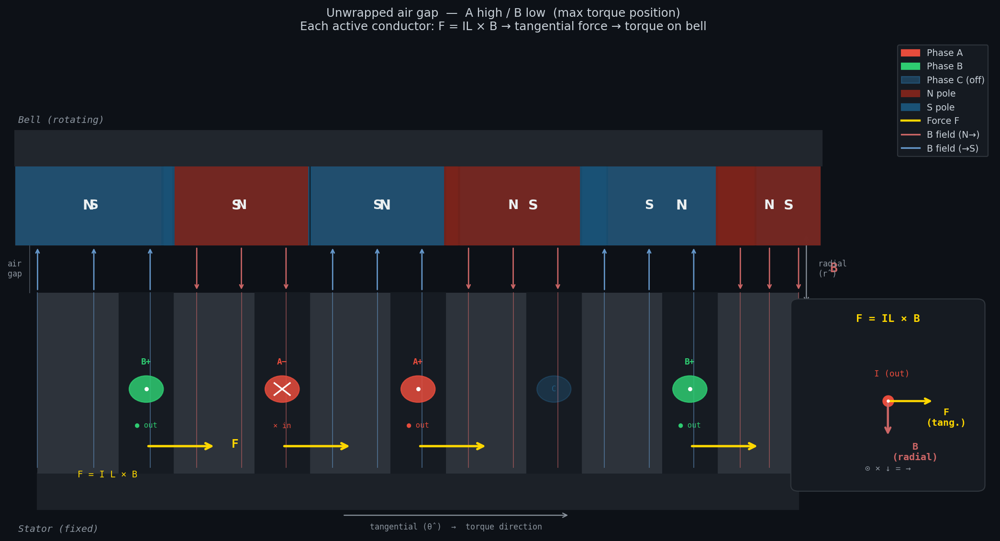
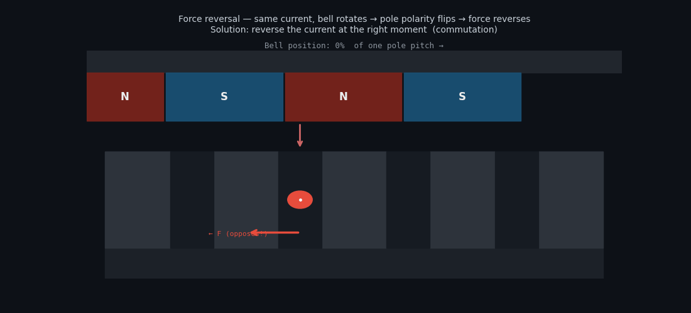
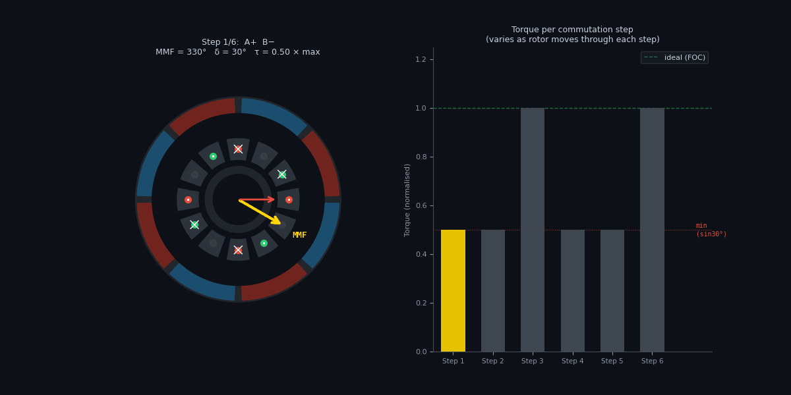
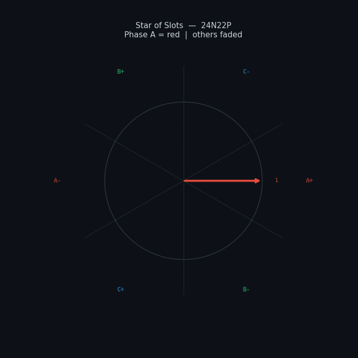
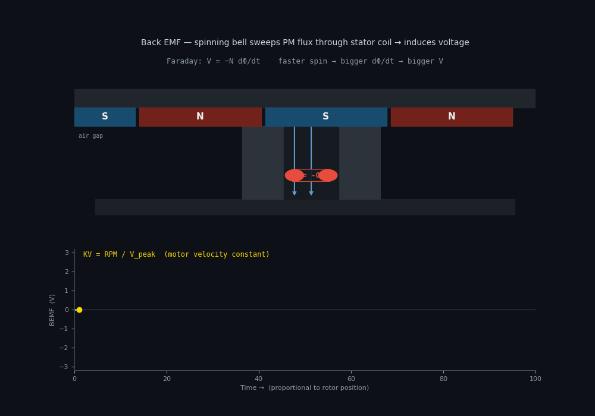

---
---

# How a Brushless Outrunner Motor Works

This is a bottom-up explanation of how a brushless outrunner motor produces torque — starting from a single wire in a magnetic field, building up through commutation, trapezoidal control, and finally why FOC exists and what it's actually doing.

---

## 1. The Only Fact You Need

Every electric motor is built on one physical law:

$$\vec{F} = I \vec{L} \times \vec{B}$$

A current-carrying wire inside a magnetic field experiences a **force**. The force is:
- Proportional to the current $$I$$ and wire length $$L$$
- Proportional to the field strength $$B$$
- **Perpendicular to both** the current direction and the field direction (the cross product)

That's it. Every motor, from a toy to a Tesla, is just this equation repeated many times over.

---

## 2. The Outrunner Layout

An outrunner BLDC motor has two parts:

| Part | Description | Moves? |
|------|-------------|--------|
| **Bell** | Outer rotating shell, permanent magnets on inner face | Yes — this is your output shaft |
| **Stator** | Inner fixed part, copper coils wound on iron teeth | No — bolted to your frame |

The magnets on the bell alternate N–S–N–S around the circumference. The coils on the stator sit in the air gap between bell and stator.


Outrunners have higher torque for the same motor volume because the force acts at a larger radius (the bell), giving a longer moment arm.

---

## 3. One Coil, One Pole Pair

Let's strip everything back: one coil on one tooth, and one N–S pair on the bell.

The PM creates a **radial B field** through the air gap:
- Under the N pole: B points **inward** (from bell toward stator)
- Under the S pole: B points **outward** (from stator toward bell)

The coil has two sides — current goes **in** one side and **out** the other (it's a loop). By design, the two sides sit under opposite poles:

```
Bell:    |     N     |     S     |
              ↓ B          ↑ B       (radial field)
Stator:  [× current in]  [● current out]
              → F          → F       (force: tangential, same direction)
```

**Both** sides of the coil push the bell in the same direction — one because current-in × B-inward = rightward, the other because current-out × B-outward = also rightward.

The stator is fixed, so by Newton's third law: the **bell** gets pushed in the opposite direction and rotates.



---

## 3a. Where Does F = IL×B Come From?

The formula isn't magic — it falls out of one more fundamental law: the **Lorentz force** on a moving charge.

### Step 1 — Force on a single charge

A charge $$q$$ moving with velocity $$\vec{v}$$ through a magnetic field $$\vec{B}$$ experiences:

$$\vec{F} = q\vec{v} \times \vec{B}$$

This is experimental fact — it's how magnetic fields are defined. The force is perpendicular to both the velocity and the field.

### Step 2 — Current is just moving charges

In a wire carrying current $$I$$:
- There are $$n$$ charge carriers per unit volume
- Each has charge $$q$$ and drifts at velocity $$\vec{v}_d$$ (the drift velocity)
- The current is: $$I = nqv_d A$$ where $$A$$ is the wire's cross-sectional area

In a small element of wire with length $$dL$$:
- Number of charges in that element: $$dN = nA \cdot dL$$
- Force on each charge: $$d\vec{F}_{per\ charge} = q\vec{v}_d \times \vec{B}$$
- Total force on the element:

$$d\vec{F} = dN \cdot q(\vec{v}_d \times \vec{B}) = nAq \cdot dL\ (\hat{L} \times \vec{B})$$

Since $$nqv_d A = I$$, we can substitute:

$$d\vec{F} = I\ (d\vec{L} \times \vec{B})$$

Integrate along the whole wire in a uniform field:

$$\boxed{\vec{F} = I\vec{L} \times \vec{B}}$$

That's it. F = IL×B is just the Lorentz force on all the drifting charges in the wire, summed up.

---

### Step 3 — Why does the field superposition picture give the same answer?

The wire carries current → it creates its own circular B field (by Biot-Savart):

$$B_{wire} = \frac{\mu_0 I}{2\pi r}$$

This field superimposes with the PM field. The total stored magnetic energy density at any point is:

$$u = \frac{B_{total}^2}{2\mu_0} = \frac{(\vec{B}_{PM} + \vec{B}_{wire})^2}{2\mu_0}$$

Expanding:

$$u = \frac{B_{PM}^2 + 2\vec{B}_{PM}\cdot\vec{B}_{wire} + B_{wire}^2}{2\mu_0}$$

The $$B_{PM}^2$$ and $$B_{wire}^2$$ terms are fixed. Only the **cross term** $$\vec{B}_{PM} \cdot \vec{B}_{wire}$$ changes with position:

```
Left of wire:  B_PM and B_wire point same way  →  dot product > 0  →  high energy density
Right of wire: B_PM and B_wire point opposite  →  dot product < 0  →  low energy density
```

A system always moves to minimise its energy. The wire is pushed **from the high-energy side to the low-energy side** — i.e., rightward.

The force is the gradient of the interaction energy:

$$\vec{F} = -\nabla U_{interaction} = -\nabla \int \frac{\vec{B}_{PM} \cdot \vec{B}_{wire}}{\mu_0}\ dV$$

When you work through this integral (it becomes the Maxwell stress tensor), you recover exactly:

$$\vec{F} = I\vec{L} \times \vec{B}$$

**Both derivations are the same physics.** The Lorentz route is faster. The field energy route shows you *why* the weak-field side pulls — the system is literally moving downhill in energy.

---

## 4. The Problem: Force Reverses

The bell rotates. Eventually the N pole that was sitting over your `×` conductor moves on, and an S pole arrives instead. The B field at that conductor has **reversed direction**.

Same current + reversed B = **reversed force** — now opposing rotation.

You have to **reverse the current** at exactly the right moment to keep the force in the same direction. This is **commutation**.



---

## 5. Three Phases

One coil with binary on/off commutation is jerky and inefficient. Real motors use **three sets of coils** (phases A, B, C) wound around the stator, spaced 120° apart electrically. At any moment, two phases are active — current enters through one terminal and returns through another. The third floats.

Why two phases at a time? You need a complete circuit (current must loop), and two active phases means more conductors contributing force simultaneously.

---

## 6. Trapezoidal Commutation — 6-Step

With three phases you have six valid on/off combinations. You cycle through them as the rotor turns:

| Step | High | Low | Net MMF direction |
|------|------|-----|-------------------|
| 1 | A | B | 330° |
| 2 | A | C | 30° |
| 3 | B | C | 90° |
| 4 | B | A | 150° |
| 5 | C | A | 210° |
| 6 | C | B | 270° |

Each step, all the currents in all the active slots produce a combined magnetic field — the **MMF vector** — pointing in one fixed direction. The rotor chases that vector. When it gets close, you switch to the next step and it chases again.



---

## 7. The MMF Vector

All the currents in all the active slots add up as vectors to produce one net magnetic field direction — the **magnetomotive force (MMF) vector**.

For A high, B low — you can work out the contribution of each coil side, sum them geometrically, and get one arrow pointing in a specific direction. That arrow is what the rotor is chasing.



The torque depends on the **angle δ** between this MMF vector and the rotor's own magnetic field (from the PMs):

$$\tau = k \cdot |\text{MMF}| \cdot |\Phi_{rotor}| \cdot \sin(\delta)$$

Maximum torque when **δ = 90°** because sin(90°) = 1.

---

## 8. Why Trapezoidal is Bad

In 6-step control the MMF only exists in **six fixed directions**, 60° apart. The rotor moves continuously but the MMF jumps discretely. As a result, δ isn't constant — it drifts between 60° and 120° (ideally) or worse:

```
At δ = 90°:   sin(90°) = 1.00   → 100% of possible torque
At δ = 60°:   sin(60°) = 0.87   → 87%
At δ = 30°:   sin(30°) = 0.50   → 50%   ← worst case mid-step
```

So torque ripples between ~50% and 100% of maximum **every 60° of electrical rotation**. On a 22-pole motor that's 11 electrical cycles per mechanical revolution — a lot of ripple.

Additional problems:
- Current switches abruptly (full on → full off) → voltage spikes, acoustic noise
- No control over the **magnitude** of the MMF — it's either on or off
- Wasted power heating coils at the transition points

---

## 9. The Ideal: Always 90°

If, instead of 6 discrete steps, you vary all three phase currents **continuously and sinusoidally**, you can make the MMF vector **rotate smoothly** rather than jump.

If you know where the rotor is at every instant (encoder, Hall sensors, or sensorless estimation), you can calculate exactly what currents to inject so the MMF always stays **exactly 90° ahead of the rotor flux** — regardless of speed or load.

This is **Field Oriented Control (FOC)**.

$$\tau = k \cdot \sin(90°) = k \cdot 1 = \text{maximum torque at every instant}$$

Results:
- Zero torque ripple — smooth, quiet rotation
- Maximum torque per amp — no current wasted
- Full torque at zero speed — no "dead zone" like trapezoidal has at step transitions

The **d/q axis** framing you see in FOC literature is just a coordinate system that rotates with the rotor. Saying "keep q-axis current high, d-axis current zero" is mathematically identical to "keep the MMF 90° ahead of the rotor flux at all times."


---

## 10. Back EMF — The Motor as a Generator

Here's something that seems unrelated but is crucial: **spin the bell with no power connected and measure the voltage across two phase wires.**

You'll see an AC voltage appear. Why?

**Faraday's law**: a changing magnetic flux through a coil induces a voltage.

As the bell spins, PM poles sweep past the stator teeth. Each tooth sees the flux through it change from +Φ to −Φ and back as N and S poles pass. The rate of change of flux induces a voltage in the coil:

$$V = -N \frac{d\Phi}{dt}$$

Faster spin → faster flux change → higher induced voltage.



This induced voltage is the **back EMF (BEMF)**. It's proportional to speed, and the proportionality constant is the **motor velocity constant**:

$$KV = \frac{RPM_{mechanical}}{V_{BEMF}}$$

Higher KV → more RPM per volt → faster but less torque per amp. Lower KV → slower but more torque per amp. This is why motor selection comes down to matching KV to your gearbox and load.

### Why BEMF Limits Maximum Speed

When you're actually driving the motor, BEMF opposes the supply voltage (Lenz's law — induced voltages always oppose the change that caused them). The net current is:

$$I = \frac{V_{supply} - V_{BEMF}}{R_{winding}}$$

As speed increases, BEMF increases, current decreases, torque decreases. At some speed:

$$V_{BEMF} = V_{supply} \implies I = 0 \implies \tau = 0$$

This is the **no-load maximum speed** — the ceiling set by your supply voltage and KV. To go faster you either need more voltage or a motor with higher KV.

### Measuring KV

You can measure KV by spinning the motor with a drill at a known RPM and measuring the peak-to-peak voltage across two phase wires. You just need to account for:

1. The **pole pair count** (P/2): one mechanical revolution = P/2 electrical cycles, so the electrical frequency is P/2 × mechanical RPM
2. The **winding factor** $$k_w$$: the coils aren't perfectly aligned, so the effective EMF is slightly less than theoretical. For a 24N22P motor, $$k_w \approx 0.958$$
3. The **√3 factor**: measuring phase-to-phase voltage rather than phase-to-neutral

$$KV = \frac{RPM_{mech} \times \frac{P}{2}}{V_{phase-phase} \cdot k_w \cdot \frac{\sqrt{3}}{2}}$$

---

## Summary

| Concept | One line |
|---------|----------|
| Force on conductor | F = IL × B, always tangential |
| Why the force reverses | Bell rotates → pole polarity flips under conductor |
| Commutation | Reverse the current before the force reverses |
| 3-phase, 6-step trap | Step MMF through 6 fixed directions, rotor chases |
| Why trap is bad | MMF jumps → δ varies → sin(δ) < 1 → torque ripple |
| MMF vector | Net field from all active coils combined |
| 90° rule | τ = k sin(δ), maximised at δ = 90° |
| FOC | Track rotor, set currents so MMF always 90° ahead |
| Back EMF | Spinning PMs induce voltage proportional to speed |
| KV constant | RPM per volt — set by turns, poles, and flux |
