# Robot Dog Butler
---

## 28/02/26
Project started today!

## 05/05/26
Today's the day I actually start this! It's been 3 months since I promised my
daughter we would make a robot dog. There's been a few things that have stopped
me:

1. They're expensive
2. They take a lot of time commitment 
3. I don't have a good solution for the BLDC driver, which ties into point 1.

But, last night, I was using Claude to review a previous [BLDC motor design of
mine](https://github.com/maxsimmonds1337/EBIKE/blob/main/KiCAD_Ebike_Controller/Ebike_Controller.pdf) and I realised how awesome (although, I already knew, just didn't think about it for this implementation) it is for asking questions like "how do I size the DC link capacitors" and "why did this latch up my MCU when going down hill and regenerating".

It did a really good job explaining the physics, which was the intuition I was
missing. How much energy a hill is generating:

$$ E = P \cdot t = \tau \cdot \omega \cdot t $$

This was close to 500w of mechanical power into the system, and that has to go
somewhere. Anyway, I digress. The point is, we started talking about FOC (Field
Oriented Control) which is a requirement for the BLDC driver in this project. I
was initially worried about this, but, as Claude showed me, I know most of the
math already: Clarke Transform, P/Q transform, then two controllers (PI). It's
been a few years since I've done those, but It'll be fine.

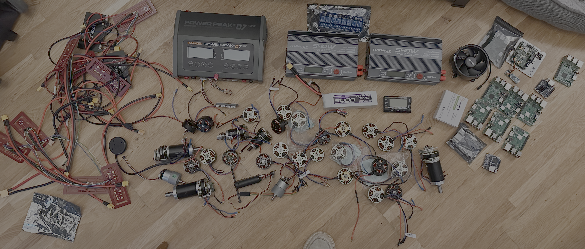

Anyway, to that end, I thought a cool way to start would be:

1. Look through my collection (see above) of motors, find the highest torque one
2. Find a design of a leg online -> 3D print to match my chosen motor
3. Either buy an odrive or Chinese replica, and see if I can get this leg to
   jump. Will be used initially for a torque test/firmware control

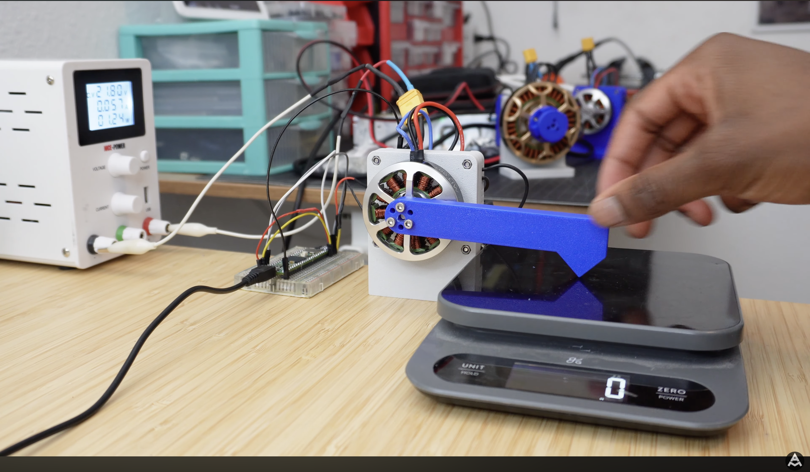

This is the setup used by [Aaed
Musa](https://www.youtube.com/watch?v=GFLa1b1juUo) who's built a couple of dog
bots now, I believe [James Bruton](https://www.youtube.com/@jamesbruton) does
something similar, too.

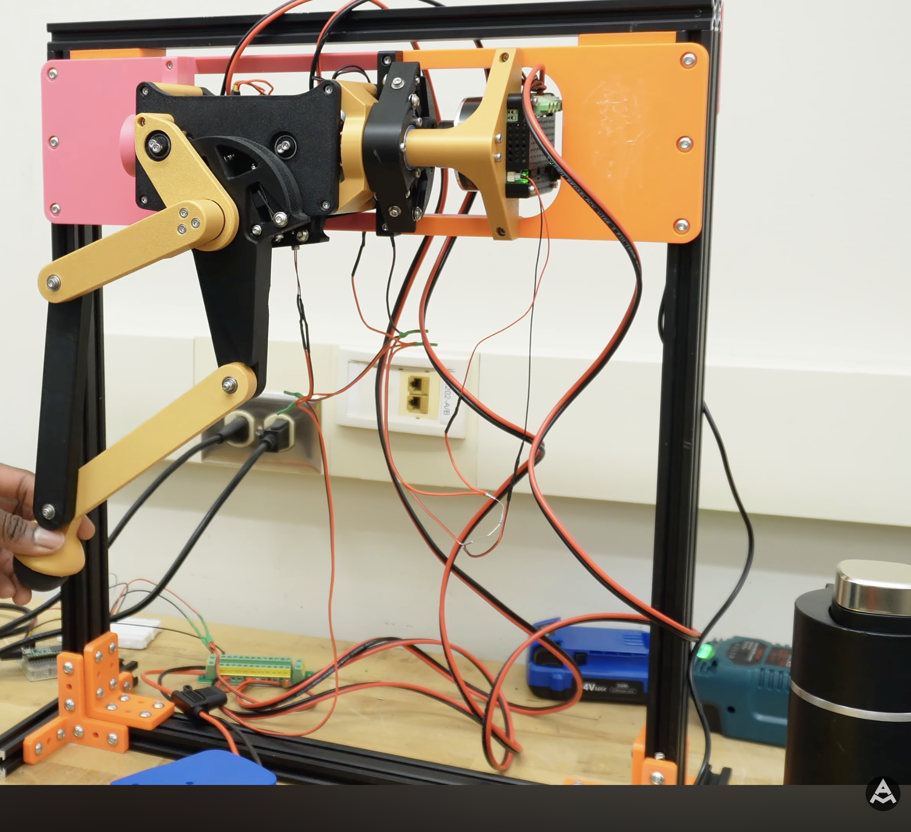

The test jig I envision to look like the above. I don't currently have any Al
extrusion, but if I get that far, I'll buy some.

### What I Want To Get From This Project

Before I get too into the weeds on this, I thought it would be a good idea to
quantify what I would like to learn from this project. That way, when it's done,
I can look back and see how far I've come.

- FOC - field orientated control
- More about robots, I see my career and engineering moving towards physical AI,
  having a good foundation on modern robots will help
- Quasi direct drive actuators
- A more intuitive understanding of electric motors
- Control loops for "springy" legs
- Fast prototyping with 3D printing (I have a good background in 3D printing,
  but not so much with fast iterative designs)

There's probably a bunch more, but those are the ones I can think of right now.
Time to find a leg to print!

## 07/05/26

I've been wanting to build a test leg for a while. As I mentioned, I got a bunch
of motors from my workplace, so I rummaged through the box and found 3 (two of
which are basically the same from different manufacturers). 

- Turnigy Multistar 4822-390Kv 22Pole Multi-Rotor Outrunner (the other is
  basically the same as this, not branded)
- A generic X4114-370 24 poles (I think)

I have a bunch of things I want to do regarding this motor controller design:

1. Understand the motor itself, how it works, why Field Oriented Control is
   desirable
2. How does BEMF manifest itself, how and why does it occur?
3. Model of a 3 phase full bridge driver - for testing different control
   strategies, starting with trapezoidal, moving on to FOC.
4. Model of a motor, maybe not the full dynamics but at least an RL (C?) with
   BEMF
5. Fortesque transform, it's derivation, intuition, and application in FOC
6. Clarke / P and Q transform, it's derivation, intuition, and application in
   FOC
7. Characterisation of bearing eccentricity and it's affects on motor control
   (this is a bit of a stretch goal if I have time, I can't imagine it's going
   to be of paramount importance).

Not sure how I will blog this, probably different projects, all linked here or
something.

Anyway, this latest update is is about how I disassembled the x4114. This has
the best torque capabilities out of all the motors I currently have, and I have
two of them (only! I have about 30 of the others). That's enough to make a test
leg, measure torque, learn a bunch and get a feel for how much torque I need in
practice.

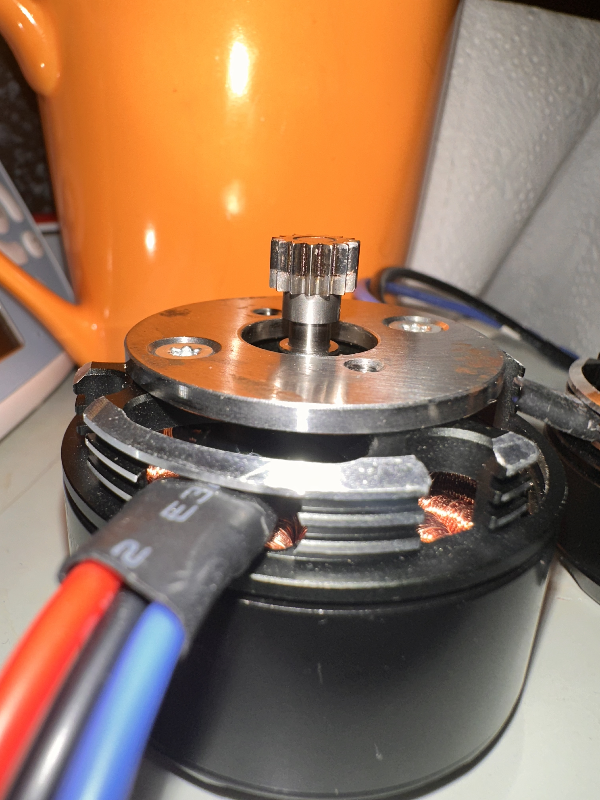

Above shows the image of the motor. The current issue is, I don't need that spur
gear. I've been looking at the [cycloidal
drive](https://en.wikipedia.org/wiki/Cycloidal_drive) (which will be yet another
project, linked here no doubt) and I will be printing my own spur gear, much
larger in diameter. So, this has to go! Long story short, it was not as easy as
I thought. I tried twisting it off in the vice, using dowels to hammer it out, a
hot air gun at 200 Deg C, levering with screwdrivers, the lot. I got these
second hand from work, so I checked the intranet to see if they had documented
_how_ they added the gear, and luckily they did! Not for this exact motor, but
one very similar. It was, of course, push fitted via a press and loctite'd into
place. 

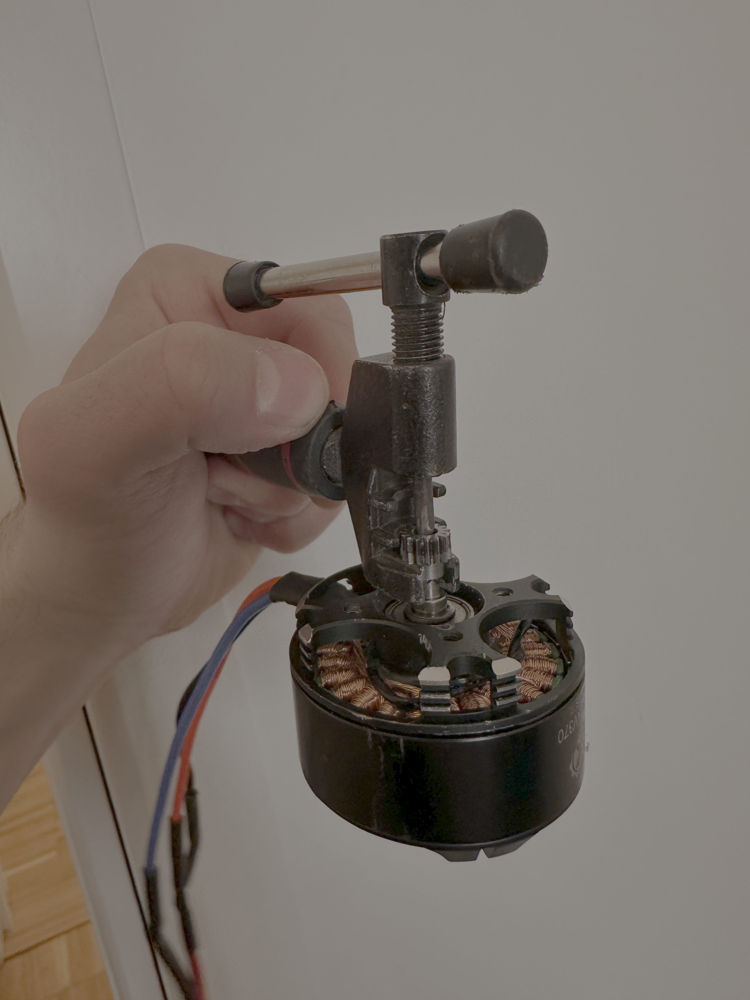

I managed to come up with a pretty novel solution; using an old bicycle chain
splitter (that I bought 9 years ago in the Netherlands!). With a slight
modification with a Dremel I was able to make a poor mans gear puller!

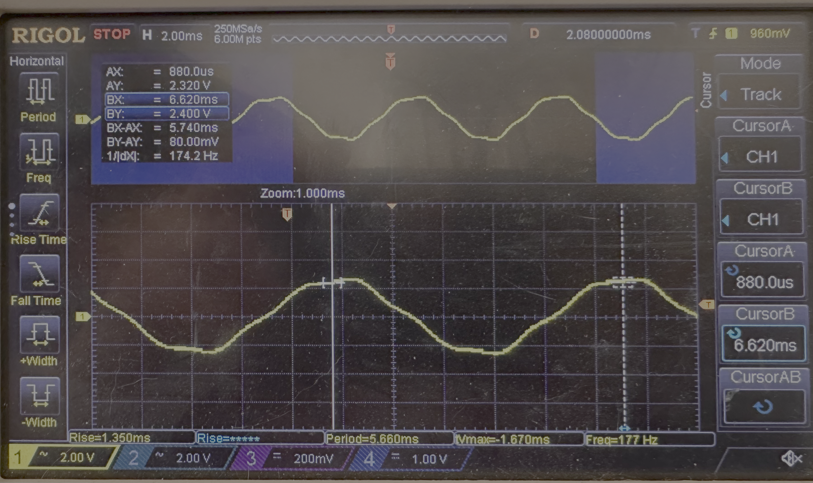

Lastly, I used my hand held drill to spin up the  motor, and measure the
voltage across two of the phases. This was in an attempt to measure the KV -
[motor velocity
constant](https://en.wikipedia.org/wiki/Motor_constants#Motor_velocity_constant,_back_EMF_constant) - measured in RPM/V. IE,  how many revolutions per minute, per volt, is generated by the motor. It's often called the BEMF constant, too. 

This is where, I think, things get a little complicated. There's 2 types of
rotation going on here. We have the mechanical frequency, the number of
rotations of the bell/outer case per second, and the electrical rotation, which
is one full electrical cycle, a N-S-N change across a stator tooth. That means
for one mechanical rotation, there are $$f_{mech} = p \cdot f_{elec} $$ where p
= number of poles. Our current motor has 22 magnets, and 24 teeth (known as
poles and slots, respectively). Therefore, the we can determine the KV of the
motor with the following:

$$ KV = \frac{\text{electrical RPM}}{V_{phase peak}} $$

I've left out the "fudge factor" at the moment. There's a constant that's added
to the denominator. This is a result of three things, but the one I understand
intuitively at the moment, and makes the largest contribution to this motor, is
the 'spread' of the vector across the stator teeth. Motors are often |nd such
that neighbouring slots are of the same phase, but opposite polarity (make
sense, you need an N/S pair - often stators also have the opposite slot (180
deg) be the opposite, too). Anyway, if you do the math, then 8 vectors
pointing ~15 deg apart, 4 on one side and 4 on the other, gives you an overall
vector pointing ~0.95x what a vector pointing perfectly straight would. That's
the fudge factor that's sometimes added.

$$ KV = \frac{\frac{177}{11}*60}{2.4} \approx 400$$

Pretty close to the stated 370 KV.

## 13/05/26

I've been spending some time looking through various cycloidal drives, trying to
understand how they work. As well as that, I was deep diving into how BLDC
motors work, how field orientated control works, Fortesque transforms, Clarke
transforms, etc. There's a lot to learn and I don't have much time, but I think
it's important to get a good grasp on these concepts, as they come up over and
over and over in other areas.

Anyway, I'm not in a place to update about that yet, but I can with the
cycloidal drive.

Here's were I am so far. I settled on taking [James Bruton's v3 cycloidal drive](https://github.com/XRobots/CycloidalDrive/tree/main/V3). Mainly, it was simple enough to quickly understand what I needed to print, and a pretty similar motor to what I had. I scaled the design down based on the ratio of motor diameters, I needed to make it almost half the size. 

There's a bunch of things that need to be changed, which is why I'm writing this
update, I want to formalise them so I can understand what I need.

1. The screw holes didn't scale down well. They ended up being 1mm or something.
   Smallest screws I have are M2s, I'll redo the designs to account for this. 
2. The cover isn't the right size, needs to be redesigned.
3. The cycloidal gears might need to be made smaller ever so slightly, they
   pinch a bit. This might be because the roller bearings that sit on the
   outside of the cycloidal gears aren't well dimensioned, 3D printing small
   tubes is never great. I can either make these part of the body of the gear, I
   don't think they really need to roll, or, replace with Teflon tubes that I
   buy.
4. The eccentric gear needs some consideration, it's very thing, I thin it'll
   snap pretty quickly. I reckon I can make it thicker, and maybe change how the
   two are connected.
5. Need a better solution for the small bearings and spacers - in fact, all
   bearings need some thought. If I do use metal bearings (and probably I will
   need too) then they need to be a standard size, so I'll need to account that.

## 23/05/26

Okay, it's been a while since I posted, but I've actually been working a lot on
this. I'd be splitting my efforts between designing the cycloidal drive,
arguably the most important part of the dog bot, and understand _how_ BLDC
outrunners work. Specifically, I've been looking at:

- What causes the motor to turn?
- What are the stator winding patterns?
- Why do they have seemingly random pole / slot ratios? (22/24, for example)
- Trapezoidal vs Field Oriented Control
- Fortesque and Clarke / PQ transforms
- Forces on conductors in magnetic fields
- Lorentz forces
- Back EMF (BEMF) and modelling this in LTSpice

### Cycloidal Gearbox Development

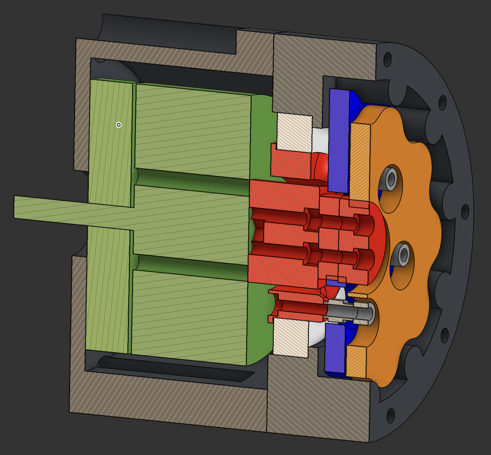
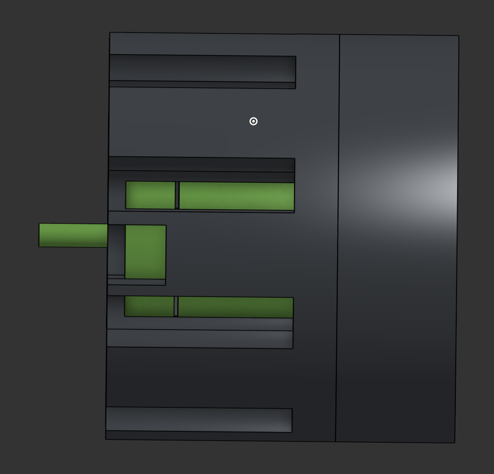
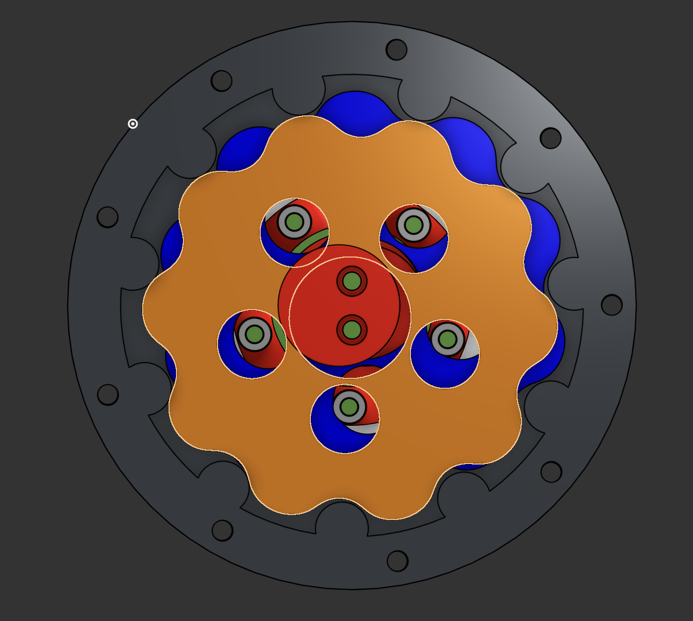
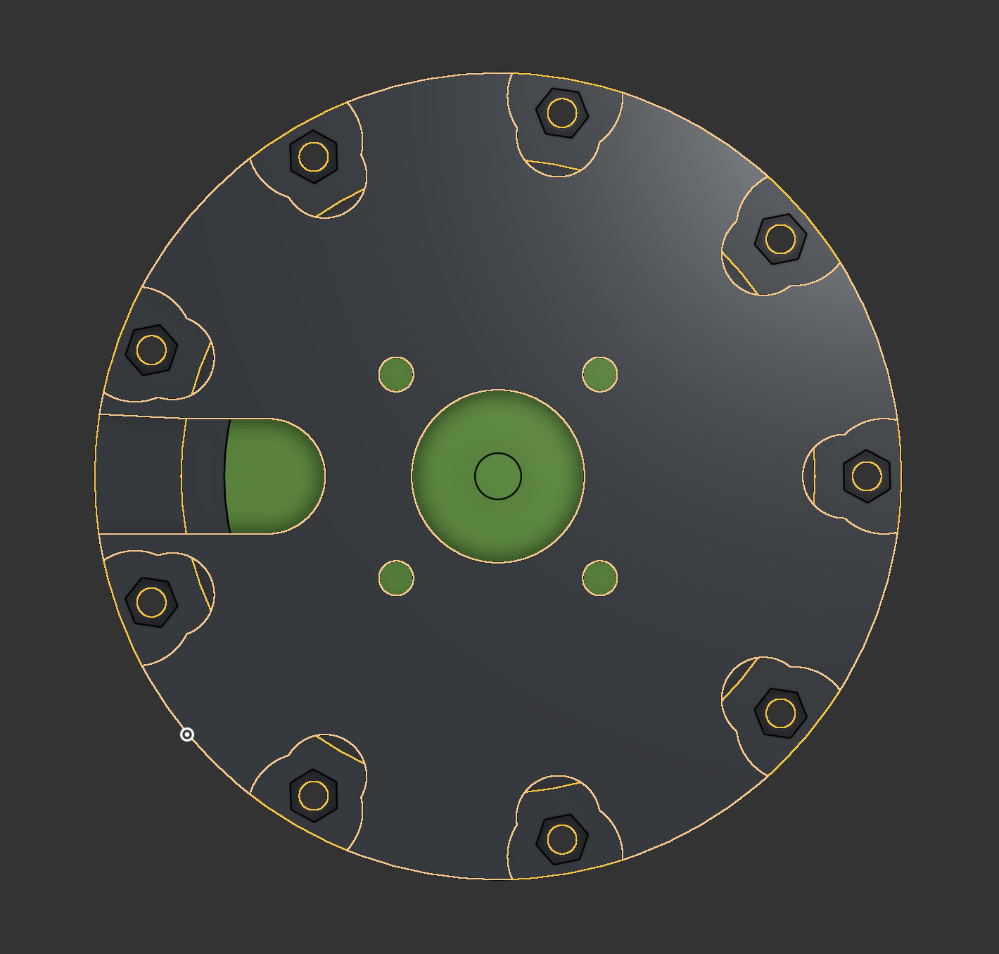

Gearbox development is going well. I have printed these components now, and
tested using a drill, all seems to be working!

The outstanding parts are the top output drive cup (? can't think of a better
name!) and the plate that caps the gear ring holder (again, no idea what's a
good name for that). I need to make a few mods to the current design, just for
"assembability", but I'm happy with the progress!

### BLDCs — Notes and Reference

I spent a lot of time going deep on BLDC theory — Lorentz forces, winding patterns, trapezoidal vs FOC, Fortescue and Clarke transforms, BEMF, the lot. There's genuinely a huge amount of material and I have no desire to rewrite it up into a polished article. So instead, the raw working notes are here as standalone pages. They're dense and written for me rather than a reader, but the physics is right.

- [How a Brushless Outrunner Motor Works](./how_bldc_works.md)
- [Field Oriented Control — A Full Tutorial](./FOC_control.md)
- [FFT, Fourier, and the Link to Fortescue](./FFT_and_Fortescue.md)

## 10/09/26

### Cycloidal Drive — Redesign and First Failure

Since the last update I've completely redesigned all of the 3D parts. The screw holes are now properly dimensioned for M2s (the scaled-down design had them at ~1mm, which was useless), the cover has been remade, and the overall assembly has been cleaned up for printability.

I got it printed and spinning — genuinely satisfying to see it working for the first time.

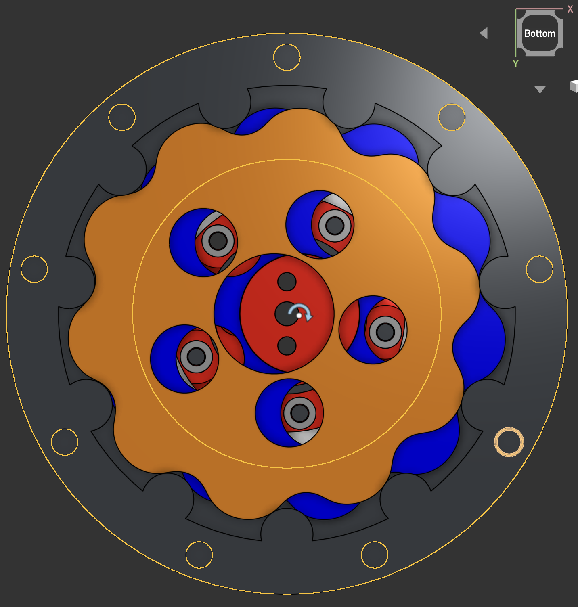

Unfortunately it didn't last. The failure mode is straightforward once you see it: the cycloidal disc and eccentric gear are both plastic, so when they run against each other the friction generates heat. Under sustained load they get hot enough that the disc material softens, and the two parts literally melt and fuse together. Once that happens, rotation stops dead.

The fix is probably a combination of things — either a lubricant (though getting it to stay put on an FDM part is tricky), switching the eccentric gear to metal or a higher-temp filament like PC, or adding enough clearance that the contact pressure drops. I'm leaning toward metal for the eccentric since that's the part generating most of the heat as it spins inside the disc bore.

More on this once I've tried a fix.
